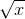
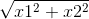

### 16.3.1　幂运算

基本的幂函数是 `Math.pow` ，还有一些便捷函数用于计算平方根、立方根和e的幂，如表16-1所示。

<b class="my_markdown">表16-1　　幂函数</b>

| 函　　数 | 描　　述 | 例　　子 |
| :-----  | :-----  | :-----  | :-----  | :-----  |
| Math.pow(x, y) | xy | Math.pow(2, 3) // 8 | Math.pow(1.7, 2.3)　// ~3.39 |
| Math.sqrt(x) | 251658240等于Math.pow(x, 0.5) | Math.sqrt(16) // 4 | Math.sqrt(15.5)　// ~3.94 |
| Math.cbrt(x) | X的立方根，等于Math.pow(x, 1/3) | Math.cbrt(27) //3 | Math.cbrt(22) // ~2.8 |
| Math.exp(x) | ex 等于　 Math.pow(Math.E, x) | Math.exp(1) // ~2.718 | Math.exp(5.5)　// ~244.7 |
| Math.expm1(x) | ex − 1 等于 Math.exp(x) - 1 | Math.expm1(1) // ~1.718 | Math.expm1(5.5)　// ~243.7 |
| Math.hypot(x1, x2,...) | 参数的平方根之和： | Math.hypot(3, 4)　// 5 | Math.hypot(2, 3, 4) // ~5.36 |

