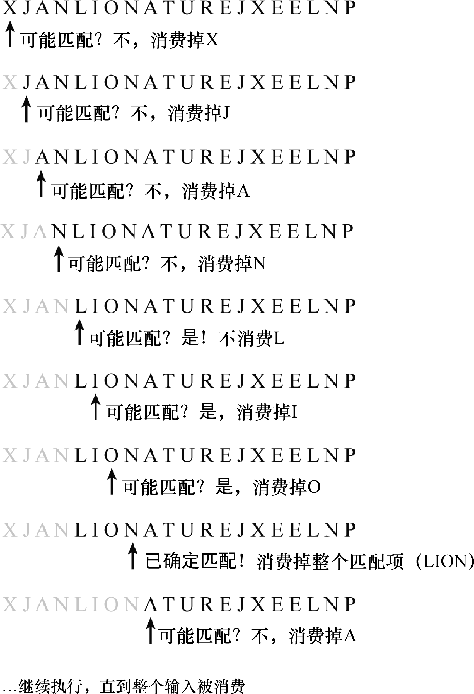

### 17.5　消费输入

关于正则表达式，从“天真”的角度来看，它只是“在一个大字符串中查找子字符串”（文艺点就叫作“海底捞针”）。虽然这个天真的想法通常能够满足全部需求，但它却限制了真正理解正则表达式的含义，以及如何利用正则表达式去完成更有挑战性的任务。

而从复杂的角度来看，正则表达式是一个消费给定字符串的模式。匹配（要寻找的内容）则成为了这种理念的副产品。

为了将正则表达式的工作方式概念化，有一个比较好的办法是，将它比作一个普通的儿童文字游戏：一个需要找出其中所含单词的字母网格。简单起见，忽略斜向和纵向匹配。事实上，这里只考虑网格中的第一行。

```javascript
X J A N L I O N A T UR E J X E E L N P 
```

人们很擅长玩这个游戏。当看到它的时候，就能很快地找出LION、NATURE和EEL（以及ION，其实已经找出来了）。计算机或者正则表达式可没有这么聪明。如果以正则表达式的视角来玩这个游戏，这样不仅能看到正则表达式的工作方式，而且还能了解很多需要注意的限制因素。

简单起见，告诉正则表达式要查找的单词是LION、ION、NATURE和EEL；也就是说，预先给出答案，然后再看答案是否能通过验证。

正则表达式会从第一个字符X开始查找。它注意到要查找的单词中没有以X开始的，所以就说“没有匹配项”。不过它并没有放弃，而是移动到下一个字符J继续查找。随后它发现J的情况跟X一样，继续移动到A。在沿字符串移动时，就认为正则表达式移动所经过的字母被消费了。碰到L的时候，事情开始变得有趣起来 。此时，正则表达式引擎会说：“呀，这个可能是LION!”由于这可能是一个潜在的匹配项，所以L不会被消费，这是理解此处的关键。接着正则表达式会继续执行，匹配I、O，以及N。至此，它就识别出了一个匹配项：匹配成功！当识别出一个匹配项后就可以消费掉整个单词，所以L、I、O和N都被消费了。此时事情变得更有趣了，LION和NATURE有重叠的地方。作为人类，不会被这个现象迷惑。但是正则表达式非常严格，它不会再去查找已经消费过的字符。所以它不会“退回去”尝试在已经被消费的字符中查找匹配项。这样一来，正则表达式就找不到NATURE了，因为N已经被消费了。它只能找到ATURE，而这不符合所要查找的单词。当然，最后它还会找到EEL。

现在重新回顾这个例子，将LION中的O改成X。那么会发生什么呢？当正则表达式碰到L的时候，它还是会识别出一个潜在的匹配项（LION），因此它不会消费L。当它移动到I的时候，也不会消费I。而当移动到X的时候，此时，它意识到这不是一个匹配项：因为没有以LIX开始的目标单词。接下来，正则表达式会回到L并消费它，然后继续正常地移动。在这种情况下，它将匹配上NATURE，因为N没有被当做LION的一部分消费掉。

图17-1是这个过程的一部分示例：


<center class="my_markdown"><b class="my_markdown">图17-1　正则表达式示例</b></center>

在讨论正则表达式元语言之前，先来抽象地思考一下正则表达式在“消费”字符串时使用的算法：

+ 字符串从左到右被消费。
+ 一旦某个字符已经被消费，就不会被再次访问。
+ 如果匹配失败，正则表达式每次只会往下找一个字符，从而试图查找匹配项。
+ 如果匹配成功，正则表达式会立即消费匹配项的所有字符；然后继续用下一个字符进行匹配（如果正则表达式是全局的话，这个会在后面讲到）

这是个普通的算法，即使细节有些复杂，可能也不会感到惊讶。特别是，当正则表达式确定没有任何匹配项时，该算法会被提前终止。

在学习正则表达式元语言特性的时候，试着记住这个算法。想象一下字符串从左到右被消费掉，每次一个字符，直到找到匹配项，此时，整个匹配项的字符会一次性被消费。

