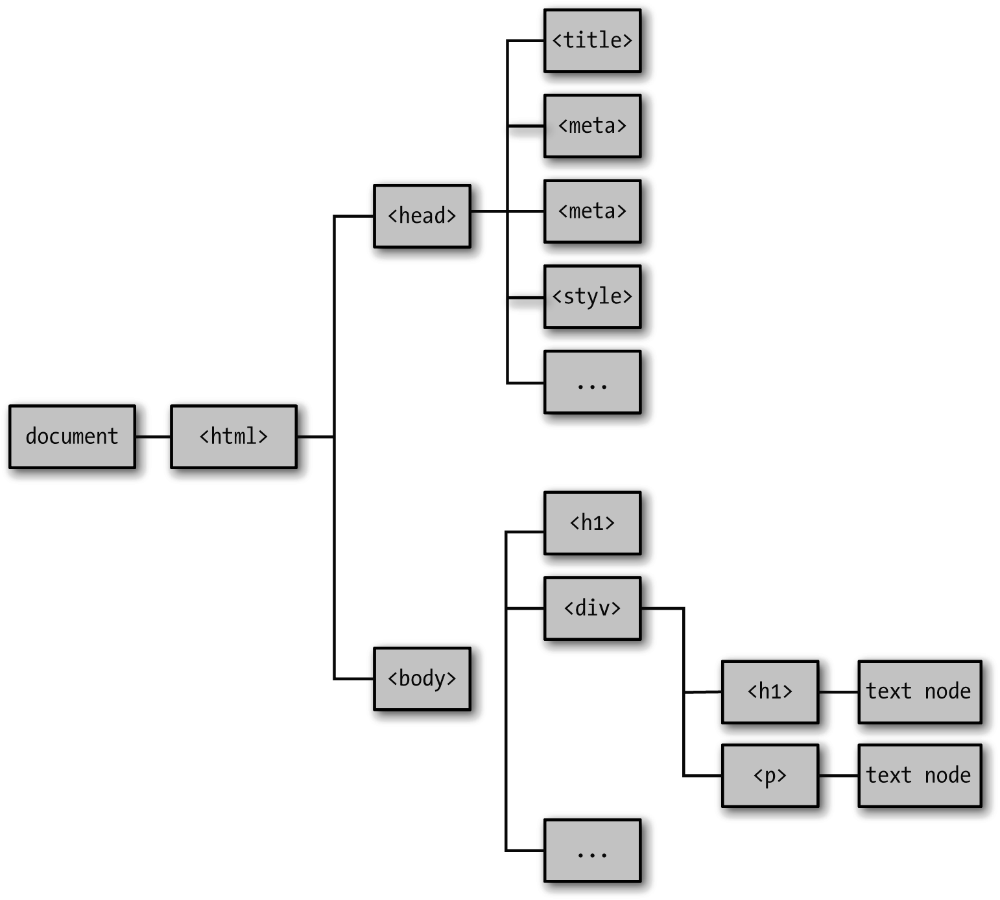

### 18.2　文档对象模型

文档对象模型（Document Object Model），又称DOM，是一种描述HTML文档结构的约定，它是与浏览器进行交互的核心。

从概念上讲，DOM是一棵由节点构成的树：每个节点都有一个父节点（除了根节点），以及0个或多个子节点。根节点是一个文档，它只有一个子节点，也就是<html>元素。<html>元素有两个子节点：<head>元素和<body>元素（图18-1就是一个DOM树的例子）。


<center class="my_markdown"><b class="my_markdown">图18-1　DOM树</b></center>

DOM树（包括文档本身）中的每一个节点都是一个节点类（Node class）（这里的节点跟Node.js没有关系，下一章会讲到）的实例。节点（Node）对象拥有父节点（parentNode）和子节点（childNode）属性，以及像节点名（nodeName）和节点类型（nodeType）这些用来标识节点的属性。

> 
> DOM全部由节点组成，其中只有一部分节点是HTML元素。比如，段落标签（<p>）是HTML元素，但段落中的文字却是文本节点。节点和元素这两个术语经常会被交叉使用，虽然这样不会引起混淆，但从技术的角度来讲是不对的。本章中，接触到的大多数节点都是HTML元素，所以当讲到“元素”的时候，实际上说的是“元素节点。”

在下面的例子中，作者会用一个很简单的HTML文件来展示这些特性。首先，创建一个名为simple.html的文件：

```javascript
<!doctype html>
<html>
    <head>
        <meta charset="utf-8">
        <title>Simple HTML</title>
        <style>
            .callout {
                border: solid 1px #ff0080;
                margin: 2px 4px;
                padding: 2px 6px;
            } 
            .code { 
                background: #ccc;
                margin: 1px 2px;
                padding: 1px 4px;
                font-family: monospace;
            }
        </style>
    </head>
    <body>
        <header>
            <h1>Simple HTML</h1>
        </header>
        <div id="content">
            <p>This is a <i>simple</i> HTML file.</p>
            <div class="callout">
                <p>This is as fancy as we'll get!</p>
            </div>
            <p>IDs (such as <span class="code">#content</span>)
                are unique (there can only be one per page).</p>
            <p>Classes (such as <span class="code">.callout</span>)
                can be used on many elements.</p>
            <div id="callout2" class="callout fancy">
                <p>A single HTML element can have multiple classes.</p>
            </div>
        </div>
    </body>
</html>
```

每个节点都有nodeType和nodeName的属性（当然还有其他属性）。nodeType是一个用来标识节点类型的整数，并且在节点对象中都包含了这些数字所对应的常量。本章中主要用到的节点类型是Node.ELEMENT_NODE（HTML元素）和Node.TEXT_NODE（文本内容，一般存在于HTML元素中）。如果想了解更多内容，可以参考MDN上关于nodeType的文档。

下面来看一个颇具教学意义的练习：编写一个函数来实现从document开始，横向打印整个DOM的功能。

```javascript
function printDOM(node, prefix) {
    console.log(prefix + node.nodeName);
    for(let i=0; i<node.childNodes.length; i++) {
        printDOM(node.childNodes[i], prefix + '\t');
    }
}
printDOM(document, '');
```

这个递归函数实际上是实现了树的深度优先遍历，也叫前序遍历。也就是说，它会先遍历一个分支中的所有节点，然后才会遍历下一个分支。如果在页面加载的时候运行这段代码，控制台中就会打印整个页面的结构。

然而这只是一个用于教学的练习，如果用这种方式操作HTML（必须遍历整个DOM才能找到需要的元素），不仅过程冗长，而且效率低下。好在DOM提供了更为直接的定位HTML元素的方式。

> 
> 自己编写遍历函数固然是一个很好的练习，不过DOM API已经提供了用来遍历DOM中的所有元素的TreeWalker对象（而且还能有选择性地过滤某些类型的元素）。想了解更多内容，可以看看MDN上关于document.createTreeWalker的文档。

