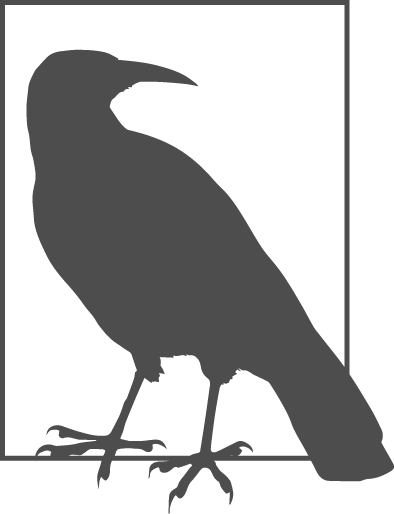

### 1.8　自动执行重复任务

思考一种场景：相比于简单地给画布上添加一个圆，如果想将多个圆以网格布局填充画布，此时要怎么做呢？如果让圆与圆之间相距50个像素并设置略小的尺寸，就可以在画布上绘制出64个圆。当然，可以将同样的代码复制63次，然后手工修改所有的坐标，让它们正确地显示在网格中。这听起来并非易事，还好计算机擅长这种重复的工作。来见证一下如何将64个均匀排列的圆绘制出来的。用下面代码替换掉前面绘制单个圆的代码：

```javascript
var c;
for(var x=25; x<400; x+=50) {
    for(var y=25; y<400; y+=50) {
        c = Shape.Circle(x, y, 20);
        c.fillColor = 'green'; 
    }
}
```

刷新浏览器，64个绿色的圆就会如期出现在大家的眼前！如果读者才开始接触编程，刚才那段代码可能会有些费解，但相信也会觉得它比手动复制修改的128行代码要好。

刚才的代码使用了for循环，它是控制流语句的一部分，关于控制流语句在第四章有详细的讲解。在For循环中，可以指定初始条件（25），结束条件（小于400），以及增量值（50）。在循环中嵌套循环是为了同时在x轴和y轴两个方向上绘制圆。

> 
> 针对这个例子，可以有很多不同的写法。上面那种写法是以x, y坐标作为一个重要的参考点：明确指定圆的开始位置，以及它们的间距。还可以从另一个方向去解决这个问题：只需要关注要绘制的圆的个数（64），然后让程序去计算怎样将它们均匀的填充在画布上。现在之所以采用第一种方式是因为它与要做的事情有更多的相似性，比如，将绘制圆的代码复制64次并自己计算出它们的间距。

