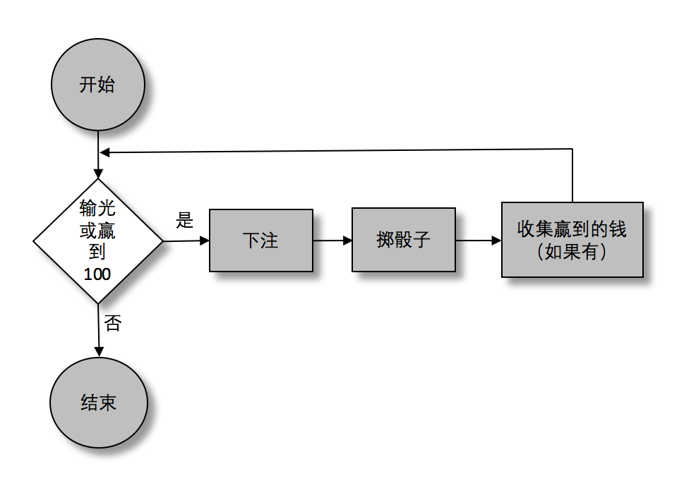
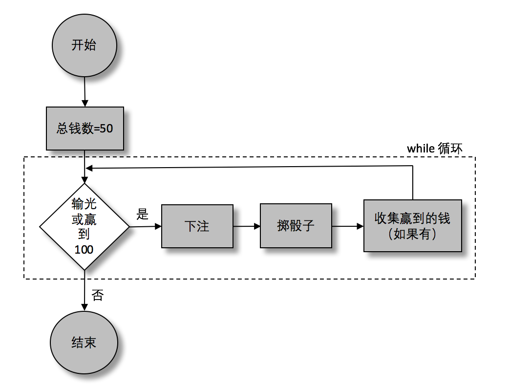

### 4.1　控制流的底层

读者很有可能已经接触过流程图的概念，它是一种用来表示控制流的虚拟方法。下面将会写一个模拟器，来作为本章的示例代码。为了更加具体深入一些，下面例子模拟一个在19世纪中叶特别流行的赌博游戏——皇冠和锚的玩家，皇家海军的候补航海员。

游戏很简单，有一个6面分别标有“皇冠”“锚”“红桃”“梅花”“黑桃”和“方块”。水手可以在这些面的组合中放任何数量的钱数，这些钱就是赌注。接着他开始掷骰子，骰子总共有三个，每一个都有上面提到的6个面。如果掷出来的结果跟水手下注的一样，那水手就赢了。下面这些例子演示了水手可能会掷出的结果，以及相应的盈利。如表4-1所示。

<b class="my_markdown">表4-1　　赌博游戏</b>

| 押　　注 | 掷骰子结果 | 盈　　利 |
| :-----  | :-----  | :-----  | :-----  | :-----  |
| 5便士压皇冠 | 皇冠，皇冠，皇冠 | 15便士 |
| 5便士压皇冠 | 皇冠，皇冠，锚 | 10便士 |
| 5便士压皇冠 | 皇冠，红桃，梅花 | 5便士 |
| 5便士压皇冠 | 红桃，锚，梅花 | 0 |
| 3便士压皇冠，2便士压梅花 | 皇冠，皇冠，皇冠 | 9便士 |
| 3便士压皇冠，2便士压梅花 | 皇冠，梅花，锚 | 5便士 |
| 所有花色都压1便士 | 任何一面 | 3便士（这可不是一个好策略!） |

挑选这个例子是因为它不复杂，而且还保留了一点想象的空间，重点是它能用来演示一个控制流的主要过程。实际上，不用模拟19世纪的海员来玩这个游戏，而是抽象这个行为即可，这种模拟在很多应用中是很常见的。在皇冠和锚的例子中，已经抽象出一个数学模型，来决定是否要开一局游戏来为公司的下一次活动筹钱。本章中构造的模拟器可以用来支撑模型的正确性。

游戏本身很简单，但是确有上千种玩法。船员——托马斯（这是一个很好的英国名字）——将会从基础的玩起，他的行为会随着游戏的发展而逐渐包含更多细节。

从基础开始：起始和结束条件。每次托马斯离港，都会带着50便士的本金来玩皇冠和锚的游戏。他自己有一个规矩：如果自己运气好使本金翻倍，他就带走这100多便士（几乎是他工资的一半）。

把游戏分为三部分：下注、掷骰子、收集赢到的钱（如果有的话）。现在已经勾勒出一个很简单且高度概括的托马斯行为。接下来就可以画一个流程图来表示它，如图4-1所示。

在流程图中，菱形表示“是或否”，方形表示动作。圆形表示起始和终止。

图4-1所画的流程图，并不能直接转换成程序。其中的步骤对普通人来说很简单，但是对于电脑来说却太过复杂。比如，“掷骰子”对于电脑而言并不那么显而易见。什么是骰子？怎么掷？为了解决这个问题，“下注”“掷骰子”“计算钱数”这几个步骤分别有各自的流程图（图4-1中的图形分别表示这三个步骤）。如果有一张足够大的纸，就可以把这些流程图画在一起，但本书只能分开来画。

<b class="my_markdown">图4-1　皇冠和锚模拟流程图</b>

而且图中的决策点对于电脑来说太含糊了：“破产或者赢到100便士？”这已经超出了电脑的理解范围。所以什么才是电脑能理解的呢？在本章中，这样约定流程图中的动作。

+ 变量定义： `funds = 50, bets = {}, hand = []` 。
+ 一个m到n之间的随机数，包括 `rand(1` , `6)` （rand是一个辅助方法，稍后会讲到）。
+ 随机的字符串表示骰子向上的一面（比如：红桃、皇冠）： `randFace()` （另一个辅助方法）。
+ 对象属性赋值： `bets["heart"] = 5, bets[randFace()] = 5` 。
+ 给数组添加元素： `hand.push(randFace())` 。
+ 基础计算： `funds - totalBet, funds + winnings` 。
+ 递增： `roll++` （这是一个常用的快捷方式，用来表示“给roll这个变量加一”）。
+ 并且我们会限制流程图中的决策：
+ 数字区间（ `funds > 0, funds < 100` ）。
+ 判等（ `totalBet === 7;`  在第5章讨论为什么需要三个等号）。
+ 逻辑操作（ `funds > 0 &amp;&amp; funds < 100` ；两个“&”符号表示“与”，也将在第5章中讲到。）

所有这些“被允许的操作”都是可以直接用JavaScript来编写，有些可能会需要一些解释和转换。

终极词汇笔记：本章中会使用一些词语如“真的”和“假的”。它们并不是简单的在真和假后面加后缀，或者只是一种“可爱”的说法，在JavaScript中它们是有意义的。这些都将会在第5章中讲到，现在可以简单地把他们想象成“真”和“假”。到此，已经对即将使用的语言有一些了解，现在需要用它们来重画图4-1所示流程图，得到图4-2中的流程图。

<b class="my_markdown">图4-2　皇冠和锚模拟流程图（修改版）</b>

