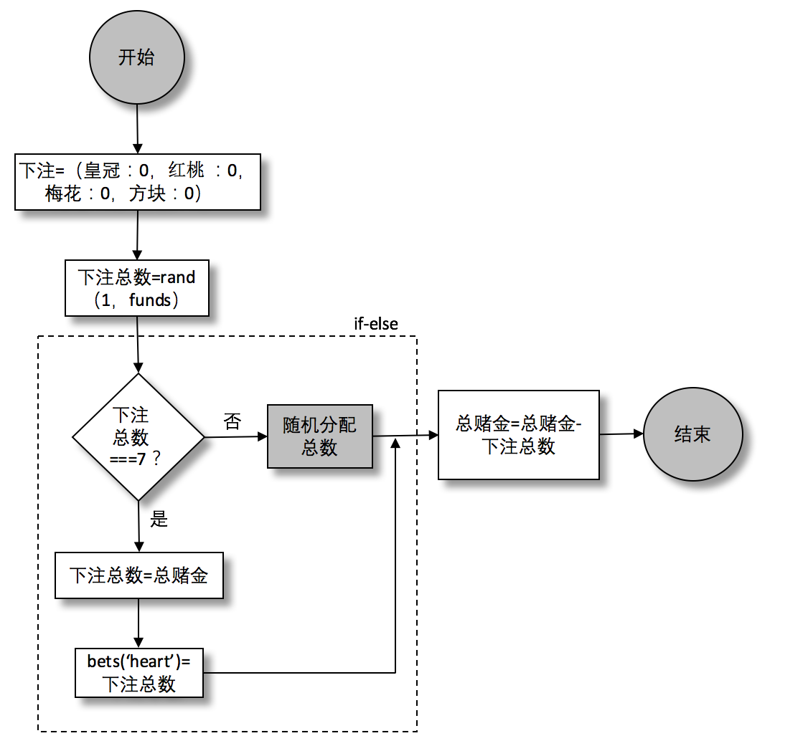

### 4.1.5　if else语句

流程图中有一个带阴影的方块，其中写着“下注”，下面来完成这部分的代码。那么托马斯怎样才能下注呢？托马斯有一个惯例，这个惯例是这样的：他会从右边口袋里随机拿出一把硬币（少则一枚硬币，多则全部拿出）。这些就是他本轮的资金。另外，托马斯很迷信，他相信数字7可以给他带来好运。所以如果他正好拿出了7枚硬币，他就会把它们都放回去然后把所有钱都压在“红桃”上。否则，他会把拿到的钱随机下注（后面会提到如何下注）。图4-3就是“下注”这个模块的流程图。


<center class="my_markdown"><b class="my_markdown">图4-3　皇冠和锚模拟器：下注流程图</b></center>

中间的条件节点（ `totalBet===7` ）代表一个 `if else` 语句。注意它不像 `while` 语句会循环执行，一旦确定，就继续往下走。这个流程可转化成下面的JavaScript代码：

```javascript
const bets = { crown: 0, anchor: 0, heart: 0,
    spade: 0, club: 0, diamond: 0 };
let totalBet = rand(1, funds);
if(totalBet === 7) {
    totalBet = funds;
    bets.heart = totalBet;
} else {
    // 分配下注总数
}
funds = funds - totalBet;
```

`if…else` 语句中的 `else` 部分不是必须的，我们后面会看到省去了else的实现。

