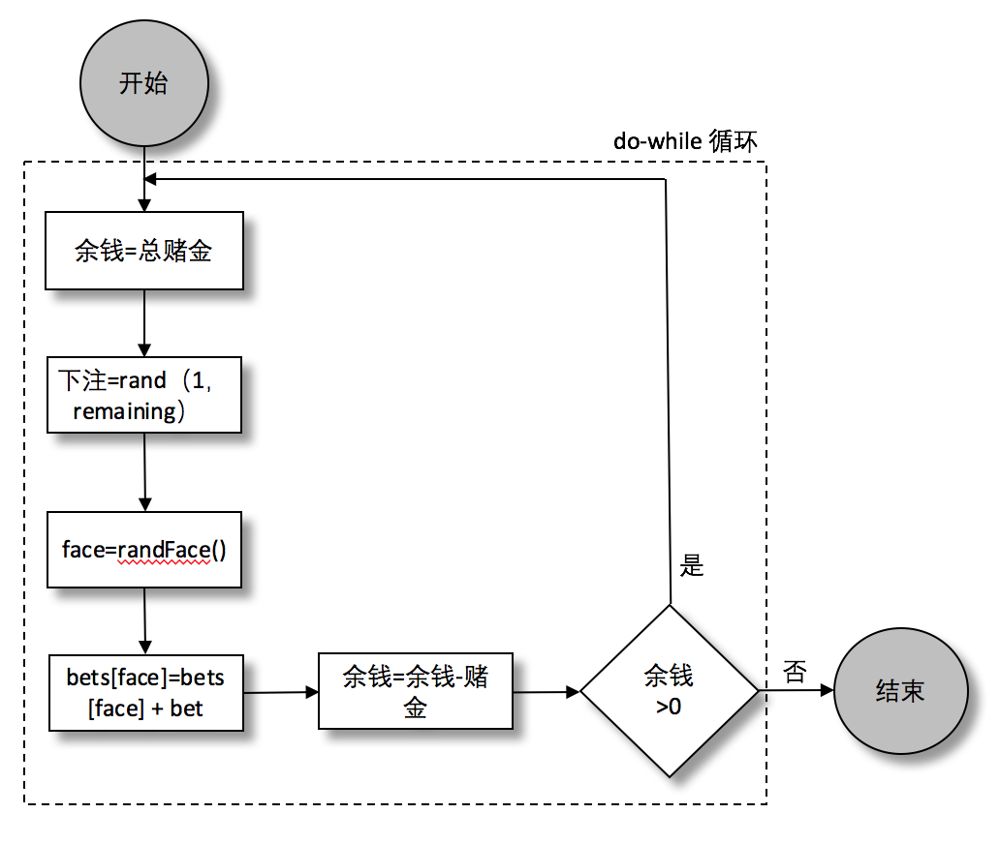

### 4.1.6　do...while循环

当托马斯拿出的银币不是7个时，他会随机把这些钱分配到不同的地方。对此他也有惯例：他右手拿钱，左手随机从右手的钱里拿出一些（少则一枚，多则全部），然后把左手的钱随机下注到其中一个里面（有时候他会把钱重复下注到一个里面）。在下注这个模块里更新随机分配的流程，如图4-4所示。


<center class="my_markdown"><b class="my_markdown">图4-4　皇冠和锚模拟器：分配赌金流程图</b></center>

注意，这个与 `while` 循环不一样：判断语句在最后面，而不是开始。 `Do... while` 循环是为了实现那些循环体至少被执行一次的情况（在 `while` 语句中，如果最开始的判断返回falsy，循环体一次都不会执行）。JavaScript代码如下：

```javascript
let remaining = totalBet;
do {
    let bet = rand(1, remaining);
    let face = randFace();
    bets[face] = bets[face] + bet;
    remaining = remaining - bet;
} while(remaining > 0);
```

