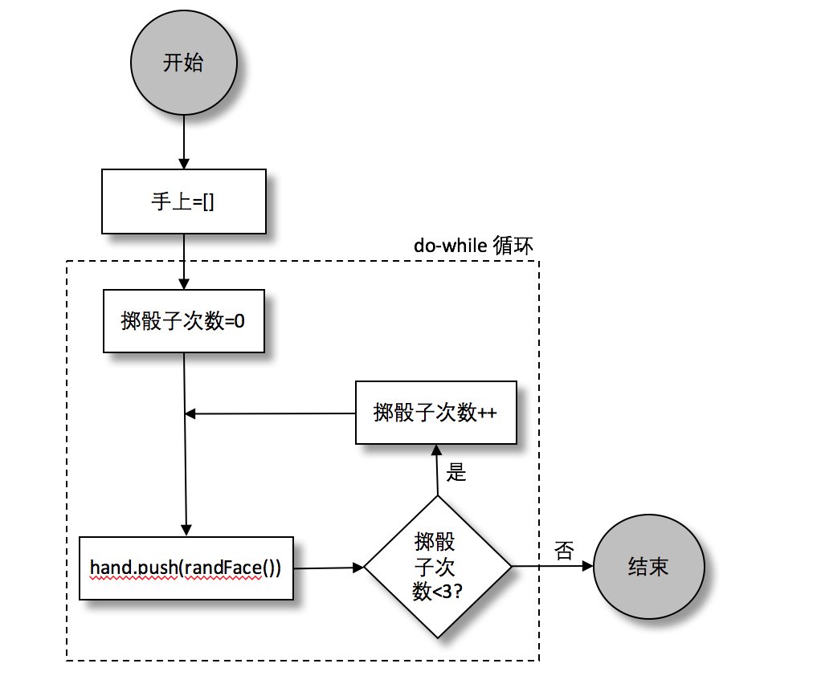

### 4.1.7　for循环

托马斯已经下完注！是时候掷骰子了。

`for` 循环非常灵活（它甚至可以替换 `while` 循环和 `do... while` 循环），它更适合那些需要执行固定次数的情况（尤其是当需要知道执行到哪一步的时候），所以用for循环来投掷固定数字的骰子（本例中需要的数字是3）再合适不过了。还是从“掷骰子”流程图开始，如图4-5所示。


<center class="my_markdown"><b class="my_markdown">图4-5　皇冠和锚模拟器：掷骰子流程图</b></center>

`for` 循环由三个部分组成：初始值（ `roll = 0` ），条件（ `roll < 3` ），和最终表达式（ `roll++` ）。虽然while也可以做这些事情，但是for循环能很方便地把循环所需的所有信息放在一起。下面JavaScript中for循环的实现：

```javascript
const hand = [];
for(let roll = 0; roll < 3; roll++) {
    hand.push(randFace());
}
```

开发人员习惯于从0开始计数，这也就是为什么这段代码中会从0开始，到2停止。

> 
> 在for循环中使用变量i（index单词的简写）计数已经是约定俗成的规范，不管给什么计数，都可以随心所欲地用开发人员想要的变量名进行计数。这里使用 `roll` 是为了明确表示是在给投掷次数计数，不过还是需要当心一点：因为在作者第一次写这个例子的时候，出于习惯用了i！

