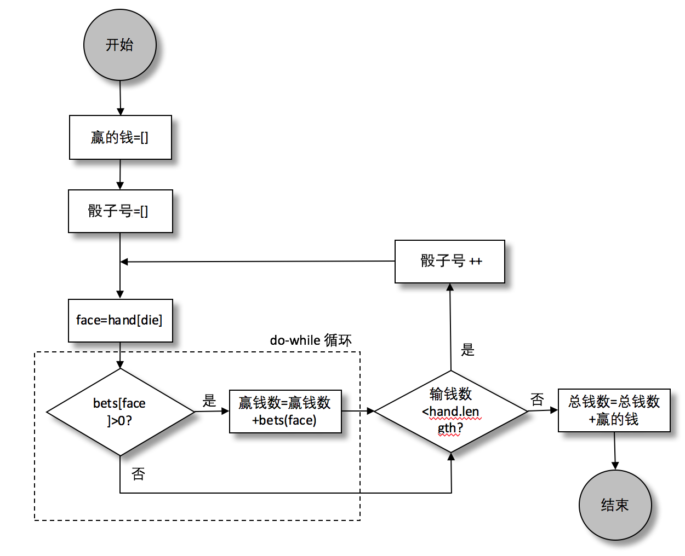

### 4.1.8　if语句

马上就要完成了！已经有了下注和掷骰子，剩下的就是收集赢钱的信息。在 `hand` 数组里有三个随机值，所以这里还需要一个 `for` 循环来找出其中的胜者。为了完成这个任务，需要 `if` 语句（这次不需要 `else` 部分）。最后这部分的流程图如图4-6所示。


<center class="my_markdown"><b class="my_markdown">图4-6　皇冠和锚模拟器：收集赢钱信息的流程图</b></center>

注意 `if..else` 语句和 `if` 语句之间的区别：在if语句中，只有一个分支会存在可执行的动作，而在 `if.. else` 语句中是两个分支。这个例子中最后一部分的代码实现如下：

```javascript
let winnings = 0;
for(let die=0; die < hand.length; die++) {
    let face = hand[die];
    if(bets[face] > 0) winnings = winnings + bets[face];
}
funds = funds + winnings;
```

注意，for循环并没有循环到3，而是到hand.length（这个值恰好是3）。这部分代码的作用是计算所有的赢钱情况，不管hand有多少种情况。这个游戏规定手里有三个骰子，不过规则是可以更改的，可能以后会有更多的骰子作为奖励，或者更少的骰子作为惩罚。重点是，只需要做少量的工作就可以让这段代码变得更通用。如果游戏规则改变了，允许更多或者更少的骰子，开发人员就不用花精力修改这段代码，不管有多少骰子它都会准确无误的执行并给出结果。

