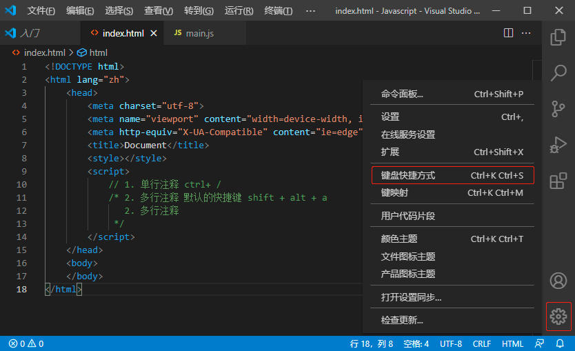
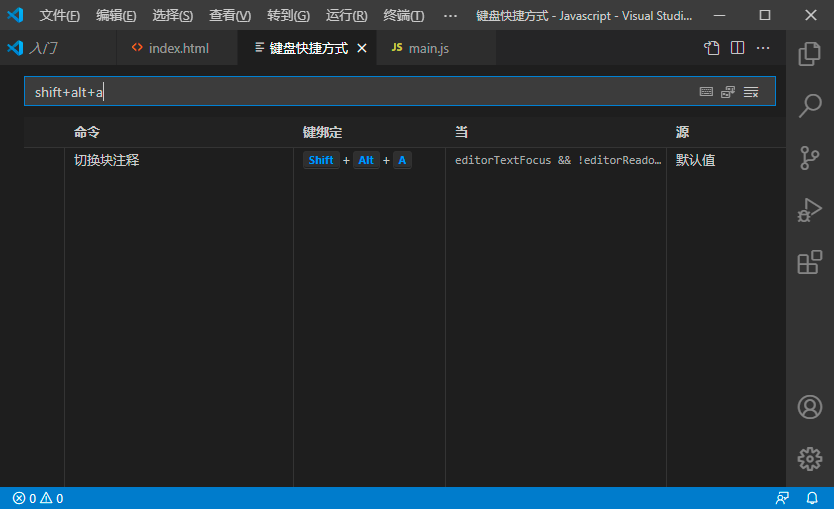
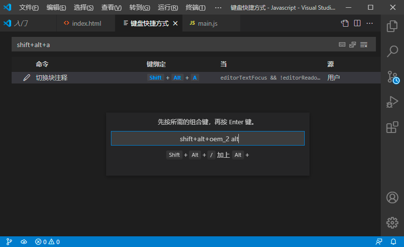

下面以修改多行注释快捷键为例，原始的快捷键为 <kbd>Shift</kbd> + <kbd>Alt</kbd> + <kbd>A</kbd> ，我们要将其修改为 <kbd>Shift</kbd> + <kbd>Alt</kbd> + <kbd>/</kbd>：

1. 点击 Visual Studio Code 界面下方的 “设置” 按钮， 在弹出的选项框中，选择 “键盘快捷方式” 选项。

   

2. 在输入框中输入原先的快捷键值，查找要修改的快捷键。

   

3. 双击要修改的快捷键项，在弹出的对话框中按下要修改后的快捷键，然后再按下 <kbd>Enter</kbd> 键即可。

   

