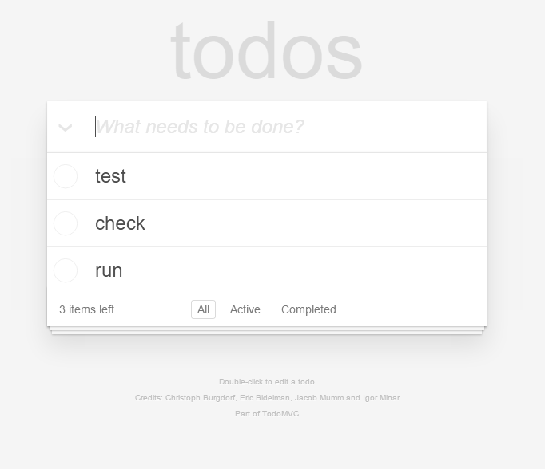

### 10.3　AngularJS和其他全栈框架

首先声明，框架是一个很容易被过度使用的术语。人们把这个词用在一些前端库（如jQuery）、图片库（如D3）、Express，以及很多更加新潮的全栈应用程序中。在本章中，我说的“框架”指的是像AngularJS、Ember和Backbone这样的全栈框架。

为了熟悉全栈框架，你需要先熟悉TodoMVC网站。这个网站定义了一个基础类型应用（一个待办事项列表）的需求，然后邀请所有框架的开发人员提交他们的实现代码。同时网站也提供了一个原生JS的实现代码（没有用任何框架），以及一个用jQuery编写的实现代码。这个网站给开发人员提供了一个途径，来比较和区别使用不同的框架来实现同一个功能有哪些不同。其中包含了所有流行的框架，并非只有AngularJS，还有Backbone.js、Dojo、Ember、React等。同时它也高亮显示了那些结合多种技术的应用，比如其中一个同时使用了AngularJS、Express和Google Cloud Platform的应用。

To-Do建议大家使用如下的目录和文件结构：

```python
index.html
package.json
node_modules/
css
└── app.css
js/
├── app.js
├── controllers/
└── models/
readme.md
```

这个结构并不复杂，它与ExpressJS应用的结构类似。但是，不同框架在实现需求时可能会有很大差异，这也是为什么使用To-Do应用程序是了解每个框架如何工作的好方法。

为了演示，我们来看看用AngularJs和Backbone.js框架实现的代码。我不会列出太多代码，因为当你读到这里的时候，这些代码肯定已经更新了。我们从AngularJS开始，重点看一下优化过的程序——该网站提供了几个基于AngularJS的不同实现。图10-1是添加了一些待办事项后的程序截图。


<center class="my_markdown"><b class="my_markdown">图10-1　添加3个待办事项后的To-Do程序</b></center>

让我们从程序的入口app.js开始。正如我们所期望的，这个文件很简单，因为所有功能都被分解到不同的模型-视图-控制器（model-view-controller）的子模块中了。

```python
/* jshint undef: true, unused: true */
/*global angular */
(function () {
'use strict';
/**
  * The main TodoMVC app module that pulls all dependency modules
declared in same named files
  *
  * @type {angular.Module}
  */
  angular.module('todomvc', ['todoCtrl', 'todoFocus', 'todoStorage']);
  })();
```

应用程序的名字是 `todomvc` ，它包含3个服务： `todoCtrl、todoFocus、todoStorage` 。用户界面包含在根目录的index.html里。这个文件比较大，我只摘抄了一小部分。页面的主要内容被一个叫 `section` 的元素包起来了，它的定义如下：

```python
<section id="todoapp" ng-controller="TodoCtrl as TC">
...
</section>
```

AngularJS在HTML中添加了一些注解，它们被称为指令（directive）。指令很容易识别，因为每条标准指令都以“ `ng-` ”开头，比如 `ng-submit` 、 `ng-blur` 和 `ng-model` 。在上面的代码片段中， `ng-controller` 这个指令定义了当前视图（view）的控制器（controller）—— TodoCtrl，可以在模板中使用TC来引用它。

```python
<form ng-submit="TC.doneEditing(todo, $index)">
    <input class="edit"
       ng-trim="false"
       ng-model="todo.title"
       ng-blur="TC.doneEditing(todo, $index)"
       ng-keydown="($event.keyCode === TC.ESCAPE_KEY)
                  && TC.revertEditing($index)"
       todo-focus="todo === TC.editedTodo">
</form>
```

在代码中可以看到多个指令（directive），其中大部分都很直观。 `ng-model` 这个指令表示视图和模型一致（也就是数据一致），在本例中是 `todo.title` 。 `TC.doneEditing` 和 `TC.revertEditing` 是控制器中的函数。我将这部分代码从控制器中提出来放在下文中。 `TC.doneEditing` 函数会重置 `TC.editedTodo` 对象，去掉编辑过的To-Do标题首尾的空格，而如果标题为空，则会删除To-Do。 `TC.revertEditing` 函数也会重置 `TC.editedTodo` 对象，并将未编辑的To-Do对象重新赋值给原始对象。

```python
TC.doneEditing = function (todo, index) {
      TC.editedTodo = {};
      todo.title = todo.title.trim();
      if (!todo.title) {
        TC.removeTodo(index);
      }
}; 
TC.revertEditing = function (index) {
      TC.editedTodo = {};
      todos[index] = TC.originalTodo;
};
```

Backnone.js的程序从界面和操作上看，都和AngularJS的版本很像，但是代码却有很大差异。如果说AngularJS版本的app.js文件是不算大，那么Backbone.js版本的主文件则更小：

```python
/*global $ */
/*jshint unused:false */
var app = app || {};
var ENTER_KEY = 13;
var ESC_KEY = 27;
$(function () {
'use strict';
// kick things off by creating the `App`
new app.AppView();
});
```

一般情况下，应用程序都是从 `app.AppView ()` 开始的。app.js很简单，但是 `app.AppView ()` 的实现却不简单。和AngularJS使用指令来注解HTML的方式不同，Backbone.js会大量使用Userscore模板。在index.html文件中，你会看到它们在页内脚本元素中的使用，例如下面代表每个独立的To-Do模板的代码。HTML中穿插了一些模板标签，例如 `title` ，以及复选框是否勾选等。

```python
<script type="text/template" id="item-template">
      <div class="view">
        <input class="toggle" type="checkbox" <%= completed ? 'checked'
             : '' %>>
        <label><%- title %></label>
        <button class="destroy"></button>
      </div>
      <input class="edit" value="<%- title %>">
    </script>
```

对模板的渲染发生在todo-view.js中，而在背后操纵渲染过程的则是app-view.js文件。下面是该文件中的一些代码：

```python
// Add a single todo item to the list by creating a view for it, and
    // appending its element to the `<ul>`.
    addOne: function (todo) {
      var view = new app.TodoView({ model: todo });
      this.$list.append(view.render().el);
    },
```

渲染发生在todo-view.js文件中，我摘出其中一部分代码展示在下面。由于之前的脚本已经被嵌入到index.html中，所以你可以看到代码中引用了 `list` 元素的标识符 `item-template` 。在index.html中， `script` 元素中的HTML提供了被视图（view）渲染的元素模板。在模板中只有数据的占位符，真实数据则来自模型（model）。在To-Do程序中，数据就是一个to-do的标题，无论它是否完整。

```python
// The DOM element for a todo item...
app.TodoView = Backbone.View.extend({
    //... is a list tag.
    tagName:  'li',
    // Cache the template function for a single item. 
    template: _.template($('#item-template').html()), 
    ... 
    // Re-render the titles of the todo item.
    render: function () {
      // Backbone LocalStorage is adding `id` attribute instantly after
      // creating a model.  This causes our TodoView to render twice. Once
      // after creating a model and once on `id` change.  We want to
      // filter out the second redundant render, which is caused by this
      // `id` change.  It's known Backbone LocalStorage bug, therefore
      // we've to create a workaround.
      // https://github.com/tastejs/todomvc/issues/469
      if (this.model.changed.id !== undefined) {
        return; 
      } 
      this.$el.html(this.template(this.model.toJSON())); 
      this.$el.toggleClass('completed', this.model.get('completed')); 
      this.toggleVisible();
      this.$input = this.$('.edit'); 
      return this;
    },
```

理解Backbone.js中的代码逻辑要比AngularJS难一些，但是就像前面说过的，阅读To-Do程序的代码可以让这一切更加清晰。我也建议大家看看这个版本的不同实现，并且亲自尝试。

视图渲染只是框架之间众多差异中的一个。在渲染时AngularJS会重新构建DOM，而Backbone.js则实时修改。AngularJS提供了双向绑定机制，也就是说UI和模型之间的数据是自动同步的。Backbone.js是MVP（model-view- presenter）架构，而AngularJS则是MVC（model-view-controller），也就意味着Backbone.js并没有数据绑定功能，你需要自己实现。另一方面，Backbone.js也更轻量级，执行速度比AngularJS快，但是AngularJS通常更适用于框架初学者，因为理解起来更简单。

无论是上述两种框架，还是其他全栈框架，都是用来动态地创建网页的。我指的并不是第10.1节中所说的动态页面生成。这些框架让我们能够方便地开发人们所熟知的单页面应用（single-page application）。它们不会在服务器生成HTML，然后将其发送到浏览器，而是对数据进行打包后发给浏览器，然后让JavaScript对页面进行构建。

这种类型的应用有个显著的优势，就是当你改变数据或者查看页面上的信息详情时，不需要每次都刷新页面。

Gmail就是一个典型的SPA应用。当你打开收件箱中的某一封邮件时，整个页面并不会刷新。相反，任何邮件所需的数据都会从服务（server）端发过来，经过整合后显示在页面上。这样就提升了速度，同时减少了用户等待页面加载的时间。但是你不会想看这个页面的源码。如果你用浏览器的源码查看功能去查看那些Google网站的源码，你会疯掉的。

一个好的框架应该具备怎样的功能呢？我认为，框架应该具备的特性之一是支持显示层和数据层之间的数据绑定。也就是说如果数据变了，用户界面也要相应地更新。框架也应该支持模板引擎，类似Express中用到的Jade模板引擎。同时能够通过某种方式减少冗余代码，所以框架还需要支持组件重用和/或模块化。

在Express应用中，我们注意到URL路由和函数之间的连接。该URL成为访问一组数据或单个数据的唯一方式。为了找到某个特定的学生，你可能需要一个这样的URL：/students/A1234，然后请求一个页面，请求中包含能够识别这个学生（A1234）的信息。一个好的框架应该能够支持这类路由。

同样，好的框架也需要支持MV*模式，也就是说，至少要做到分离业务逻辑和展示逻辑。框架可能支持多种模型，比如MVC、MVP、MVVM等，但至少要支持数据和用户界面分离。

当然，考虑到本书的主旨，一个好的框架还要能与Node集成。


