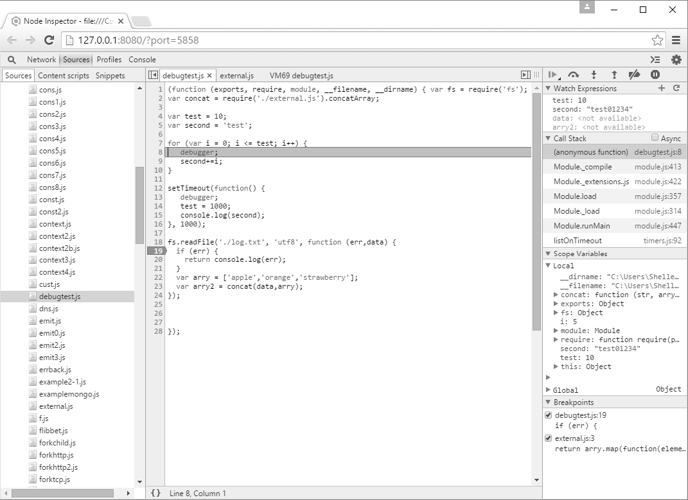

### 11.1.2　Node检查器

如果你已经准备好在调试更进一步，就需要使用Node检查器（Node Inspector）。Node检查器集成了你所熟悉的所有调试功能，它使用了Blink DevTools调试器来达到这一目的，而这个调试器可以在Chrome或者Opera中使用。这个工具的好处是它的功能增加了一定程度的复杂性，而且它还有可视化调试界面。不足之处则在于它对操作系统有一定的要求。比如说，要在我的Windows 10计算机上运行它，这个程序会告诉我必须要安装.Net Framework 2.0 SDK或者Microsoft Visual Studio 2005。

> 
> **安装Node检查器**
> 如果你遇到了Visual Studio相关的错误，你可以尝试用下面的命令改变程序所使用的Visual Studio的版本：

```python
npm install -g node-inspector --msvs_version=2013
```

> 或者不管你安装了哪个版本，直接用就行了。

如果你的环境已经准备好，可以使用下面的命令安装Node检查器：

```python
npm install -g node-inspector
```

使用下面这个命令来运行你的程序，就可以使用Node检查器。需要注意的是，

使用Node检查器时，你的程序必须加上文件名后缀.js：

```python
node-debug application.js
```

接下来有可能会发生两种情况。如果你的默认浏览器就是Chrome或者Opera，那么你的程序会在开发者工具中开始运行。否则你需要手动地打开这两个浏览器中的一个，然后提供给浏览器一个URL。

> 
> **Node检查器文档**
> Node检查器在它自己的GitHub代码库中有一些文档。这个工具的维护者——Strongloop，也提供了一些关于Node检查器的文档。文档中提到，你也可以通过查看Chrome Developer Tools的文档来获得所需要的帮助。但是要注意，Google会经常改变文档的位置，而且文档随时都有可能过期或者处于尚未完成的状态。

我在Node检查器中打开了上一节使用的debugtest.js文件。图11-1展示了调试器的界面，此时我已经单击了位于右上角的运行按钮，文件刚刚被加载。Node检查器支持 `debugger` 命令，因此这是程序的第一个断点。控制程序运行的按钮下面，就是我们设置的变量监视器。


<center class="my_markdown"><b class="my_markdown">图11-1　使用Node检查器调试器来运行debugtest.js</b></center>

设置新的断点从此变得简单，你只要在需要设置断点的那一行代码的左侧留白处单击鼠标左键就可以了。要添加新的监视器，在Watch Expression（监控表达式）标题处单击加号（+）就可以了。监视器上方的程序控制命令区域包含了可以让你控制程序的各项功能：运行至下一断点、跳过函数、进入函数、离开函数、清空断点、暂停程序等。

这个神奇的可视化界面还带来了一些新特性，包括左侧窗口的程序和模块列表、右侧窗口的调用栈、作用域变量（包括局部变量和全局变量）列表和断点设置窗口等。如果我们需要在引入的模块（external.js）中设置断点，只需要在左侧的文件列表中打开文件，然后插入一个断点就可以了。图11-2展示了一个加载了模块并停在断点处的调试器。


<center class="my_markdown"><b class="my_markdown">图11-2　加载了external.js并且停在断点处的Node检查器</b></center>

有趣的是，如果你注意观察被Node检查器加载的程序，你会发现它被一个匿名函数封装起来了，正如我们在3.1.1节中所讲的那样。

使用结束之后，按下Ctrl-C键就可以关闭浏览器并且结束批处理操作了。

> 
> **更复杂的工具**
> 内置调试器和Node检查器都提供了足够的功能来帮你调试Node程序。除此之外，如果你愿意花时间去配置环境，并且熟练使用一个更复杂的集成开发环境（IDE），你也可以在经典的Eclipse IDE中使用工具来调试，比如Nodeclipse。

