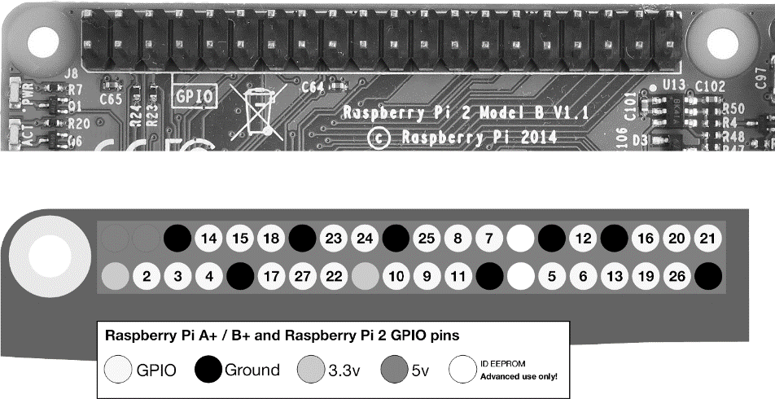

### 12.1　三星的IoT和GPIO

三星创建了IoT.js（一个Node的变体），以及一个JavaScript版本的IoT技术——JerryScript。从它的文档来看，新变体的主要目的是开发一种工具和技术，它可以运行在内存比传统JavaScript/Node环境少一些的设备上。

在一个三星员工的演示文稿附带的图表中，可以看到JerryScript的完整实现只有200KB，其内存占用量仅为16 KB～64 KB。相对而言，V8的可执行文件有10 MB，且内存占用为8 MB。当你在IoT设备上工作时，每一块空间和内存都很重要。

在IoT.js的文档中，你会发现它所支持的功能是Node核心模块的部分（如Buffer、HTTP、Net和文件系统（File System））的。考虑到其应用场景，缺少一些模块（如Crypto模块）支持也能理解。IoT同时添加了一个新的模块：GPIO。它表示物理硬件的应用接口，是应用程序和物理设备之间的桥梁。

GPIO是通用输入/输出（general-purpose input/output）的缩写。它表示集成电路中的引脚，可以是输入或输出，其行为由我们创建的应用程序控制。GPIO引脚为设备提供了一个接口。作为输入，它们可以从诸如温度或运动传感器的设备接收信息；作为输出，它们可以控制灯、触摸屏、电机、旋转设备等。

在诸如树莓派的设备上（在12.3节中会详细介绍），一侧有一组引脚，其中大部分是GPIO引脚，同时伴有接地和电源引脚散布其间。图12-1是实际的引脚照片，图12-1中的下图是一个逻辑引脚图，显示了树莓派2 Model B上的GPIO、电源和接地引脚。

<b class="my_markdown">图12-1　树莓派2中的引脚和相关的引脚图，由树莓派基金会提供，通过CC许可CC-BY-SA使用</b>

你可能会注意到，逻辑引脚图中的引脚号并不对应其电路板上的实际物理位置。引脚标签中的数字是GPIO编号。有些API（包括三星的IoT.js）在请求一个引脚号时会用到GPIO号码。

在使用三星IoT.js时，可以先初始化GPIO对象，然后调用其中一个函数，如gpio.setPen()，它将引脚号作为第一个参数，其他参数为方向（例如，'in'表示输入，'out'表示输出，'none'为释放）、可选模式和回调函数。要将数据发送到引脚，可以使用gpio.writePin()函数，参数为引脚号、一个布尔值和回调函数。

显然，三星IoT.js尚在开发。它似乎与三星众所周知的 SAMIO相冲突，SAMIO工具定义了一个数据交换平台，在监控火焰传感器时，它可以让Arduino和树莓派之间进行通信（请参阅相关教程），其中使用了Node。但是，它们都处于活跃的开发状态，我们保持关注即可。

> 
> **树莓派和Arduino**
> 我们将在12.3节中更详细地介绍树莓派和Arduino。

