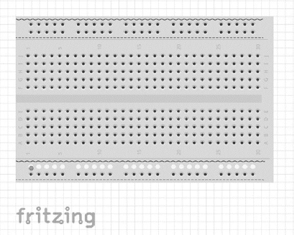
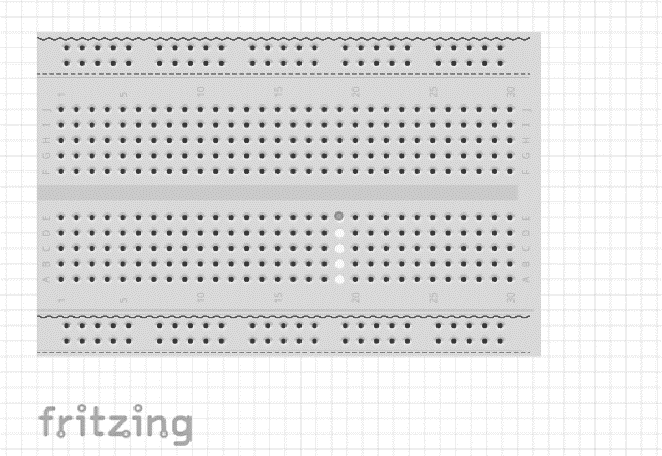
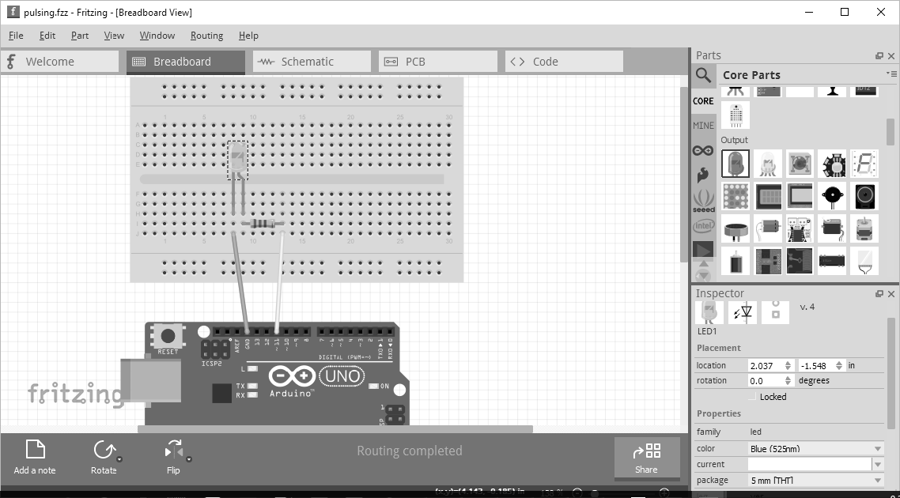
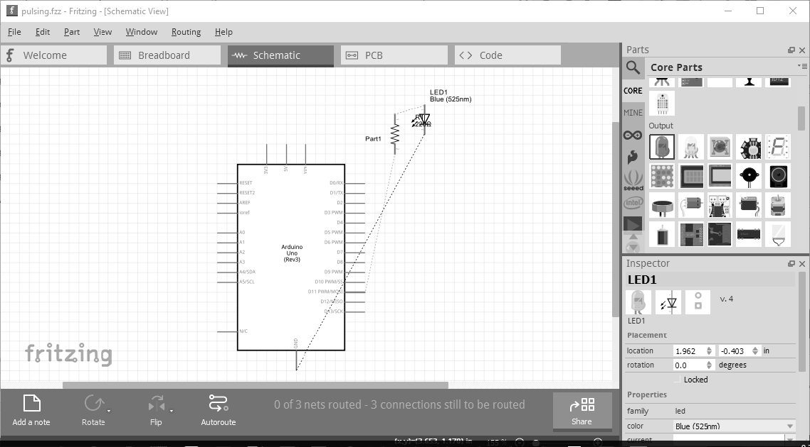
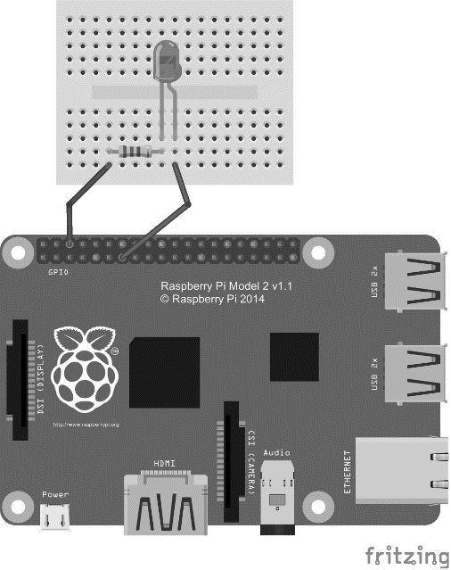

### 12.3.1　Fritzing

Fritzing是一款开源软件，它是一个可以用来设计原型的工具，并且可以通过Fritzing Fab实现该原型。这款软件是免费的（如果你觉得它还不错，我建议可以给它捐款）。如果你看到Arduino和树莓派项目的线路图，那么它们很有可能是用Fritzing画的。

> 
> **下载应用**
> 可以从Fritzing网站下载该程序。由于应用程序所需的图形组件数量庞大，所以它并不小。它提供了Windows、OS X或Linux版本的软件下载。

打开应用后你可以创建一个新的草图（也就是设计图），草图中会自动添加一个面包板。面包板是一种简单的电子元件项目的原型制作方法。有了它，就不需要焊接任何组件；你只要将电线的一端插入电路板引脚，将另一端插入面包板就够了。在面包板塑料的外壳下面是导电金属条，竖直方向的金属条（如果有的话）比较长，位于电源通道下面（如图12-2所示的高亮部分，用虚线和波浪线条表示），水平方向的金属条比较短，位于接线板下面（如图12-3所示）。接下来把所有项目所需的组件添加到面包板上。

<b class="my_markdown">图12-2　电源线高亮显示的面包板图</b>

<b class="my_markdown">图12-3　接线板高亮显示的面包板图</b>

> 
> **剖析面包板**
> 如果想要了解关于面包板更细节的信息，比如它的历史或它如何工作，我推荐SparkFun的“如何使用面包板”教程。

所有需要用到的组件都是从右侧的配件列表中拖拽过来的。在图12-4中，是我为下一节准备的Arduino控制LED闪烁的示例草图。其中包括一个从右边拖过来的Arduino Uno、一个一半尺寸的面包板、两根连接线、一个电阻和一个可以改变颜色（从红色变成蓝色）的LED灯（也是从配件列表拖拽过来的）。右下角有详细的配件描述信息。你可以手动编辑所有组件的信息，包括面包板（比如从全尺寸修改为一半尺寸）。

<b class="my_markdown">图12-4　Arduino脉冲项目的Fritzing草图</b>

创建导线时，点击Arduino的引脚，并从该引脚拖拽到面包板上需要连接的地方即可。Fritzing会自动加上导线。每一个组件都可以通过从配件列表中拖拽从而添加到草图上。为了确保电路的准确和完整，你还可以查看项目的电路图，如图12-5所示。

LED有两条“腿”，叫作引线，一条较长一条较短。在LED的图标中，较长的引线显示为弯曲状态，它是正极（阳极）引线，而较短的引线则是负极（阴极）引线。在草图中，负极引线接入Arduino的地线，而正极引线接入11号引脚。

一条导线通过接地的引脚连接到面包板上。LED的负极（阴极）连接到面包板上接地线的那一列。电阻的一条引线连接到面包板上接入LED阳极的那一列。最后，还有一根导线连接电阻的另一条引线和Arduino的第11号引脚，这样就形成回路了。

<b class="my_markdown">图12-5　Arduino脉冲项目的电路图</b>

电阻是一个新组件。顾名思义，它的作用是“阻挡电流”。如果回路没有电阻（整个电路是一个回路），LED很可能会消耗太多电量，从而损坏GPIO引脚和电路板。

电阻的单位是欧姆（符号为Ω，简称欧），上图中的电阻是220Ω。通过电阻上的标签就可以知道它是多少欧的。回路中不同类型的电阻可以通过频带上的不同颜色（以及频带的数量）来区分。

> 
> **电位**
> 如何知道该用哪个电阻呢？答案就是“欧姆定律”。没错，你在学校学到的物理知识现在终于能用上了。

LED是极化的，也就是说它有方向。所以它连接到面包板（和回路）上的方式很重要（正极接地）。不过电阻可不是极化的，所以它的连接方向无所谓。而且，电阻也不是必须接在LED后面。就像图12-2中所展示的，电阻也可以接在LED之前。因为这个回路很简单，所以只要其中包含一个电阻就够了。电阻接在LED之前的Fritzing草图如图12-6所示（这个图中使用了树莓派，该项目会在第12.3.3节中详细介绍）。

以上只是一些电路图元件的简单介绍，但这些足够应付后面两节中的例子了。

<b class="my_markdown">图12-6　树莓派LED项目的Fritzing草图</b>

