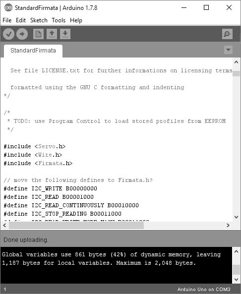
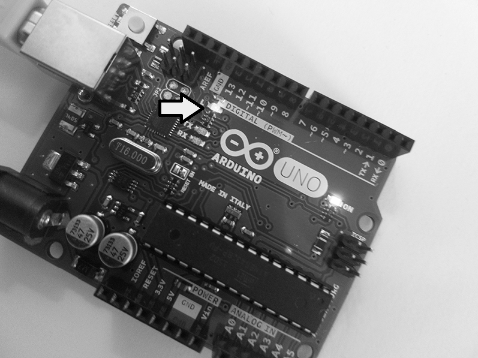
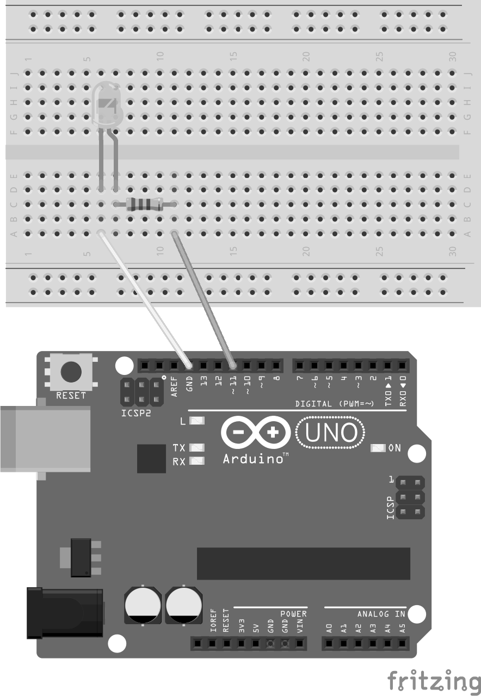
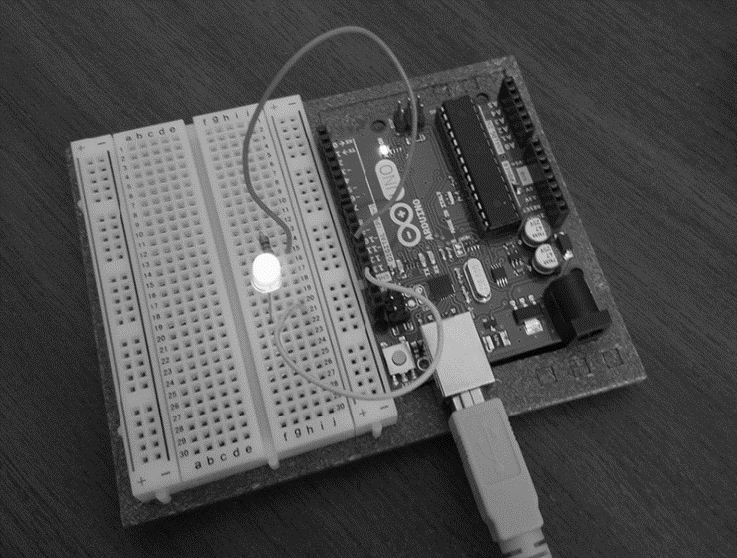

### 12.3.2　Node和Arduino

在使用Arduino云编程之前，需要在计算机上安装Arduino软件。我用的软件版本是1.7.8，操作系统是Windows 10。操作系统还有OS X和Linux的版本。Arduino网站上有非常具体的安装指南，可以参考。安装好之后，将Arduino通过USB线连接到计算机上，注意连接电路板的串行端口（对我而言是COM3）。

使用Node之前，还需要将Firmata上传到Arduino上。Firmata是一个微控制器通信协议，通过该协议，可以让计算机或手持设备通过软件对其进行控制。在Arduino应用中，选择File→Examples→Firmata→StandardFirmata。图12-7显示了加载到Arduino应用中的Firmata。窗口顶部有一个向右箭头。单击它可以将Firmata上传到Arduino。

Node和JavaScript都不是Arduino或树莓派上的默认（甚至不是常用的）编程语言（常用的是Python）。不过，有一个叫作Johnny-Five的Node框架却能让我们在这些设备上编程。使用如下方式在Node中安装它：

```python
npm install johnny-five
```

Johnny-Five网站不仅提供了用于控制电路板的扩展API描述，而且还有一些示例，其中包括被当作“Hello World”的LED闪烁应用程序。与Johnny-Five网站提供的示例不同（直接将LED连接到Arduino云的引脚上），在这里我们试着让嵌入电路板中的LED闪烁。我们可以用13号引脚访问该LED。


<center class="my_markdown"><b class="my_markdown">图12-7　在Arduino中使用Node之前必须上传Firmata</b></center>

下面的代码实现了让嵌入电路板中的LED闪烁（或者接入13号引脚的外接LED）：

```python
var five = require("johnny-five");
var board = new five.Board();
board.on("ready", function() {
  var led = new five.Led(13);
  led.blink(500);
});
```

这个软件会加载Johnny-Five模块并创建一个新的电路板，用来代表Arduino。有了电路板之后，该软件会创建一个新的LED，连接到Arduino的13号引脚上。注意，这里的引脚号跟GPIO不一样，Johnny-Five使用了一个物理编号系统，可以反映卡上标记的针脚位置。创建LED对象之后，它的blink()函数会被调用。图12-8展示了最终结果。（箭头所指位置为LED。）

程序运行时会打开一个REPL。输入 **.exit**  可以终止程序，即停止LED闪烁。如果在停止程序的时候LED灯是亮着的，需要断电才能让它熄灭掉。


<center class="my_markdown"><b class="my_markdown">图12-8　接入Arduino云13号引脚的LED灯闪烁效果</b></center>

> **安全！安全！安全！**
> IoT本身很有意思，如果你没有炸掉电路板或者计算机的话。
> 说真的，只要你按照说明操作，还是可以轻松、安全地使用大多数IoT和小设备上的应用的。这也是为什么在挑选和连接元器件时要仔细检查电路图。
> 保持工作环境的清洁和整洁也很重要，尽量用光线强烈的灯，确保在触摸任何电子设备（而你自己是接地状态）之前，你没有穿着袜子在尼龙地毯上走过（袜子和尼龙摩擦可能会产生静电），更换组件之前一定要给设备断电，工作时尽量不要让宠物或者小孩待在旁边。同时，我建议不要把咖啡杯放在电路板旁边。
> 如果家里有小孩子，最好在工作结束后把电子元件都收起来。因为除电路板之外，很多电子元件都比较小，可能被孩子误吞下去，LED长着一个看起来好像可以吃的样子。不过对于大一点的孩子来说，硬件项目是一个很好的实践，至于多大的孩子才能独立做项目，我想大家都知道这个常识。
> 如果你不像我一样戴眼镜，在工作时最好戴一副工作眼镜来保护自己。
> 其实电子器件一般会自带一些保护措施。比如Arduino云上有板载调节器，可以防止那些看上去毫无危险的小设备烧了你的计算机。不过电路板本身还是很容易损坏的。虽然它们很便宜，但也不是说烧坏一个电路板或者搞坏引脚就无所谓。
> 想了解更多内容，可以访问StackExchange网站。

闪烁的LED的确很有意思，不过现在我们有了闪亮的新玩具（程序本身），来看看它是怎么运作的。LED对象提供了一些很有意思的功能，比如pulse()和fadeIn()。不过，这些功能需要脉宽调制（PWM）引脚，也称为模拟输出。13引脚不是PWM。不过11号引脚是，这一点可以从该引脚前面的波浪号（～）看出来。

首先拔下电路板，然后拿一个面包板、LED灯、220Ω的电阻和两根导线。大多数套件应该都包含这些组件。

把电路板摆正，让“Arduino”这个单词正面朝上。最上面是一排引脚。将一根导线连到接地的引脚上（在电路板上用CND标出）。将第二根导线连到标有“~11”的引脚上。至于Arduino旁边的面包板，仿照Fritzing草图（如图12-9所示）将剩下的电子元件接到面包板上。完成后，将Arduino电路板接回去。


<center class="my_markdown"><b class="my_markdown">图12-9　Arduino云脉冲项目的Fritzing草图</b></center>

例12-1中的程序通过 `REPL.inject()` 函数向REPL暴露了一些函数。也就是说我们可以在REPL中控制电路板了。只要输入函数名就能实现调用，比如用 `on()` 打开灯，用 `fadeOut ()` 以淡出的形式关灯。

还有一些像 `pulse()` 、 `fadeIn()` 和 `fadeOut()` 这样的函数，需要使用模拟输出引脚。程序中使用了一个动画来模拟 `pulse()` 函数。想要停止动画，在REPL中输入 ** **stop()** ** 即可，同时还会有“Animation stopped”的消息。停止动画后你还需要关闭LED灯。一定要在关闭LED之前停止动画，否则动画是不会自己停止的。

**例12-1　通过程序与REPL的交互控制LED**

```python
var five = require("johnny-five");
var board = new five.Board();
board.on("ready", function() {
  console.log("Ready event. Repl instance auto-initialized!");
  var led = new five.Led(11);
  this.repl.inject({
    // Allow limited on/off control access to the
    // Led instance from the REPL.
    on: function() {
      led.on(); 
    }, 
    off: function() {
      led.off();
    },
strobe: function() {
    led.strobe(1000);
},
pulse: function() {
    led.pulse({
           easing: "linear",
           duration: 3000,
           cuePoints: [0, 0.2, 0.4, 0.6, 0.8, 1],
           keyFrames: [0, 10, 0, 50, 0, 255],
           onstop: function() {
               console.log("Animation stopped");
           }
        });
}, 
stop: function() {
    led.stop();
},
fade: function() {
    led.fadeIn();
},
fadeOut: function() {
    led.fadeOut();
}
  });
});
```

用Node运行程序：

```python
node fancyblinking
```

在看到“Ready event…”消息后，就可以输入命令了。下面这个例子可以让LED开始闪烁：

```python
>> strobe()
```

输入 `stop()` 就可以停止闪烁效果，输入 `off()` 彻底关掉LED。接着可以试试更加炫酷的 `pulse()` 、 `fade()` 和 `fadeOut()` 。图12-10是LED闪烁的画面（虽然很难通过静态图片来展示跳动效果，不过相信我，它真的生效了）。


<center class="my_markdown"><b class="my_markdown">图12-10　Arduino云脉冲项目</b></center>

一旦掌握了LED的闪烁，就可以试试关于Node和Arduino的其他程序了：

+ 使用Arduino、Node和Plotly进行实时温度记录；
+ Node.js中的Arduino试验指导中有很多不错的项目，以及相应的解决方案；
+ 用Arduino和Node控制一艘汽艇；
+ 除了Johnny-Five，你还可以试试Cylon Arduino模块；
+ 使用HTML5中的游戏手柄API来控制玩具汽车；
+ 如何通过Arduino控制飞利浦灯（添加运动传感器）。

上面这些程序可以够你忙上几个月了。树莓派给IoT中引入了一个全新的维度，我们会在下一节讲解。

