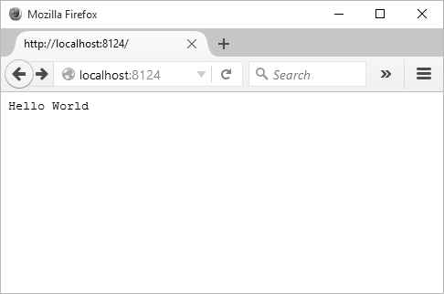
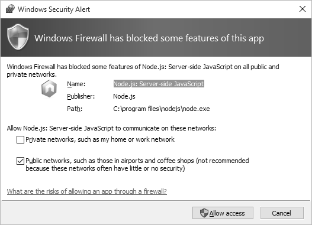

[toc]

### 1.2.1　一个基本的 Hello World 程序

让我们先来看看 Node 官方文档中的 “Hello, World” 程序。用你最喜欢的文本编辑器（我在 Windows 中用 notepad++，在 Linux 中用 Vim ）创建一个文本文件，然后把下面这段 JavaScript 代码复制进去。

```python
var http = require('http');
http.createServer(function (request, response) {
  response.writeHead(200, {'Content-Type': 'text/plain'});
  response.end('Hello World\n');
}).listen(8124);
console.log('Server running at http://127.0.0.1:8124/
');
```

然后将文件保存为 `hello.js` 。要运行这个程序，在 OSX 或者 Linux 中需要打开一个终端（terminal），在 Windows 下则需要打开 Node 命令行窗口。切换到文件所在的目录，然后输入这行命令就可以运行程序了。

```python
node hello.js
```

程序通过 `console.log()` 函数调用将执行结果打印到命令行。

```python
Server running at http://127.0.0.1:8124/
```

然后打开浏览器，在地址栏中输入 **http://localhost:8124/** 或者 **http://127.0.0.1:8124** （如果是在自己的服务器上运行这个程序，也可以输入你自己的域名）。此时浏览器中应该显示一个简单朴素的 Web 页面，页面顶上有 “Hello World” 字样，如图1-1所示。

如果你是在 Windows 上面运行这个程序，那你很有可能会收到一个 Windows 防火墙的警告信息，如图1-2所示。取消公用网络，选择私人网络，然后单击“允许访问”按钮。


<center class="my_markdown"><b class="my_markdown">图1-1　你的第一个Node程序</b></center>


<center class="my_markdown"><b class="my_markdown">图1-2　在Windows中设置允许访问Node程序</b></center>

Windows 会记住你的选择，所以这个操作做一次就够了。

要退出这个程序，你可以直接关掉终端或者命令行窗口（命令行窗口其实也是终端），也可以按 <kbd>Ctrl</kbd>+<kbd>C</kbd> 组合键。因为我们的程序是从终端前台运行的，所以其实除了按 <kbd>Ctrl</kbd>+<kbd>C</kbd>组合键之外，你也没办法输入别的命令，同时关掉终端意味着 Node 进程也会被关闭。

> 
> **如何获取稳定的Node运行环境**
> 就现在而言，在终端前台运行 Node 没什么问题。你正在学习如何使用这个工具，但你不希望你的应用程序被其他人使用，而且希望在结束使用的时候可以终止它。我们会在第 11 章讲到如何创建一个更为稳定的 Node 运行环境。

回到我们的 Hello World 程序，JavaScript 为我们创建了一个 Web 服务，我们在浏览器中访问它时，会显示包含 “Hello World” 的 Web 页面。在这个例子中我们使用了 Node 的好几个关键模块。

首先，它包含了运行一个简单的 HTTP 服务器所必需的模块：一个以 HTTP 命名的模块。Node 的非核心功能是通过不同的模块来引入的。这些模块会对外暴露其特有的功能，这些功能可以被程序或者另外一个模块引用，就像你在其他编程语言中用过的类库一样。

```python
var http = require('http');
```

> 
> **Node 模块、核心模块和 HTTP 模块**
> HTTP 模块是 Nodev的核心模块之一，讲解核心模块是本书的主要内容。我会在第 3 章深入地讲解Node 模块和模块管理，然后在第 5 章讲解 HTTP 模块。

这个模块是通过 Node 的 `require` 声明引入的，其结果被赋值到一个局部变量。引入完成之后，我们就可以用这个局部变量来实例化Web服务，即 `http.createServer()` 函数。在函数的参数中，我们用到了回调函数（见例1-1），这是构成 Node 的基本概念之一。匿名函数会把 Web 端的请求（request）和响应（response）传递给对应的代码，如此一来就可以方便地处理请求并生成对应的响应了。

**例1-1　Hello World回调函数**

```python
http.createServer(function (request, response) { 
  response.writeHead(200, {'Content-Type': 'text/plain'}); 
  response.end('Hello World\n'); 
}).listen(8124);
```

JavaScript 是单线程的。那么 Node 是如何在单线程环境下模拟一个异步环境的呢？答案是事件循环（event loop），也就是通过在特定事件被触发时，调用相关的回调函数来完成。在例 1-1中，只要接收到一个 Web 请求，回调函数就会被执行。

创建 Web 服务的函数调用完成之后， `console.log()` 会将消息打印到终端中。此时程序本身并不会结束或是阻塞，而是在等待接受 Web 请求。

```python
console.log('Server running at http://127.0.0.1:8124/
');
```

> 
> **关于事件循环和回调函数**
> 我会在第 2 章中讲解更多关于 Node 事件循环、它对异步编程的支持以及回调函数的内容。

Web 服务被创建，并且接收到一个 Web 请求之后，回调函数就会向浏览器发送一个纯文本的响应头（response header）和 200 的状态码（status code），然后发送 Hello World 这段信息，最后结束响应。

恭喜！你通过短短几行代码就用 Node 创建了第一个 Web 服务。但是，这远远不够，除非你唯一的兴趣就是向世界问好（Hello World!）。在本书中你将会学习如何写出更有用的 Node 程序，但是在结束Hello World 的练习之前，让我们在这个基本程序上面做一点修改，让它变得更有意思。

