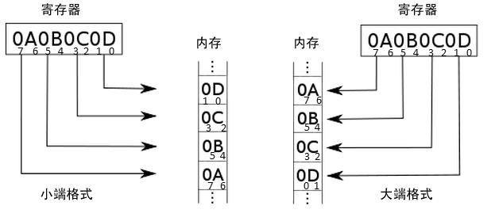

[toc]

### 2.2.2　缓冲器操作

你可以通过一系列类型化的方法，以指定的偏移量来对缓冲器进行读写。下面的代码片段中有一些使用了这些方法的例子。该例将4个无符号8位整数写入了缓冲器，然后将它们读出，并且打印：

```python
var buf = new Buffer(4);
// write values to buffer
buf.writeUInt8(0x63,0);
buf.writeUInt8(0x61,1);
buf.writeUInt8(0x74,2);
buf.writeUInt8(0x73,3);
// now print out buffer as string
console.log(buf.toString());
```

把以上代码复制到一个文件中，你就可以在自己的计算机上测试了。你也可以使用 `buffer.readUInt8()` 方法将所有8位整数读取出来。

Node支持对无符号和有符号的8位、16位、32位的整数进行读写，也支持对浮点型和双精度浮点型的读写。除了8位整数，你可以选择使用大端格式（big-endian）或者小端格式（little-endian）来读取。下面是Node支持的一部分方法。

+ `buffer.readUIntLE()` ：使用小端格式读取缓冲器中某位置的数据。
+ `buffer.writeUInt16BE()` ：使用大端格式向某位置写入无符号16位整数。
+ `buffer.readFlostLE()` ：使用小端格式读取某位置的浮点数。
+ `buffer.writeDoubleBE()` ：使用大端格式向某位置写入64位双精度浮点数。

> **字节序**
> 字节序指的是数据被存储的格式：如果最高位被存储在最低的内存地址上，我们称之为大端格式；如果最低位被存储在最低的内存地址上，我们称之为小端格式。
> 图2-1引用于维基百科的字节序词条，很好地展示了两种格式之间的区别。
> 
>
> <center><b>图2-1　展示了大端格式和小端格式的区别（图片由维基百科提供）</b></center>

你也可以直接使用数组赋值的形式来写入8位整数：

```python
var buf = new Buffer(4);
buf[0] = 0x63;
buf[1] = 0x61;
buf[2] = 0x74;
buf[3] = 0x73;
```

除了以特定的偏移量向缓冲器中读取和写入数据之外，你还可以使用 `buffer. slice()` 从一个旧的缓冲器中取出部分内容来创建一个新的缓冲器。这个功能最有趣的一点是，修改新缓冲器的内容，旧的缓冲器里面的内容也会随之变化。例2-3演示了如何操作：首先使用字符串创建一个缓冲器，取出缓冲器中的部分数据来创建一个新的缓冲器，然后修改新缓冲器中的内容。最后将两个缓冲器都打印到控制台，你就能看到原缓冲器也被修改了。

**例2-3　展示新的缓冲器的修改如何影响到旧的缓冲器**

```python
var buf1 = new Buffer('this is the way we build our buffer');
var lnth = buf1.length;
// create new buffer as slice of old
var buf2 = buf1.slice(19,lnth);
console.log(buf2.toString()); // build our buffer
//modify second buffer
buf2.fill('*',0,5);
console.log(buf2.toString()); // ***** our buffer
// show impact on first buffer
console.log(buf1.toString()); // this is the way we ***** our buffer
```

如果你想测试两个缓冲器是否相等，可以使用 `buffer.equals()` 方法：

```python
if (buf1.equals(buf2)) console.log('buffers are equal');
```

你还可以使用 `buffer.copy()` 函数将一个缓冲器的内容复制到另外一个里面去。可以全部复制，也可以部分复制，取决于你使用的参数。要注意的是，如果第二个缓冲器不够大，你可能只能复制第二个缓冲器能装下的部分：

```python
var buf1 = new Buffer('this is a new buffer with a string');
// copy buffer
var buf2 = new Buffer(10);
buf1.copy(buf2);
console.log(buf2.toString()); // this is a
```

若想比较两个缓冲器，可以使用 `buffer.compare ()` 。这个方法的返回值表示两个缓冲器在词汇方面更大还是更小。如果后者更大，则返回–1，前者更大，则返回1。要是两个缓冲器内容相同，则返回0。

```python
var buf1 = new Buffer('1 is number one');
var buf2 = new Buffer('2 is number two');
var buf3 = new Buffer(buf1.length);
buf1.copy(buf3);
console.log(buf1.compare(buf2)); // -1
console.log(buf2.compare(buf1)); // 1
console.log(buf1.compare(buf3)); // 0
```

还有一个 `Buffer` 类叫作 `SlowBuffer` 。当你需要将一个比较小的缓冲器中的内容保存较长时间的时候，你就需要用这个类。一般情况下，对于比较小的缓冲器（大小不超过4KB），Node会从一个预分配的内存块中创建它们。这样，垃圾回收机制就不需要担心这些小的内存块中的内容了。

`SlowBuffer` 这个类允许你在预分配的内存块中创建小缓冲器，并且保存很长时间。可以想象，这种用法会导致明显的性能问题。所以，不到万不得已的时候，不要用它。

