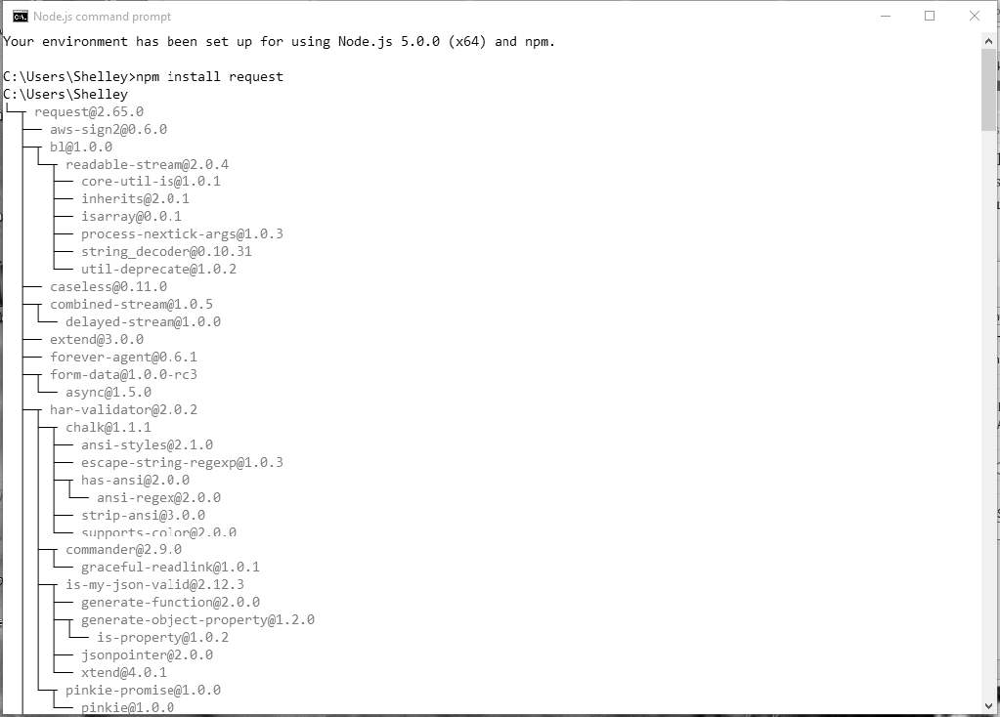

[toc]

### 3.2　NPM的深度挖掘

很多与Node相关的强大功能都是通过第三方模块引入的，如路由器模块、用于处理关系或文档数据库系统的模块、模板模块、测试模块，甚至用于支付网关的模块等。

> 
> **GitHub**
> 虽然不是强制要求，但是我们鼓励开发人员最好把他们自己编写的模块上传到GitHub。

要使用模块，你可以下载源代码，然后手动将其安装到应用程序环境中。大多数模块提供了基本的安装说明，或者至少可以通过检查模块中包含的文件和目录来推断安装要求。但是，安装Node模块有一个更简单的方法：使用npm。

> 
> 关于npm更详细的信息请见官方网站。你可以在npm官方网站中获取npm文档。

npm会随Node一起安装，但并不总是最新版。如果要使用不同版本的npm，请使用以下命令更新版本（如果环境允许的话，请使用sudo）：

```python
npm install npm -g
```

升级之前要注意：如果你用的npm版本和你的同事不一样，那么可能会出现一些奇怪的问题。

以下命令可以获取npm命令的详细说明：

```python
$ npm help npm
```

模块可以被安装在全局环境或本地环境中。如果你正在开发一个独立的项目，而这个系统的其他用户不需要访问该模块，那么本地安装是最好的方法。默认情况下，本地安装将模块安装在当前目录下的node_modules文件夹中。

```python
$ npm install modulename
```

例如，要安装Request模块，则执行下面的命令：

```python
$ npm install request
```

npm不仅会安装Request，还会查找其依赖的所有模块，并一起安装。模块越复杂，需要安装的依赖就越多。图3-1显示了在我的机器上安装Request的部分依赖（当时使用的是Node 5.0.0）。


<center class="my_markdown"><b class="my_markdown">图3-1　Request模块的部分依赖</b></center>

安装模块后，你可以在本地目录的node_modules目录中找到该模块。所有的依赖项也都安装在该模块的node_modules目录中。看一下这个目录里面的文件，你就会明白，当你安装像Request这样的模块时，你的硬盘压力有多大。

如果要将模块安装到全局环境，需要用-g或者--global参数：

```python
$ npm install request -g
```

在Linux环境下，不要忘了在命令前面加上sudo：

```python
$ sudo npm install request –g
```

某些模块（包括命令行应用程序）可能必须使用全局安装。以上这些例子安装的都是已经在npm网站上注册的模块。除此之外，你还可以从文件系统的文件夹中安装一个模块，也可以从本地或通过URL获取的压缩包中安装：

```python
npm install http://somecompany.com/somemodule.tgz
```

如果对模块有版本要求，你可以安装指定版本的模块：

```python
npm install modulename@0.1 
```

甚至可以安装jQuery：

```python
npm install jquery
```

如果不再使用这个模块，可以卸载它：

```python
npm uninstall modulename
```

下面这条命令会让npm检查新的模块，如果发现了就会对本地的模块进行更新：

```python
npm update
```

你也可以单独更新一个模块：

```python
npm update modulename 
```

如果要更新npm本身，请运行：

```python
npm install npm –g
```

如果只是想检查是否有模块需要更新，请运行：

```python
npm outdated
```

另外，这条命令也可以针对单个模块使用。

要使用列表列出所有的模块和依赖，可以运行ls、la或者ll：

```python
npm ls
```

la和ll参数可以在结果中添加描述。比如Request有一个依赖是tunnel- agent@0.4.1（tunnel-agent的0.4.1版本）。那tunnel-agent又是什么？在命令行运行npm la request，就会列出所有的依赖，包括tunnel-agent和其他的细节信息：

```python
tunnel-agent@0.4.1
HTTP proxy tunneling agent. Formerly part of mikeal/request,
now a standalone module
git+https://github.com/mikeal/tunnel-agent.git
https://github.com/mikeal/tunnel-agent#readme
```

有时候输出的结果中会包含警告信息，比如未满足的依赖条件，或者对一个旧模块的依赖。要解决这些问题，就要安装所需的模块或其特定版本：

```python
npm install jsdom@0.2.0
```

你也可以直接加上-d参数来安装所有的依赖。比如，在模块目录中，输入以下命令：

```python
npm install –d
```

如果你要安装一个尚未被上传到npm模块库的模块版本，你可以直接从它的Git代码库中安装：

```python
npm install https://github.com/visionmedia/express/tarball/master
```

但是请注意，如果你安装了一个尚未发布的模块版本，然后执行一次npm update，那么已发布的版本就会覆盖你本地已经安装的版本。

> 
> **在Linux中通过PuTTY来使用npm**
> 如果你是在Windows中通过PuTTY来在Linux中使用Node和npm，那么你可能会注意到，使用npm的时候，程序的输出很奇怪：本来应该整齐地显示各种依赖的地方，显示出来的却都是乱码。
> 要解决这个问题，你需要让PuTTY对UTF-8编码进行翻译。在PuTTY中，单击窗口→翻译，然后在下拉菜单中选择UTF-8。

要查看安装在全局环境中的模块，请输入：

```python
npm ls –g
```

使用config命令可以让你了解到更多npm的安装信息。下面这条命令会列出npm的配置信息：

```python
npm config list
```

下面这条命令可以获得一个更详细的配置信息：

```python
npm config ls -l
```

你也可以通过命令行来编辑或者删除配置信息：

```python
npm config delete keyname 
npm config set keyname value 
```

也可以直接编辑配置文件：

```python
$ npm config edit
```

> 
> 我强烈建议你了解一下npm的配置信息，除非你非常清楚某个改动会造成什么影响。

你还可以使用你觉得最接近的关键字来搜索任何一个模块：

```python
npm search html5 parser
```

第一次搜索时，npm会花几分钟时间建立索引。结束之后，你会得到一个符合关键词的结果列表。

> 
> **当你遇到“registry error parsing json”错误**
> 使用npm时，如果得到“registry error parsing json”错误，那你可以尝试使用一个npm镜像来完成你要做的事情。

npm网站提供了一个模块仓库供浏览，还提供了一个最新的“被引用最多”的模块列表——即被其他模块或者Node应用程序使用最多的模块。下一节中，我会介绍几个这样的模块。

继续下面的内容之前我们再讲最后一个内容。当你第一次使用npm时，你可能会注意到输入内容中有一段警告信息。第一行告诉你没有找到package.json文件，其余的内容都是关于这个package.json文件的。

npm文档推荐我们创建一个package.json文件来维护本地的依赖。创建文件本身并不麻烦，但是警告信息确实有点烦人。

要在项目目录中创建一个默认的package.json文件，可以运行下面的命令：

```python
npm init ––yes
```

这条命令会问你一系列关于项目的基本信息，比如你的名字和项目的名字，而且都有默认值，然后它在目录中创建一个默认的package.json文件。从现在开始，安装模块时就不会有烦人的警告信息了。如果要补全信息，你需要在JSON文件中添加描述信息和代码库地址。另外，如果想每次安装新模块时，JSON文件中都会反映出修改，那可以运行这条命令：

```python
npm install request --save-dev
```

这条命令会将模块名称和版本号写入package.json文件中的devDependencies区域。你也可以将模块信息保存在产品环境的依赖区域，关于package.json文件的详细说明，我会在3.3节中讲到。

如果要自动保存依赖，你可以添加或修改npmrc文件。你可以为用户添加（~/.npmrc）、为项目添加（/path/project/.npmrc）、添加到全局（$PREFIX/etc/npmrc），或者使用内建的配置文件（/path/to/npm/npmrc）。运行下面的命令可以编辑设置文件从而自动保存依赖：

```python
npm config set save=true
npm config set save-exact=true
```

这个配置将会在你安装新模块时添加--save参数（将模块保存在依赖中）、--save-exact参数（保存精确版本，而不是npm的默认语义化的版本区间）。

npm有很多配置项可以使用，具体使用场景可以查看npm文档。

