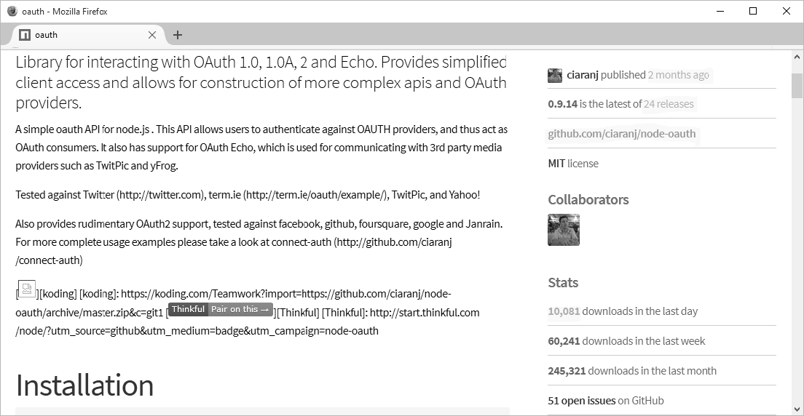

[toc]

### 3.4　探索Node模块以及3个必要模块

要查找Node模块一点都不难。你最容易接触到的就是朋友和同事介绍给你的模块。而要获取其他模块，你可以使用搜索引擎进行搜索，它们都会出现在搜索结果的最前面。

曾经有一段时间，在各个领域表现优秀的模块被手动展示在一个页面上。不过那是很久以前的事了。现在，如果你要查找模块，一般都可以直接在npm网站上找。你在这个网站上不仅能找到npm文档，还能找到一个可搜索的Node模块库。

如果你要查找一个支持OAuth协议的模块，可以在网站顶部的搜索栏中输入关键字（OAuth）进行搜索。结果中的第一个就是名为OAuth的模块，也是目前应用最广泛的OAuth模块——看一眼模块的统计数据就能发现。

关注一下模块的统计数据还是很有必要的。搜索Node模块时，最大的挑战就是很多模块已经停止维护了，或者并不是最佳选择。分辨一个模块是否还在维护，以及是否是被广泛使用的标准，就要查看页面右边的统计数据。图3-2就是一个例子，显示了OAuth模块的统计数据。

<b class="my_markdown">图3-2　OAuth模块的NPM统计数据</b>

请注意高亮显示的文字。可用的最新版本发布于几周之前，说明这个模块最近被更新过。这个模块历史上一共有24次更新，说明更新频率很高。最重要的数据则是下载数：每天超过10 000次下载。这个数据说明这个模块的使用频率非常高，也就意味着这个模块很好用，而且很有可能一直被维护着。

另外，你还可以访问该模块的GitHub主页，看看项目的问题（issues）。问题可以反映出开发者是否对报告的bug足够重视，也可以看看是不是有特别严重的bug导致模块无法使用（比如安全性问题）。

显然OAuth模块很可能既得到了不错的维护，又是同类模块中最好的。这并不是说没有其他更好的选择，但是在你进一步熟悉Node之前，最好还是使用那些被高频使用的Node模块。

说到最常用的模块，npm网站的首页就给出了目前最流行的Node模块列表。这个列表还包含获得是（star）最多的模块，以及被依赖最多的模块。后者指的是被作为依赖用在其他模块中的模块。在下面的内容中，我会讲解3个模块：Async、Commander和Underscore，这3个模块同时出现在了前面提到的两个列表中。这是我在本书中用到的其他模块的补充。

