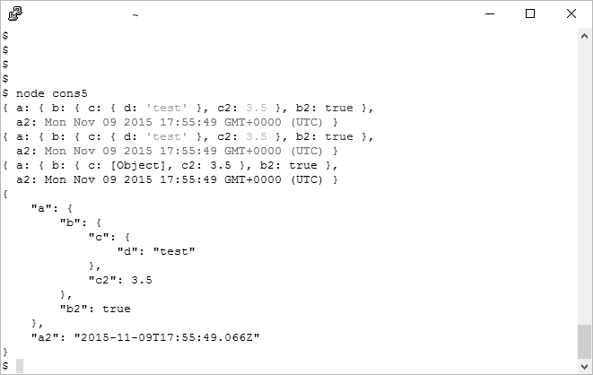

[toc]

### 4.5.2　使用util.format()和util.inspect()来格式化消息

`Console` 对象中的4个函数： `log()` 、 `warn()` 、 `error()` 和 `info()` 都可以接收任意类型的数据作为参数，甚至是对象。如果接收到的内容不是对象，也不是字符串，就会被强制转换成字符串。如果接收到的内容是一个对象，那么Node只会打印两级嵌套。如果需要更多信息，就要在对象上调用 `JSON.stringify()` ，从而打印出可读性更高且具有缩进的“树”：

```python
var test = { 
   a: { 
      b: { 
        c: { 
         d : 'test' 
        } 
      } 
   } 
} 
// only two levels of nesting are printed out
console.log(test);
// three levels of nesting are printed
var str = JSON.stringify(test, null, 3);
console.log(str);
```

上面这段代码的输出是：

```python
{ a: { b: { c: [Object] } } }
{
   "a": { 
      "b": { 
         "c": {
            "d": "test"
         } 
      } 
   }
}
```

如果要打印字符串，那么这4个函数都可以用类似于 `printf` 的格式进行格式化：

```python
var val = 10.5;
var str = 'a string';
console.log('The value is %d and the string is %s', val, str);
```

如果你需要处理的是函数参数，或者Web请求中的数据，那这种方式的好处就很明显了。它支持的格式化类型就是 `util.format()` 功能模块所支持的格式化类型，你也可以用它来直接创建字符串：

```python
var util = require('util');
var val = 10.5,
    str = 'a string';
var msg = util.format('The value is %d and the string is %s',val,str);
console.log(msg);
```

如果只需要一个函数，那么就用 `console.log()` 吧，因为它更简单。它提供的格式化选项有：

+ `%s` ，字符串；
+ `%d` ，数字（整形和浮点型）；
+ `%j` ，JSON，将循环引用部分替换为 `['circular']` ；
+ `%%` ，使用百分号。

多余的参数会被转化成字符串一并输出。如果参数不够，那么会打印相应的占位符：

```python
var val = 3; 
// results in 'val is 3 and str is %s'
console.log('val is %d and str is %s', val);
```

并不是只有这4个函数可以用来提供反馈， `console.dir()` 也可以。

`console.dir()` 函数跟其他函数的不同之处在于，不管给它传入了什么对象，它都会传给 `util.inspect()` 。这个工具模块函数通过第二个参数 `options` 为对象的显示提供了更精确的控制。像 `util.format ()` ，它也可以直接使用。下面是一个例子：

```python
var test = { 
   a: { 
      b: { 
        c: { 
         d : 'test' 
        } 
      } 
   } 
}
var str = require('util').inspect(test, {showHidden: true, depth: 4 });
console.log(str);
```

对象会被解析，然后根据 `options` 参数转化为字符串并返回。支持的参数如下所述。

+ `showHidden` ：是否显示非枚举或符号属性（默认是 `false` ）。
+ `depth` ：对要显示的对象进行递归的次数（默认是2）。
+ `colors` ：如果是true，输出样式就会用ANSI颜色代码（默认是 `false` ）。
+ `customInspect` ：如果是 `false` ，那么被检查对象上的自定义 `inspect` 函数就不会被调用（默认是 `false` ）。

全局的颜色配置是定义在 `util.inspect.styles` 对象中的。所以你也可以修改颜色配置，目前使用的颜色配置可以用 `console.log()` 打印出来：

```python
var util = require('util');
console.log(util.inspect.styles);
console.log(util.inspect.colors);
```

例4-2中的应用程序在要打印的对象上添加了一个日期、一个数字和一个布尔值。此外，布尔值的颜色值从黄色变为蓝色，从而可以将其与数字区分开（默认情况下，它们都为黄色）。该对象用了各种方法来打印：用 `util.inspect ()` 处理后打印；使用相同的参数用 `console.dir()` 打印；用基本的 `console.log()` 打印，用 `JSON.stringify()` 处理后的结果打印。

**例4-2　使用不同的参数来打印一个对象**

```python
var util = require('util');
var today = new Date();
var test = { 
   a: { 
      b: { 
        c: { 
         d : 'test' 
        }, 
        c2 : 3.50 
      }, 
      b2 : true 
   }, 
   a2: today 
} 
util.inspect.styles.boolean = 'blue';
// output with util.inspect direct formatting
var str = util.inspect(test, {depth: 4, colors: true });
console.log(str);
// output using console.dir and options
console.dir(test, {depth: 4, colors: true});
// output using basic console.log
console.log(test);
// and JSON stringify
console.log(JSON.stringify(test, null, 4));
```

结果如图4-1所示，你可以看到颜色的改变。我在终端中用了白色的背景色和黑色的文字。


<center class="my_markdown"><b class="my_markdown">图4-1　终端中使用不同的格式进行字符串输出的截图</b></center>

> 
> `console.dir()` 函数支持 `util.inspect()` 中的3种属性： `showHidden` 、 `depth` 和 `colors` 。它不支持 `customInspect` 。如果将 `customInspect` 属性设为 `true` ，意味着这个对象会提供自己的检查函数。

