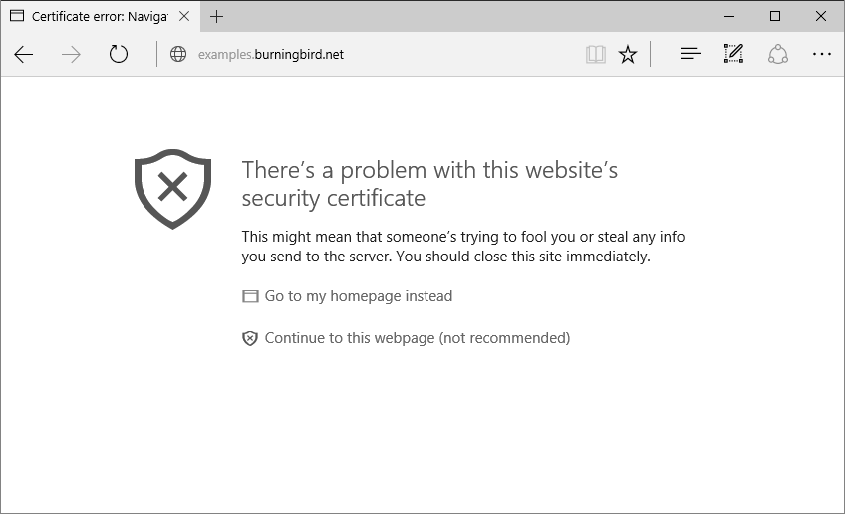
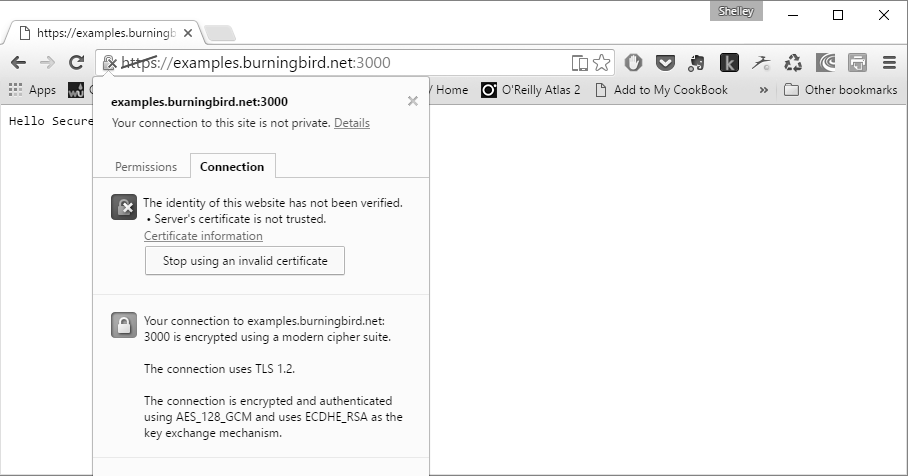

### 7.2.2　使用HTTPS

要求用户登录或提供信用卡信息的网页都应以HTTPS形式提供。否则，你的数据将以明文传输，并且很容易被窃取。HTTPS是HTTP协议与SSL相结合的产物，目的在于确保网站的正确性，并且确保数据在传输过程中被加密，且没有任何篡改。

添加对HTTPS的支持的方法和添加对HTTP的支持的方法很类似，只是多了一个提供公钥和签名证书的选项。HTTPS服务器的默认端口也不同：HTTP默认情况下使用80端口，而HTTPS使用443端口。

> 
> **避免使用端口号**
> 在Node应用程序中使用SSL的一个优点是HTTPS的默认端口是443，这意味着你在访问应用程序时不必指定端口号，并且不会与Apache或其他Web服务器冲突。当然，除非你还使用非Node的Web服务器。

例7-7演示了一个非常基础的HTTPS服务器。它只是将传统的Hello World消息稍加改变发送到浏览器。

**例7-7　创建一个简单的HTTPS服务**

```python
var  fs = require("fs"),
     https = require("https");
var privateKey = fs.readFileSync('site.key').toString();
var certificate = fs.readFileSync('final.crt').toString();
var options = {
   key: privateKey,
   cert: certificate
};
https.createServer(options, function(req,res) {
   res.writeHead(200);
   res.end("Hello Secure World\n");
}).listen(443);
```

程序会打开公钥和证书，并同步读取其中的内容。读取到的数据被加入 `options` 对象中，然后作为 `https.createServer` 方法中传入的第一个参数。而这个方法的回调函数，就是我们早已用过的那个以服务器请求和响应对象作为参数的回调函数。

运行Node应用程序时，你需要使用root权限。这是因为服务器需要绑定到默认的443端口。绑定到任何小于1024的端口都需要root权限。你可以使用其他端口（如3000）来运行它，它也可以正常工作。但访问该站点时，你需要明确指定该端口：

```python
https://examples.burningbird.net:3000
```

如图7-1所示，访问这个页面就能看到使用自签名证书时的情况。这也就不难理解为什么只有在测试期间才能使用自签名证书，而使用localhost访问页面就会隐藏安全警告。


<center class="my_markdown"><b class="my_markdown">图7-1　这是当我们使用Edge来访问一个使用自签名证书的HTTPS网站时会显示的内容</b></center>

如图7-2所示，浏览器地址栏会以另外一种方式来表示不能信任站点证书。一个锁表示该站点是通过HTTPS访问的，而一个带有×的锁，表示证书不被信任。单击图标将打开一个信息窗口，其中包含有关证书的更多详细信息。


<center class="my_markdown"><b class="my_markdown">图7-2　在Chrome中，单击锁图标时，更多关于证书的信息会被显示出来</b></center>

再次强调，使用可信的证书颁发机构颁发的可信证书，就可以消除所有警告。而且，由于我们现在有免费的证书选项，你可以考虑为所有的Web应用程序部署HTTPS，而不仅仅是那些处理支付或密码的应用程序。

