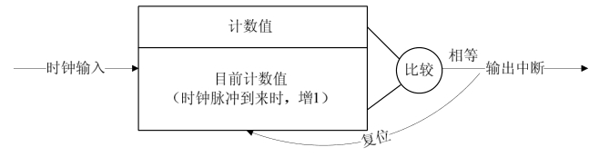

### 10.1 中断与定时器

所谓中断是指CPU在执行程序的过程中，出现了某些突发事件急待处理，CPU必须暂停执行当前的程序，转去处理突发事件，处理完毕后CPU又返回原程序被中断的位置并继续执行。

根据中断的来源，中断可分为内部中断和外部中断，内部中断的中断源来自CPU内部（软件中断指令、溢出、除法错误等，例如，操作系统从用户态切换到内核态需借助CPU内部的软件中断），外部中断的中断源来自CPU外部，由外设提出请求。

根据中断是否可以屏蔽分为可屏蔽中断与不屏蔽中断（NMI），可屏蔽中断可以通过屏蔽字被屏蔽，屏蔽后，该中断不再得到响应，而不屏蔽中断不能被屏蔽。

根据中断入口跳转方法的不同，分为向量中断和非向量中断。采用向量中断的CPU通常为不同的中断分配不同的中断号，当检测到某中断号的中断到来后，就自动跳转到与该中断号对应的地址执行。不同中断号的中断有不同的入口地址。非向量中断的多个中断共享一个入口地址，进入该入口地址后再通过软件判断中断标志来识别具体是哪个中断。也就是说，向量中断由硬件提供中断服务程序入口地址，非向量中断由软件提供中断服务程序入口地址。

一个典型的非向量中断服务程序如代码清单10.1所示，它先判断中断源，然后调用不同中断源的中断服务程序。

代码清单10.1 非向量中断服务程序典型结构

1 irq_handler() 
 
 2 { 
 
 3 ... 
 
 4 int int_src = read_int_status(); /*读硬件的中断相关寄存器*/ 
 
 5 switch (int_src) {/*判断中断源*/ 
 
 6 case DEV_A: 
 
 7 dev_a_handler(); 
 
 8 break; 
 
 9 case DEV_B: 
 
 10 dev_b_handler(); 
 
 11 break; 
 
 12 ... 
 
 13 default: 
 
 14 break; 
 
 15 } 
 
 16 ... 
 
 17 }

嵌入式系统以及X86 PC中大多包含可编程中断控制器（PIC），许多MCU内部就集成了PIC。如在80386中，PIC是两片i8259A芯片的级联。通过读写PIC的寄存器，程序员可以屏蔽/使能某中断及获得中断状态，前者一般通过中断MASK寄存器完成，后者一般通过中断PEND寄存器完成。

定时器在硬件上也依赖中断来实现，图10.1所示为典型的嵌入式微处理内可编程间隔定时器（PIT）的工作原理，它接收一个时钟输入，当时钟脉冲到来时，将目前计数值增1并与预先设置的计数值（计数目标）比较，若相等，证明计数周期满，产生定时器中断并复位目前计数值。

