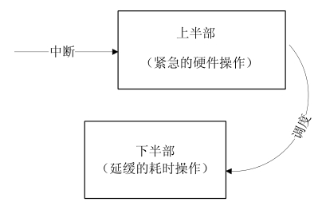

### 10.2 Linux中断处理程序架构

设备的中断会打断内核中进程的正常调度和运行，系统对更高吞吐率的追求势必要求中断服务程序尽可能的短小精悍。但是，这个良好的愿望往往与现实并不吻合。在大多数真实的系统中，当中断到来时，要完成的工作往往并不会是短小的，它可能要进行较大量的耗时处理。

图10.2描述了Linux内核的中断处理机制。为了在中断执行时间尽可能短和中断处理需完成大量工作之间找到一个平衡点，Linux将中断处理程序分解为两个半部：顶半部（top half）和底半部（bottom half）。

顶半部完成尽可能少的比较紧急的功能，它往往只是简单地读取寄存器中的中断状态并清除中断标志后就进行“登记中断”的工作。“登记中断”意味着将底半部处理程序挂到该设备的底半部执行队列中去。这样，顶半部执行的速度就会很快，可以服务更多的中断请求。

现在，中断处理工作的重心就落在了底半部的头上，它来完成中断事件的绝大多数任务。底半部几乎做了中断处理程序所有的事情，而且可以被新的中断打断，这也是底半部和顶半部的最大不同，因为顶半部往往被设计成不可中断。底半部则相对来说并不是非常紧急的，而且相对比较耗时，不在硬件中断服务程序中执行。

尽管顶半部、底半部的结合能够改善系统的响应能力，但是，僵化地认为Linux设备驱动中的中断处理一定要分两个半部则是不对的。如果中断要处理的工作本身很少，则完全可以直接在顶半部全部完成。

其他操作系统中对中断的处理也采用了类似于Linux的方法，真正的硬件中断服务程序都应该尽可能短。因此，许多操作系统都提供了中断上下文和非中断上下文相结合的机制，将中断的耗时工作保留到非中断上下文去执行。例如，在VxWorks中，网络设备包接收中断到来后，中断服务程序会通过netJobAdd()函数将耗时的包接收和上传工作交给tNetTask任务去执行。

在Linux中，查看/proc/interrupts文件可以获得系统中中断的统计信息，在单处理器的系统中，第1列是中断号，第2列是向CPU0产生该中断的次数，之后的是对于中断的描述。

Cpuo 
 
 0: 135253 XT-PIC timer 
 
 1: 22 XT-PIC i8042 
 
 2: 0 XT-PIC cascade 
 
 8: 1 XT-PIC rtc 
 
 10: 108 XT-PIC eth0 
 
 11: 3707 XT-PIC BusLogic BT-958 
 
 12: 313 XT-PIC i8042 
 
 15: 4 XT-PIC idel 
 
 NMI: 0 
 
 ERR: 0

