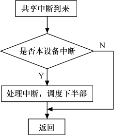

### 10.4 中断共享

多个设备共享一根硬件中断线的情况在实际的硬件系统中广泛存在，Linux 2.6支持这种中断共享。下面是中断共享的使用方法。

（1）共享中断的多个设备在申请中断时，都应该使用IRQF_SHARED标志，而且一个设备以IRQF_SHARED申请某中断成功的前提是该中断未被申请，或该中断虽然被申请了，但是之前申请该中断的所有设备也都以IRQF_SHARED标志申请该中断。

（2）尽管内核模块可访问的全局地址都可以作为request_irq(…, void *dev_id)的最后一个参数dev_id，但是设备结构体指针显然是可传入的最佳参数。

（3）在中断到来时，会遍历执行共享此中断的所有中断处理程序，直到某一个函数返回IRQ_HANDLED。在中断处理程序顶半部中，应迅速地根据硬件寄存器中的信息比照传入的dev_id参数判断是否是本设备的中断，若不是，应迅速返回IRQ_NONE，如图10.3所示。

代码清单10.8给出了使用共享中断的设备驱动程序的模板（仅包含与共享中断机制相关的部分）。

代码清单10.8 共享中断编程模板

1 /*中断处理顶半部*/ 
 
 2 irqreturn_t xxx_interrupt(int irq, void *dev_id, struct pt_regs *regs) 
 
 3 { 
 
 4 ... 
 
 5 int status = read_int_status();/*获知中断源*/ 
 
 6 if(!is_myint(dev_id,status)) /*判断是否是本设备中断*/ 
 
 
 7 return IRQ_NONE; /* 
 不是本设备中断，立即返回 
 */ 
 
 8 
 
 
 9 /* 是本设备中断，进行处理 */ 
 
 10 ... 
 
 
 11 return IRQ_HANDLED; /* 
 返回 
 IRQ_HANDLED 
 表明中断已被处理 
 */ 
 
 12 }

13 
 
 14 /*设备驱动模块加载函数*/ 
 
 15 int xxx_init(void) 
 
 16 { 
 
 17 ... 
 
 18 /*申请共享中断*/ 
 
 19 result = request_irq(sh_irq, xxx_interrupt, 
 
 
 20 
 IRQF_SHARED, "xxx", xxx_dev); 
 
 21 ... 
 
 22 } 
 
 23 
 
 24 /*设备驱动模块卸载函数*/ 
 
 25 void xxx_exit(void) 
 
 26 { 
 
 27 ... 
 
 28 /*释放中断*/ 
 
 29 free_irq(xxx_irq, xxx_interrupt); 
 
 30 ... 
 
 31 }

