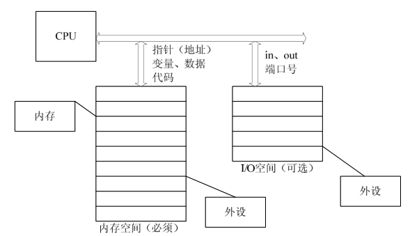

### 11.1.1 内存空间与I/O空间

在X86处理器中存在着I/O空间的概念，I/O空间是相对于内存空间而言的，它通过特定的指令in、out来访问。端口号标识了外设的寄存器地址。Intel语法的in、out指令格式如下：

IN 累加器, {端口号│DX} 
 
 OUT {端口号│DX},累加器

目前，大多数嵌入式微控制器如ARM、PowerPC等中并不提供I/O空间，而仅存在内存空间。内存空间可以直接通过地址、指针来访问，程序和程序运行中使用的变量和其他数据都存在于内存空间中。

内存地址可以直接由C语言指针操作，例如在186处理器中执行如下代码：

unsigned char *p = (unsigned char *)0xF000FF00; 
 
 *p=11;

以上程序的意义为在绝对地址0xF0000+0xFF00（186处理器使用16位段地址和16位偏移地址）写入11。

而在ARM、PowerPC等未采用段地址的处理器中，p指向的内存空间就是0xF000FF00，而*p = 11就是在该地址写入11。

再如，186处理器启动后会在绝对地址0xFFFF0（对应C语言指针是0xF000FFF0，0xF000为段地址，0xFFF0为段内偏移）执行，请看下面的代码：

typedef void (*lpFunction) ( ); /* 定义一个无参数、无返回类型的函数指针类型*/ 
 
 lpFunction lpReset = (lpFunction)0xF000FFF0; /* 定义一个函数指针，指向*/ 
 
 /* CPU启动后所执行第一条指令的位置 */ 
 
 lpReset(); /* 调用函数 */

在以上程序中，没有定义任何一个函数实体，但是程序中却执行了这样的函数调用：lpReset()，它实际上起到了“软重启”的作用，跳转到CPU启动后第一条要执行的指令的位置。因此，可以通过函数指针调用一个没有函数体的“函数”，本质上只是换一个地址开始执行。

即便是在X86处理器中，虽然提供了I/O空间，如果由我们自己设计电路板，外设仍然可以只挂接在内存空间。此时，CPU可以像访问一个内存单元那样访问外设I/O端口，而不需要设立专门的I/O指令。因此，内存空间是必须的，而I/O空间是可选的。图11.1给出了内存空间和I/O空间的对比。

