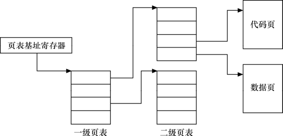
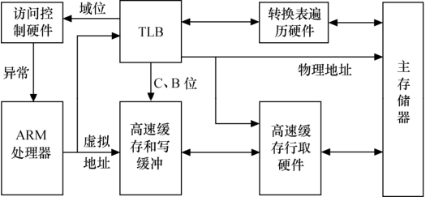

### 11.1.2 内存管理单元MMU

高性能处理器一般会提供一个内存管理单元（MMU），该单元辅助操作系统进行内存管理，提供虚拟地址和物理地址的映射、内存访问权限保护和Cache缓存控制等硬件支持。操作系统内核借助MMU，可以让用户感觉到好像程序可以使用非常大的内存空间，从而使得编程人员在写程序时不用考虑计算机中的物理内存的实际容量。

为了理解基本的MMU操作原理，需先明晰几个概念。

（1）TLB：Translation Lookaside Buffer，即转换旁路缓存，TLB是MMU的核心部件，它缓存少量的虚拟地址与物理地址的转换关系，是转换表的Cache，因此也经常被称为“快表”。

（2）TTW：Translation Table walk，即转换表漫游，当TLB中没有缓冲对应的地址转换关系时，需要通过对内存中转换表（大多数处理器的转换表为多级页表，如图11.2所示）的访问来获得虚拟地址和物理地址的对应关系。TTW成功后，结果应写入TLB。

图11.3给出了一个典型的ARM处理器访问内存的过程，其他处理器也执行类似过程。当ARM要访问存储器时，MMU先查找TLB中的虚拟地址表。如果ARM的结构支持分开的数据TLB （DTLB）和指令TLB（ITLB），则除取指令使用ITLB外，其他的都使用DTLB。ARM处理器的MMU如图11.3所示。

若TLB中没有虚拟地址的入口，则转换表遍历硬件从存放于主存储器中的转换表中获取地址转换信息和访问权限（即执行TTW），同时将这些信息放入TLB，它或者被放在一个没有使用的入口或者替换一个已经存在的入口。之后，在TLB条目中控制信息的控制下，当访问权限允许时，对真实物理地址的访问将在Cache或者在内存中发生，如图11.4所示。

ARM中的TLB条目中的控制信息用于控制对对应地址的访问权限以及Cache的操作。

● C（高速缓存）和B（缓冲）位被用来控制对应地址的高速缓存和写缓冲，并决定是否高速缓存。

● 访问权限和域位用来控制读写访问是否被允许。如果不允许，则MMU将向ARM处理器发送一个存储器异常，否则访问将被允许进行。

上述描述的MMU机制针对的虽然是ARM处理器，但PowerPC、MIPS等其他处理器也均有类似的操作。

MMU具有虚拟地址和物理地址转换、内存访问权限保护等功能，这将使得Linux操作系统能单独为系统的每个用户进程分配独立的内存空间并保证用户空间不能访问内核空间的地址，为操作系统的虚拟内存管理模块提供硬件基础。

Linux内核使用了三级页表PGD、PMD和PTE，对于许多体系结构而言，PMD这一级实际上只有一个入口。代码清单11.1给出了一个典型的从虚拟地址得到PTE的页表查询（page table walk）过程。

代码清单11.1 Linux的三级页表与页表查询

1 static int walk_page_tables(struct mm_struct *mm, 
 
 2 unsigned long address, 
 
 3 pte_t *pte_ret) 
 
 4 { 
 
 5 pgd_t *pgd; 
 
 6 pmd_t *pmd; 
 
 7 pte_t *ptep; 
 
 8 #ifdef HAVE_PUD_T 
 
 9 pud_t *pud; 
 
 10 #endif 
 
 11 
 
 12 pgd = pgd_offset(mm, address); 
 
 13 if (pgd_none(*pgd) || unlikely(pgd_bad(*pgd))) 
 
 14 goto out; 
 
 15 
 
 16 #ifdef HAVE_PUD_T 
 
 17 pud = pud_offset(pgd, address); 
 
 18 if (pud_none(*pud) || unlikely(pud_bad(*pud))) 
 
 19 goto out; 
 
 20 
 
 21 pmd = pmd_offset(pud, address); 
 
 22 #else 
 
 23 pmd = pmd_offset(pgd, address); 
 
 24 #endif 
 
 25 if (pmd_none(*pmd) || unlikely(pmd_bad(*pmd))) 
 
 26 goto out; 
 
 27 ptep = pte_offset_map(pmd, address); 
 
 28 if (!ptep) 
 
 29 goto out; 
 
 30 
 
 31 *pte_ret = *ptep; 
 
 32 pte_unmap(ptep);

33 
 
 34 return 0; 
 
 35 out: 
 
 36 return -1; 
 
 37 }

第1行的类型为struct mm_struct的参数mm用于描述Linux进程所占有的内存资源。上述代码中的pgd_offset、pmd_offset分别用于得到一级页表和二级页表的入口，最后通过pte_offset_map得到目标页表项。

但是，MMU并非对所有处理器都是必须的，例如常用的SAMSUNG基于ARM7TDMI系列的S3C44B0X不附带MMU，新版的Linux 2.6支持不带MMU的处理器。在嵌入式系统中，仍存在大量无MMU的处理器，Linux 2.6为了更广泛地应用于嵌入式系统，融合了mClinux，以支持这些MMU-less系统，如Dragonball、ColdFire、Hitachi H8/300、Blackfin等。

