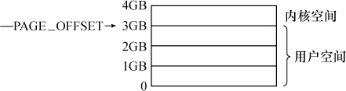
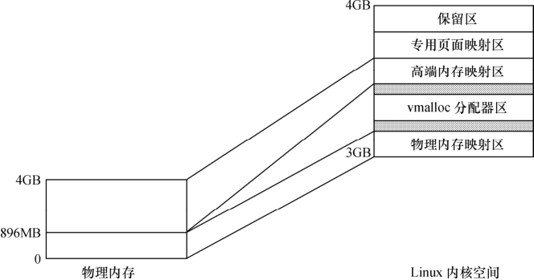

### 11.2 Linux内存管理

对于包含MMU的处理器而言，Linux系统提供了复杂的存储管理系统，使得进程所能访问的内存达到4GB。

在Linux系统中，进程的4GB内存空间被分为两个部分—用户空间与内核空间。用户空间地址一般分布为0～3GB（即PAGE_OFFSET，在0x86中它等于0xC0000000），这样，剩下的3～4GB为内核空间，如图11.5所示。用户进程通常情况下只能访问用户空间的虚拟地址，不能访问内核空间虚拟地址。用户进程只有通过系统调用（代表用户进程在内核态执行）等方式才可以访问到内核空间。

每个进程的用户空间都是完全独立、互不相干的，用户进程各自有不同的页表。而内核空间是由内核负责映射，它并不会跟着进程改变，是固定的。内核空间地址有自己对应的页表，内核的虚拟空间独立于其他程序。

Linux中1GB的内核地址空间又被划分为物理内存映射区、虚拟内存分配区、高端页面映射区、专用页面映射区和系统保留映射区这几个区域，如图11.6所示。

一般情况下，物理内存映射区最大长度为896MB，系统的物理内存被顺序映射在内核空间的这个区域中。当系统物理内存大于896MB时，超过物理内存映射区的那部分内存称为高端内存（而未超过物理内存映射区的内存通常被称为常规内存），内核在存取高端内存时必须将它们映射到高端页面映射区。

Linux保留内核空间最顶部FIXADDR_TOP～4GB的区域作为保留区。

紧接着最顶端的保留区以下的一段区域为专用页面映射区（FIXADDR_START～FIXADDR_ TOP），它的总尺寸和每一页的用途由fixed_address枚举结构在编译时预定义，用_ _fix_to_virt(index)可获取专用区内预定义页面的逻辑地址。其开始地址和结束地址宏定义如下：

#define FIXADDR_START (FIXADDR_TOP - _ _FIXADDR_SIZE) 
 
 #define FIXADDR_TOP ((unsigned long)_ _FIXADDR_TOP) 
 
 #define _ _FIXADDR_TOP 0xfffff000

接下来，如果系统配置了高端内存，则位于专用页面映射区之下的就是一段高端内存映射区，其起始地址为PKMAP_BASE，定义如下：

#define PKMAP_BASE ( (FIXADDR_BOOT_START - PAGE_SIZE*(LAST_PKMAP + 1)) & PMD_MASK )

其中所涉及的宏定义如下：

#define FIXADDR_BOOT_START (FIXADDR_TOP - _ _FIXADDR_BOOT_SIZE) 
 
 #define LAST_PKMAP PTRS_PER_PTE 
 
 #define PTRS_PER_PTE 512 
 
 #define PMD_MASK (~(PMD_SIZE-1)) 
 
 # define PMD_SIZE (1UL << PMD_SHIFT) 
 
 #define PMD_SHIFT 21

在物理区和高端映射区之间为虚存内存分配区（VMALLOC_START～VMALLOC_END），用于vmalloc()函数，它的前部与物理内存映射区有一个隔离带，后部与高端映射区也有一个隔离带，vmalloc区域定义如下：

#define VMALLOC_OFFSET (8*1024*1024) 
 
 #define VMALLOC_START (((unsigned long) high_memory + 
 
 vmalloc_earlyreserve + 2*VMALLOC_OFFSET-1) & ~(VMALLOC_OFFSET-1))

#ifdef CONFIG_HIGHMEM /*支持高端内存*/ 
 
 # define VMALLOC_END (PKMAP_BASE-2*PAGE_SIZE) 
 
 #else /*不支持高端内存*/ 
 
 # define VMALLOC_END (FIXADDR_START-2*PAGE_SIZE) 
 
 #endif

当系统物理内存超过4GB时，必须使用CPU的扩展分页（PAE）模式所提供的64位页目录项才能存取到4GB以上的物理内存，这需要CPU的支持。加入了PAE功能的Intel Pentium Pro及其后的CPU允许内存最大可配置到64GB，具备36位物理地址空间寻址能力。

由此可见，在3～4GB之间的内核空间中，从低地址到高地址依次为：物理内存映射区—隔离带—vmalloc虚拟内存分配器 — 隔离带—高端内存映射区—专用页面映射区—保留区。

