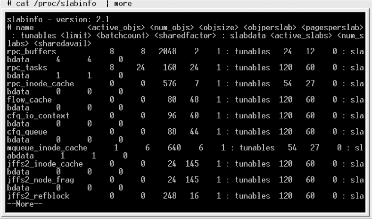

### 11.3.2 内核空间内存动态申请

在Linux内核空间申请内存涉及的函数主要包括kmalloc()、_ _get_free_pages()和vmalloc()等。kmalloc()和_ _get_free_pages()（及其类似函数）申请的内存位于物理内存映射区域，而且在物理上也是连续的，它们与真实的物理地址只有一个固定的偏移，因此存在较简单的转换关系。而vmalloc()在虚拟内存空间给出一块连续的内存区，实质上，这片连续的虚拟内存在物理内存中并不一定连续，而vmalloc()申请的虚拟内存和物理内存之间也没有简单的换算关系。

#### 1．kmalloc()

void *kmalloc(size_t size, int flags);

给kmalloc()的第一个参数是要分配的块的大小，第二个参数为分配标志，用于控制kmalloc()的行为。

最常用的分配标志是GFP_KERNEL，其含义是在内核空间的进程中申请内存。kmalloc()的底层依赖_ _get_free_pages()实现，分配标志的前缀GFP正好是这个底层函数的缩写。使用GFP_ KERNEL标志申请内存时，若暂时不能满足，则进程会睡眠等待页，即会引起阻塞，因此不能在中断上下文或持有自旋锁的时候使用GFP_KERNE申请内存。

在中断处理函数、tasklet和内核定时器等非进程上下文中不能阻塞，此时驱动应当使用GFP_ATOMIC标志来申请内存。当使用GFP_ATOMIC标志申请内存时，若不存在空闲页，则不等待，直接返回。

其他的相对不常用的申请标志还包括GFP_USER（用来为用户空间页分配内存，可能阻塞）、GFP_HIGHUSER（类似GFP_USER，但是从高端内存分配）、GFP_NOIO（不允许任何I/O初始化）、GFP_NOFS（不允许进行任何文件系统调用）、_ _GFP_DMA（要求分配在能够DMA的内存区）、_ _GFP_HIGHMEM（指示分配的内存可以位于高端内存）、_ _GFP_COLD（请求一个较长时间不访问的页）、_ _GFP_NOWARN（当一个分配无法满足时，阻止内核发出警告）、_ _GFP_HIGH（高优先级请求，允许获得被内核保留给紧急状况使用的最后的内存页）、_ _GFP_REPEAT（分配失败则尽力重复尝试）、_ _GFP_NOFAIL（标志只许申请成功，不推荐）和_ _GFP_NORETRY（若申请不到，则立即放弃）。

使用kmalloc()申请的内存应使用kfree()释放，这个函数的用法和用户空间的free()类似。

#### 2．_ _get_free_pages ()

_ _get_free_pages()系列函数/宏是Linux内核本质上最底层的用于获取空闲内存的方法，因为底层的伙伴算法以page的2的n次幂为单位管理空闲内存，所以最底层的内存申请总是以页为单位的。

_ _get_free_pages()系列函数/宏包括get_zeroed_page()、_ _get_free_page()和_ _get_free_pages()。

get_zeroed_page(unsigned int flags);

该函数返回一个指向新页的指针并且将该页清零。

_ _get_free_page(unsigned int flags);

该宏返回一个指向新页的指针但是该页不清零，它实际上为：

#define _ _get_free_page(gfp_mask) \ 
 
 _ _get_free_pages((gfp_mask),0)

就是调用了下面的_ _get_free_pages()申请1页。

_ _get_free_pages(unsigned int flags, unsigned int order);

该函数可分配多个页并返回分配内存的首地址，分配的页数为2order，分配的页也不清零。order允许的最大值是10（即1 024页）或者11（即2 048页），依赖于具体的硬件平台。

_ _get_free_pages ()和get_zeroed_page ()的实现中调用了alloc_pages()函数，alloc_pages()既可以在内核空间分配，也可以在用户空间分配，其原型为：

struct page * alloc_pages(int gfp_mask, unsigned long order);

参数含义与_ _get_free_pages()类似，但它返回分配的第一个页的描述符而非首地址。

使用_ _get_free_pages()系列函数/宏申请的内存应使用下列函数释放：

void free_page(unsigned long addr); 
 
 void free_pages(unsigned long addr, unsigned long order);

如果申请和释放的order不一样，则会引起内存的混乱。

_ _get_free_pages等函数在使用时，其申请标志的值与kmalloc()完全一样，各标志的含义也与kmalloc()完全一致，最常用的是GFP_KERNEL和GFP_ATOMIC。

#### 3．vmalloc()

vmalloc()一般用在为只存在于软件中（没有对应的硬件意义）的较大的顺序缓冲区分配内存，vmalloc()远大于_ _get_free_pages()的开销，为了完成vmalloc()，新的页表需要被建立。因此，只是调用 vmalloc()来分配少量的内存（如1页）是不妥的。

vmalloc()申请的内存应使用vfree()释放，vmalloc()和vfree()的函数原型如下：

void *vmalloc(unsigned long size); 
 
 void vfree(void * addr);

vmalloc()不能用在原子上下文中，因为它的内部实现使用了标志为GFP_KERNEL的kmalloc()。

使用vmalloc函数的一个例子函数是create_module()系统调用，它利用vmalloc()函数来获取被创建模块需要的内存空间。

#### 4．slab与内存池

一方面，完全使用页为单元申请和释放内存容易导致浪费（如果要申请少量字节也需要1页）；另一方面，在操作系统的运作过程中，经常会涉及大量对象的重复生成、使用和释放内存问题。在Linux系统中所用到的对象，比较典型的例子是inode、task_struct等。如果我们能够用合适的方法使得在对象前后两次被使用时分配在同一块内存或同一类内存空间且保留了基本的数据结构，就可以大大提高效率。slab算法就是针对上述特点设计的。实际上kmalloc()即是使用slab机制实现的。

（1）创建slab缓存。

struct kmem_cache *kmem_cache_create(const char *name, size_t size, 
 
 size_t align, unsigned long flags, 
 
 void (*ctor)(void*, struct kmem_cache *, unsigned long), 
 
 void (*dtor)(void*, struct kmem_cache *, unsigned long));

kmem_cache_create()用于创建一个slab缓存，它是一个可以驻留任意数目全部同样大小的后备缓存。参数size是要分配的每个数据结构的大小，参数flags是控制如何进行分配的位掩码，包括SLAB_NO_REAP（即使内存紧缺也不自动收缩这块缓存）、SLAB_HWCACHE_ALIGN（每个数据对象被对齐到一个缓存行）、SLAB_CACHE_DMA（要求数据对象在DMA内存区分配）等。

（2）分配slab缓存。

void *kmem_cache_alloc(struct kmem_cache *cachep, gfp_t flags);

上述函数在kmem_cache_create()创建的slab后备缓冲中分配一块并返回首地址指针。

（3）释放slab缓存。

void kmem_cache_free(struct kmem_cache *cachep, void *objp);

上述函数释放由kmem_cache_alloc()分配的缓存。

（4）收回slab缓存。

int kmem_cache_destroy(struct kmem_cache *cachep);

代码清单11.2给出了slab缓存的使用范例。

代码清单11.2 slab缓存使用范例

1 /*创建slab缓存*/ 
 
 2 static kmem_cache_t *xxx_cachep; 
 
 3 xxx_cachep = kmem_cache_create("xxx", sizeof(struct xxx), 
 
 4 0, SLAB_HWCACHE_ALIGN|SLAB_PANIC, NULL, NULL); 
 
 5 /*分配slab缓存*/ 
 
 6 struct xxx *ctx; 
 
 7 ctx = kmem_cache_alloc(xxx_cachep, GFP_KERNEL); 
 
 8 .../* 使用slab缓存 */ 
 
 9 /*释放slab缓存*/ 
 
 10 kmem_cache_free(xxx_cachep, ctx); 
 
 11 kmem_cache_destroy(xxx_cachep);

在系统中通过/proc/slabinfo结点可以获知当前slab的分配和使用情况，例如在LDD6410开发板上运行“cat /proc/slabinfo”：

注意，slab不是要代替_ _get_free_pages()，其在最底层仍然依赖于_ _get_free_pages()，slab在底层每次申请1页或多页，之后再分隔这些页为更小的单元进行管理，从而节省了内存，也提高了slab缓冲对象的访问效率。

除了slab以外，在Linux内核中还包含对内存池的支持，内存池技术也是一种非常经典的用于分配大量小对象的后备缓存技术。

Linux内核中，与内存池相关的操作包括如下几种。

（1）创建内存池。

mempool_t *mempool_create(int min_nr, mempool_alloc_t *alloc_fn, 
 
 mempool_free_t *free_fn, void *pool_data);

mempool_create()函数用于创建一个内存池，min_nr参数是需要预分配对象的数目，alloc_fn 和free_fn是指向内存池机制提供的标准对象分配和回收函数的指针，其原型分别为：

typedef void *(mempool_alloc_t)(int gfp_mask, void *pool_data);

和

typedef void (mempool_free_t)(void *element, void *pool_data);

pool_data是分配和回收函数用到的指针，gfp_mask是分配标记。只有当_ _GFP_WAIT标记被指定时，分配函数才会休眠。

（2）分配和回收对象。

在内存池中分配和回收对象需由以下函数来完成：

void *mempool_alloc(mempool_t *pool, int gfp_mask); 
 
 void mempool_free(void *element, mempool_t *pool);

mempool_alloc()用来分配对象，如果内存池分配器无法提供内存，那么就可以用预分配的池。

（3）回收内存池。

void mempool_destroy(mempool_t *pool);

mempool_create()函数创建的内存池需由mempool_destroy()来回收。

