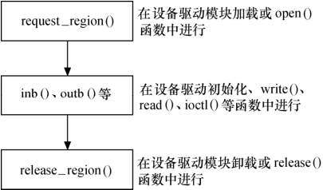
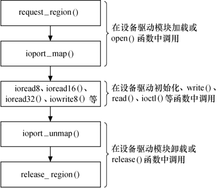
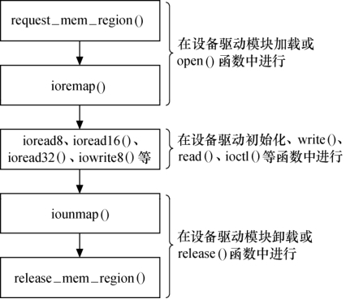

### 11.4.3 设备I/O端口和I/O内存访问流程

综合11.3节和本节的内容，可以归纳出设备驱动访问I/O端口和I/O内存的步骤。

I/O端口访问的一种途径是直接使用I/O端口操作函数：在设备打开或驱动模块被加载时申请I/O端口区域，之后使用inb()、outb()等进行端口访问，最后，在设备关闭或驱动被卸载时释放I/O端口范围。整个流程如图11.7所示。

I/O端口访问的另一种途径是将I/O端口映射为内存进行访问：在设备打开或驱动模块被加载时，申请I/O端口区域并使用ioport_map()映射到内存，之后使用I/O内存的函数进行端口访问，最后，在设备关闭或驱动被卸载时释放I/O端口并释放映射。整个流程如图11.8所示。

I/O内存的访问步骤如图11.9所示，首先是调用request_mem_region()申请资源，接着将寄存器地址通过ioremap()映射到内核空间虚拟地址，之后就可以通过Linux设备访问编程接口访问这些设备的寄存器了。访问完成后，应对ioremap()申请的虚拟地址进行释放，并释放release_mem_ region()申请的I/O内存资源。

