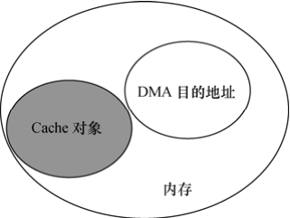
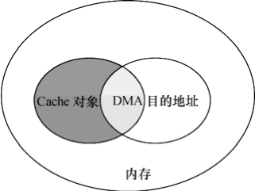
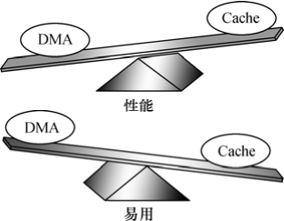

### 11.6.1 DMA与Cache一致性

Cache和DMA本身似乎是两个毫不相关的事物。Cache被用做CPU针对内存的缓存，利用程序的空间局部性和时间局部性原理，达到较高的命中率从而避免CPU每次都一定要与相对慢速的内存交互数据来提高数据的访问速率。DMA可以用做内存与外设之间传输数据的方式，这种传输方式之下，数据并不需要经过CPU中转。

假设DMA针对内存的目的地址与Cache缓存的对象没有重叠区域（如图11.10所示），DMA 和Cache之间将相安无事。但是，如果DMA的目的地址与Cache所缓存的内存地址访问有重叠（如图11.11所示），经过DMA操作，Cache缓存对应的内存的数据已经被修改，而CPU本身并不知道，它仍然认为Cache中的数据就是内存中的数据，以后访问Cache映射的内存时，它仍然使用陈旧的Cache数据。这样就发生Cache与内存之间数据“不一致性”的错误。

所谓Cache数据与内存数据的不一致性，是指在采用Cache的系统中，同样一个数据可能既存在于Cache中，也存在于主存中，Cache与主存中的数据一样则具有一致性，数据若不一样则具有不一致性。

需要特别注意的是，Cache与内存的一致性问题经常被初学者遗忘。在发生Cache与内存不一致性错误后，驱动将无法正常运行。如果没有相关的背景知识，工程师几乎无法定位错误的原因，因为看起来所有的程序都是完全正确的。

解决由于DMA导致的Cache一致性问题的最简单方法是直接禁止DMA目标地址范围内内存的Cache功能。当然，这将牺牲性能，但是却更可靠，图11.12所示为Cache和DMA在考虑性能和易用两个方面时处于跷跷板两端的比重。

Cache的不一致问题并非只是发生在DMA的情况下，实际上，还存在于Cache使能和关闭的时刻。例如，对于带MMU功能的ARM处理器，在开启MMU之前，需要先置Cache无效，TLB也是如此，代码清单11.15所给出的一段汇编被用来完成此任务。

代码清单11.15 置ARM的Cache无效

1 /* 使cache无效 */ 
 
 2 "mov r0, #0\n" 
 
 3 "mcr p15, 0, r0, c7, c7, 0\n" /* 使数据和指令cache无效 */ 
 
 4 "mcr p15, 0, r0, c7, c10, 4\n" /* 放空写缓冲 */ 
 
 5 "mcr p15, 0, r0, c8, c7, 0\n" /* 使TLB无效 */

