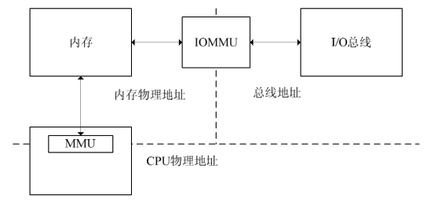
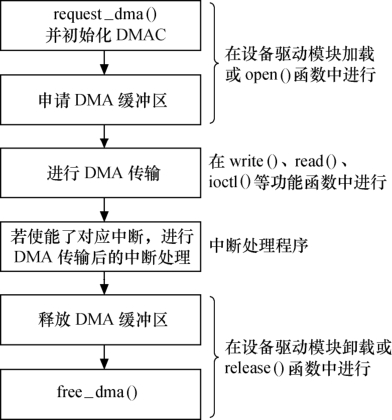

### 11.6.2 Linux下的DMA编程

首先DMA本身不属于一种等同于字符设备、块设备和网络设备的外设，它只是外设与内存交互数据的一种方式。因此，本节的标题不是“Linux下的DMA驱动”而是“Linux下的DMA编程”。

内存中用于与外设交互数据的一块区域被称做DMA缓冲区，在设备不支持scatter/gather（分散/聚集，简称SG）操作的情况下，DMA缓冲区必须是物理上连续的。

#### 1．DMA ZONE

对于X86系统的ISA设备而言，其DMA操作只能在16MB以下的内存中进行，因此，在使用kmalloc()和__get_free_pages()及其类似函数申请DMA缓冲区时应使用GFP_DMA标志，这样能保证获得的内存位于DMA_ZONE，是具备DMA能力的。

内核中定义了__get_free_pages()针对DMA的“快捷方式”_ _get_dma_pages()，它在申请标志中添加了GFP_DMA，如下所示：

#define _ _get_dma_pages(gfp_mask, order) \ 
 
 __get_free_pages((gfp_mask) | GFP_DMA,(order))

如果不想使用log2size即order为参数申请DMA内存，则可以使用另一个函数dma_mem_ alloc()，其源代码如代码清单11.16所示。

代码清单11.16 dma_mem_alloc()函数

1 static unsigned long dma_mem_alloc(int size) 
 
 2 {

3 int order = get_order(size);/* 大小->指数 */ 
 
 4 return _ _get_dma_pages(GFP_KERNEL, order); 
 
 5 }

对于大多数现代嵌入式处理器而言，DMA操作可以在整个常规内存区域进行，因此DMA ZONE就直接覆盖了常规内存。

#### 2．虚拟地址，物理地址和总线地址

基于DMA的硬件使用总线地址而非物理地址，总线地址是从设备角度上看到的内存地址，物理地址则是从CPU MMU控制器外围角度上看到的内存地址（从CPU核角度看到的是虚拟地址）。虽然在PC上，对于ISA和PCI而言，总线地址即为物理地址，但并非每个平台都是如此。因为有时候接口总线通过桥接电路被连接，桥接电路会将I/O地址映射为不同的物理地址。例如，在PReP（PowerPC Reference Platform）系统中，物理地址0在设备端看起来是0x80000000，而0通常又被映射为虚拟地址0xC0000000，所以同一地址就具备了三重身份：物理地址0、总线地址0x80000000及虚拟地址0xC0000000。还有一些系统提供了页面映射机制，它能将任意的页面映射为连续的外设总线地址。内核提供了如下函数用于进行简单的虚拟地址/总线地址转换：

unsigned long virt_to_bus(volatile void *address); 
 
 void *bus_to_virt(unsigned long address);

在使用IOMMU或反弹缓冲区的情况下，上述函数一般不会正常工作。而且，这两个函数并不建议使用。如图11.13所示，IOMMU的工作原理与CPU内的MMU非常类似，不过它针对的是外设总线地址和内存地址之间的转化。由于IOMMU可以使得外设DMA引擎看到“虚拟地址”，因此在使用IOMMU的情况下，在修改映射寄存器后，可以使得SG中分段的缓冲区地址对外设变得连续。

#### 3．DMA地址掩码

设备并不一定能在所有的内存地址上执行DMA操作，在这种情况下应该通过下列函数执行DMA地址掩码：

int dma_set_mask(struct device *dev, u64 mask);

例如，对于只能在24位地址上执行DMA操作的设备而言，就应该调用dma_set_mask (dev, 0xffffff)。

#### 4．一致性DMA缓冲区

DMA映射包括两个方面的工作：分配一片DMA缓冲区；为这片缓冲区产生设备可访问的地址。同时，DMA映射也必须考虑Cache一致性问题。内核中提供了以下函数用于分配一个DMA一致性的内存区域：

void * dma_alloc_coherent(struct device *dev, size_t size, dma_addr_t *handle, gfp_t gfp);

上述函数的返回值为申请到的DMA缓冲区的虚拟地址，此外，该函数还通过参数handle返回DMA缓冲区的总线地址。handle的类型为dma_addr_t，代表的是总线地址。

dma_alloc_coherent()申请一片DMA缓冲区，进行地址映射并保证该缓冲区的Cache一致性。与dma_alloc_coherent()对应的释放函数为：

void dma_free_coherent(struct device *dev, size_t size, void *cpu_addr, dma_addr_t handle);

以下函数用于分配一个写合并（writecombining）的DMA缓冲区：

void * dma_alloc_writecombine(struct device *dev, size_t size, dma_addr_t *handle, gfp_t gfp);

与dma_alloc_writecombine()对应的释放函数dma_free_writecombine()实际上就是dma_free_ coherent()，因为它定义为：

#define dma_free_writecombine(dev,size,cpu_addr,handle) \ 
 
 dma_free_coherent(dev,size,cpu_addr,handle)

此外，Linux内核还提供了PCI设备申请DMA缓冲区的函数pci_alloc_consistent()，其原型为：

void * pci_alloc_consistent(struct pci_dev *pdev, size_t size, dma_addr_t *dma_addrp);

对应的释放函数为pci_free_consistent()，其原型为：

void pci_free_consistent(struct pci_dev *pdev, size_t size, void *cpu_addr, 
 
 dma_addr_t dma_addr);

#### 5．流式DMA缓冲区

并非所有的DMA缓冲区都是驱动申请的，如果是驱动申请的，用一致性DMA缓冲区自然最方便，直接考虑了Cache一致性问题。但是，许多情况下，缓冲区来自内核的较上层（如网卡驱动中的网络报文、块设备驱动中要写入设备的数据等），上层很可能用的是普通的kmalloc()、__get_free_pages()等方法申请，这时候就要使用流式DMA映射。流式DMA缓冲区使用的一般步骤如下。

（1）进行流式DMA映射。

（2）执行DMA操作。

（3）进行流式DMA去映射。

流式DMA映射操作在本质上多数就是进行Cache的invalidate或flush操作，以解决Cache一致性问题。

相对于一致性DMA映射而言，流式DMA映射的接口较为复杂。对于单个已经分配的缓冲区而言，使用dma_map_single()可实现流式DMA映射，该函数原型为：

dma_addr_t dma_map_single(struct device *dev, void *buffer, size_t size, 
 
 enum dma_data_direction direction);

如果映射成功，返回的是总线地址，否则，返回NULL。第4个参数为DMA的方向，可能的值包括DMA_TO_DEVICE、DMA_FROM_DEVICE、DMA_BIDIRECTIONAL和DMA_NONE。

dma_map_single()的反函数为dma_unmap_single()，原型是：

void dma_unmap_single(struct device *dev, dma_addr_t dma_addr, size_t size, 
 
 enum dma_data_direction direction);

通常情况下，设备驱动不应该访问unmap的流式DMA缓冲区，如果一定要这么做，可先使用如下函数获得DMA缓冲区的拥有权：

void dma_sync_single_for_cpu(struct device *dev, dma_handle_t bus_addr, 
 
 size_t size, enum dma_data_direction direction);

在驱动访问完DMA缓冲区后，应该将其所有权返还给设备，通过如下函数完成：

void dma_sync_single_for_device(struct device *dev, dma_handle_t bus_addr, 
 
 size_t size, enum dma_data_direction direction);

如果设备要求较大的DMA缓冲区，在其支持SG模式的情况下，申请不连续的多个相对较小的DMA缓冲区通常是防止申请太大的连续物理空间的方法。在Linux内核中，使用如下函数映射SG：

int dma_map_sg(struct device *dev, struct scatterlist *sg, int nents, 
 
 enum dma_data_direction direction);

nents是散列表（scatterlist）入口的数量，该函数的返回值是DMA缓冲区的数量，可能小于nents。对于scatterlist中的每个项目，dma_map_sg()为设备产生恰当的总线地址，它会合并物理上临近的内存区域。

scatterlist结构体的定义如代码清单11.17所示，它包含了scatterlist对应的page结构体指针、缓冲区在page中的偏移（offset）、缓冲区长度（length）以及总线地址（dma_address）。

代码清单11.17 scatterlist结构体

1 struct scatterlist { 
 
 2 struct page *page; 
 
 3 unsigned int offset; 
 
 4 dma_addr_t dma_address; 
 
 5 unsigned int length; 
 
 6 };

执行dma_map_sg()后，通过sg_dma_address()可返回scatterlist对应缓冲区的总线地址，sg_dma_len()可返回scatterlist对应缓冲区的长度，这两个函数的原型为：

dma_addr_t sg_dma_address(struct scatterlist *sg); 
 
 unsigned int sg_dma_len(struct scatterlist *sg);

在DMA传输结束后，可通过dma_map_sg()的反函数dma_unmap_sg()去除DMA映射：

void dma_unmap_sg(struct device *dev, struct scatterlist *list, 
 
 int nents, enum dma_data_direction direction);

SG映射属于流式DMA映射，与单一缓冲区情况下的流式DMA映射类似，如果设备驱动一定要访问映射情况下的SG缓冲区，应该先调用如下函数：

void dma_sync_sg_for_cpu(struct device *dev, struct scatterlist *sg, 
 
 int nents, enum dma_data_direction direction);

访问完后，通过下列函数将所有权返回给设备：

void dma_sync_sg_for_device(struct device *dev, struct scatterlist *sg, 
 
 int nents, enum dma_data_direction direction);

Linux系统中可以有一个相对简单的方法预先分配缓冲区，那就是同步“mem=”参数预留内存。例如，对于内存为64MB的系统，通过给其传递mem=62MB命令行参数可以使得顶部的2MB内存被预留出来作为I/O内存使用，这2MB内存可以被静态映射（11.5节），也可以被执行ioremap()。

#### 6．申请和释放DMA通道

和中断一样，在使用DMA之前，设备驱动程序需首先向系统申请DMA通道，申请DMA通道的函数如下：

int request_dma(unsigned int dmanr, const char * device_id);

同样的，设备结构体指针可作为传入device_id的最佳参数。

使用完DMA通道后，应该利用如下函数释放该通道：

void free_dma(unsigned int dmanr);

现在可以总结出在Linux设备驱动中DMA相关代码的流程，如图11.14所示。

