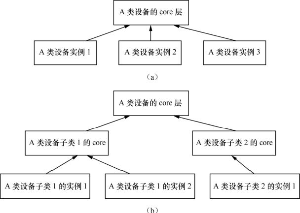

### 12.2.1 设备驱动核心层和例化

在面向对象的程序设计中，可以为某一类相似的事物定义一个基类，而具体的事物可以继承这个基类中的函数。如果对于继承的这个事物而言，其某成员函数的实现与基类一致，那它就可以直接继承基类的函数；相反，它可以重载之。这种面向对象的设计思想极大地提高了代码的可重用能力，是对现实世界事物间关系的一种良好呈现。

Linux内核完全由C语言和汇编语言写成，但是却频繁用到了面向对象的设计思想。在设备驱动方面，往往为同类的设备设计了一个框架，而框架中的核心层则实现了该设备通用的一些功能。同样的，如果具体的设备不想使用核心层的函数，它可以重载之。举个例子：

return_type core_funca(xxx_device * bottom_dev, param1_type param1, param1_type param2) 
 
 { 
 
 if (bottom_dev->funca) 
 
 return bottom_dev->funca(param1, param2); 
 
 /* 核心层通用的funca代码 */ 
 
 ... 
 
 }

上述core_funca的实现中，会检查底层设备是否重载了funca()，如果重载了，就调用底层的代码，否则，直接使用通用层的。这样做的好处是，核心层的代码可以处理绝大多数该类设备的funca()对应的功能，只有少数特殊设备需要重新实现funca()。

再看一个例子：

return_type core_funca(xxx_device * bottom_dev, param1_type param1, param1_type param2) 
 
 { 
 
 /*通用的步骤代码A */ 
 
 typea_dev_commonA(); 
 
 ...

/* 底层操作ops1 */ 
 
 bottom_dev->funca_ops1();

/*通用的步骤代码B */ 
 
 typea_dev_commonB(); 
 
 ... 
 
 /* 底层操作ops2 */ 
 
 bottom_dev->funca_ops2();

/*通用的步骤代码C */ 
 
 
 typea_ 
 dev_ 
 commonB(); 
 
 
 ...

/** 底层操作ops3 */ 
 
 bottom_dev->funca_ops3(); 
 
 }

上述代码假定为了实现funca()，对于同类设备而言，操作流程一致，都要经过“通用代码A、底层ops1、通用代码B、底层ops2、通用代码C、底层ops3”这几步，分层设计明显带来的好处是，对于通用代码A、B、C，具体的底层驱动不需要再实现，而仅仅只关心其底层的操作ops1、ops2、ops3。

图12.1明确反映了设备驱动的核心层与具体设备驱动的关系，实际上，这种分层可能只有两层（图12.1的a），也可能是多层的（图12.1的b）。

这样的分层化设计在Linux的input、RTC、MTD、I2C、SPI、TTY、USB等诸多设备驱动类型中屡见不鲜。下面的两小节以input和RTC为例先行进行一番讲解，当然，后续的章节会对几个大的设备类型对应驱动的层次进行更详细的分析。

