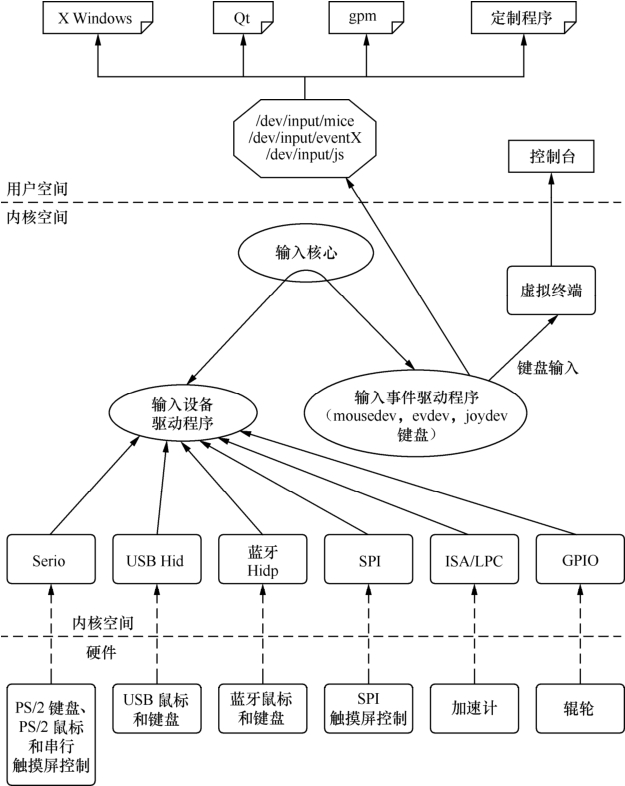

### 12.2.2 输入设备驱动

输入设备（如按键、键盘、触摸屏、鼠标等）是典型的字符设备，其一般的工作机理是底层在按键、触摸等动作发送时产生一个中断（或驱动通过timer定时查询），然后CPU通过SPI、I2C或外部存储器总线读取键值、坐标等数据，放入一个缓冲区，字符设备驱动管理该缓冲区，而驱动的read()接口让用户可以读取键值、坐标等数据。

显然，在这些工作中，只是中断、读键值/坐标值是设备相关的，而输入事件的缓冲区管理以及字符设备驱动的file_operations接口则对输入设备是通用的。基于此，内核设计了输入子系统，由核心层处理公共的工作。Linux内核输入子系统的框架如图12.2所示。

输入核心提供了底层输入设备驱动程序所需的API，如分配/释放一个输入设备：

struct input_dev *input_allocate_device(void); 
 
 void input_free_device(struct input_dev *dev);

input_allocate_device()返回的是1个input_dev的结构体，此结构体用于表征1个输入设备。

注册/注销输入设备用的接口如下：

int __must_check input_register_device(struct input_dev *); 
 
 void input_unregister_device(struct input_dev *);

报告输入事件用的接口如下：

/* 报告指定type、code的输入事件 */ 
 
 void input_event(struct input_dev *dev, unsigned int type, unsigned int code, int value); 
 
 /* 报告键值 */ 
 
 void input_report_key(struct input_dev *dev, unsigned int code, int value); 
 
 /* 报告相对坐标 */ 
 
 void input_report_rel(struct input_dev *dev, unsigned int code, int value);

/* 报告绝对坐标 */ 
 
 void input_report_abs(struct input_dev *dev, unsigned int code, int value); 
 
 /* 报告同步事件 */ 
 
 void input_sync(struct input_dev *dev);

而所有的输入事件，内核都用统一的数据结构来描述，这个数据结构是input_event，形如代码清单12.8。

代码清单12.8 input.event结构体

1 struct input_event { 
 
 2 struct timeval time; 
 
 3 __u16 type; 
 
 4 __u16 code; 
 
 5 __s32 value; 
 
 6 };

drivers/input/keyboard/gpio_keys.c基于input架构实现了一个通用的GPIO按键驱动。该驱动基于platform_driver架构，名为“gpio-keys”。它将硬件相关的信息（如使用的GPIO号，按下和抬起时的电平等）屏蔽在板文件platform_device的platform_data中，因此该驱动可应用于各个处理器，具有良好的跨平台性。代码清单12.9列出了该驱动的probe()函数。

代码清单12.9 GPIO按键驱动的probe()函数

1 static int __devinit gpio_keys_probe(struct platform_device *pdev) 
 
 2 { 
 
 3 struct gpio_keys_platform_data *pdata = pdev->dev.platform_data; 
 
 4 struct gpio_keys_drvdata *ddata; 
 
 5 struct input_dev *input; 
 
 6 int i, error; 
 
 7 int wakeup = 0; 
 
 8 
 
 9 ddata = kzalloc(sizeof(struct gpio_keys_drvdata) + 
 
 10 pdata->nbuttons * sizeof(struct gpio_button_data), 
 
 11 GFP_KERNEL); 
 
 
 12 input = input_ 
 allocate_ 
 device(); 
 
 13 if (!ddata || !input) { 
 
 14 error = -ENOMEM; 
 
 15 goto fail1; 
 
 16 } 
 
 17 
 
 18 platform_set_drvdata(pdev, ddata); 
 
 19 
 
 20 input->name = pdev->name; 
 
 21 input->phys = "gpio-keys/input0"; 
 
 22 input->dev.parent = &pdev->dev; 
 
 23 
 
 24 input->id.bustype = BUS_HOST; 
 
 25 input->id.vendor = 0x0001; 
 
 26 input->id.product = 0x0001; 
 
 27 input->id.version = 0x0100; 
 
 28 
 
 29 ddata->input = input; 
 
 30 
 
 31 for (i = 0; i < pdata->nbuttons; i++) { 
 
 32 struct gpio_keys_button *button = &pdata->buttons[i];

33 struct gpio_button_data *bdata = &ddata->data[i]; 
 
 34 int irq; 
 
 35 unsigned int type = button->type ?: EV_KEY; 
 
 36 
 
 37 bdata->input = input; 
 
 38 bdata->button = button; 
 
 39 setup_timer(&bdata->timer, 
 
 40 gpio_check_button, (unsigned long)bdata); 
 
 41 
 
 42 ... 
 
 43 error = request_irq(irq, gpio_keys_isr, 
 
 44 IRQF_SAMPLE_RANDOM | IRQF_TRIGGER_RISING | 
 
 45 IRQF_TRIGGER_FALLING, 
 
 46 button->desc ? button->desc : "gpio_keys", 
 
 47 bdata); 
 
 48 if (error) { 
 
 49 ... 
 
 50 } 
 
 51 
 
 52 if (button->wakeup) 
 
 53 wakeup = 1; 
 
 54 
 
 
 55 
 input_ 
 set_ 
 capability(input, type, button->code); 
 
 56 } 
 
 57 
 
 
 58 error = input_ 
 register_ 
 device(input); 
 
 59 if (error) { 
 
 60 pr_err("gpio-keys: Unable to register input device, " 
 
 61 "error: %d\n", error); 
 
 62 goto fail2; 
 
 63 } 
 
 64 
 
 65 device_init_wakeup(&pdev->dev, wakeup); 
 
 66 
 
 67 return 0; 
 
 68 ... 
 
 69 }

上述代码的第12行分配了1个输入设备，第20～27行初始化了该input_dev的一些属性，第58行注册了这个输入设备。第31～56行则申请了此GPIO按键设备需要的中断号，并初始化了timer。第55行设置此输入设备可告知的事情。

在注册输入设备后，底层输入设备驱动的核心工作只剩下在按键、触摸等人为动作发生的时候，报告事件。代码清单12.10列出了GPIO按键中断发生时的事件报告代码。

代码清单12.10 GPIO按键中断发生时的事件报告

1 static void gpio_keys_report_event(struct gpio_button_data *bdata) 
 
 2 { 
 
 3 struct gpio_keys_button *button = bdata->button; 
 
 4 struct input_dev *input = bdata->input; 
 
 5 unsigned int type = button->type ?: EV_KEY; 
 
 6 int state = (gpio_get_value(button->gpio) ? 1 : 0) ^ button->active_low; 
 
 7

8 input_ 
 event(input, type, button->code, !!state);

9 input_ 
 sync(input);

10 }

11

12 static irqreturn_t gpio_keys_isr(int irq, void *dev_id)

13 {

14 struct gpio_button_data *bdata = dev_id;

15 struct gpio_keys_button *button = bdata->button;

16

17 BUG_ON(irq != gpio_to_irq(button->gpio));

18

19 if (button->debounce_interval)

20 mod_timer(&bdata->timer,

21 jiffies + msecs_to_jiffies(button->debounce_interval));

22 else

23 gpio_keys_report_event(bdata);

24

25 return IRQ_HANDLED;

26 }

第8行是报告键值，而第9行是1个同步事件，暗示前面报告的消息属于1个消息组。例如，用户在报告完X坐标后，又报告Y坐标，之后报告1个同步事件，应用程序即可知道前面报告的X、Y这两个事件属于1组，它会将两者联合起来形成1个（X,Y）的坐标。

代码清单12.8第2行获取platform_data，而platform_data实际上是定义GPIO按键硬件信息的数组，第31行的for循环工具这些信息申请GPIO并初始化中断，对于LDD6140电路板而言，这些信息如代码清单12.11。

代码清单12.11 LDD6410开发板GPIO按键的platform.data

1 static struct gpio_keys_button ldd6410_buttons[] = { 
 
 2 { 
 
 3 .gpio = S3C64XX_GPN(0), 
 
 4 .code = KEY_DOWN, 
 
 5 .desc = "Down", 
 
 6 .active_low = 1, 
 
 7 }, 
 
 8 { 
 
 9 .gpio = S3C64XX_GPN(1), 
 
 10 .code = KEY_ENTER, 
 
 11 .desc = "Enter", 
 
 12 .active_low = 1, 
 
 13 .wakeup = 1, 
 
 14 }, 
 
 15 { 
 
 16 .gpio = S3C64XX_GPN(2), 
 
 17 .code = KEY_HOME, 
 
 18 .desc = "Home", 
 
 19 .active_low = 1, 
 
 20 }, 
 
 21 { 
 
 22 .gpio = S3C64XX_GPN(3),

23 .code = KEY_POWER, 
 
 24 .desc = "Power", 
 
 25 .active_low = 1, 
 
 26 .wakeup = 1, 
 
 27 }, 
 
 28 { 
 
 29 .gpio = S3C64XX_GPN(4), 
 
 30 .code = KEY_TAB, 
 
 31 .desc = "Tab", 
 
 32 .active_low= 1, 
 
 33 }, 
 
 34 { 
 
 35 .gpio = S3C64XX_GPN(5), 
 
 36 .code = KEY_MENU, 
 
 37 .desc = "Menu", 
 
 38 .active_low = 1, 
 
 39 }, 
 
 40 }; 
 
 41 
 
 42 static struct gpio_keys_platform_data ldd6410_button_data = { 
 
 43 .buttons = ldd6410_buttons, 
 
 44 .nbuttons = ARRAY_SIZE(ldd6410_buttons), 
 
 45 }; 
 
 46 
 
 47 static struct platform_device ldd6410_device_button = { 
 
 48 .name = "gpio-keys", 
 
 49 .id = -1, 
 
 50 .dev = { 
 
 51 .platform_data = &ldd6410_button_data, 
 
 52 } 
 
 53 };

