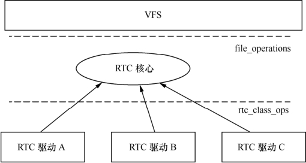

### 12.2.3 RTC设备驱动

RTC（实时钟）借助电池供电，在系统掉电的情况下时间依然可以正常走动。它通常还具有产生周期性中断以及产生闹钟（alarm）中断的能力，是一种典型的字符设备。作为一种字符设备驱动，RTC需要有file_operations中接口函数的实现，如open()、release()、read()、poll()、ioctl()等，而典型的IOCTL包括RTC_SET_TIME、RTC_ALM_READ、RTC_ALM_SET、RTC_ IRQP_SET、RTC_IRQP_READ等，这些对于所有的RTC是通用的，只有底层的具体实现是设备相关的。

因此，drivers/rtc/rtc-dev.c实现了RTC驱动通用的字符设备驱动层，它实现了file_opearations的成员函数以及一些关于RTC的通用的控制代码，并向底层导出rtc_device_register()、rtc_device_ unregister()用于注册和注销RTC；导出rtc_class_ops结构体用于描述底层的RTC硬件操作。这一RTC通用层实现的结果是，底层的RTC驱动不再需要关心RTC作为字符设备驱动的具体实现，也无需关心一些通用的RTC控制逻辑，图12.3表明了这种关系。

drivers/rtc/rtc-s3c.c实现了S3C6410的RTC驱动，其注册RTC以及绑定的rtc_class_ops的代码如代码清单12.12所示。

代码清单12.12 S3C6410 RTC驱动的rtc.class.ops实例与RTC注册

1 static const struct rtc_ 
 class_ 
 ops s3c_ 
 rtcops = {

2 .open = s3c_rtc_open,

3 .release = s3c_rtc_release,

4 .ioctl = s3c_rtc_ioctl,

5 .read_time = s3c_rtc_gettime,

6 .set_time = s3c_rtc_settime,

7 .read_alarm = s3c_rtc_getalarm,

8 .set_alarm = s3c_rtc_setalarm,

9 .irq_set_freq = s3c_rtc_setfreq,

10 .irq_set_state = s3c_rtc_setpie,

11 .proc = s3c_rtc_proc,

12 };

13

14 static int s3c_rtc_probe(struct platform_device *pdev)

15 {

16 ...

17 rtc = rtc_ 
 device_ 
 register("s3c", &pdev->dev, &s3c_ 
 rtcops,

18 THIS_MODULE);

19 ...

20 }

