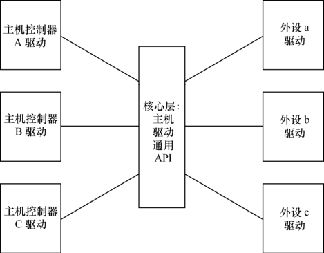

### 12.3.1 主机、外设驱动分离的意义

在Linux设备驱动框架的设计中，除了有分层设计实现以外，还有分隔的思想。举一个简单的例子，假设我们要通过SPI总线访问某外设，在这个访问过程中，要通过操作CPU XXX上的SPI控制器的寄存器来达到访问SPI外设YYY的目的，最简单的方法是：

return_type xxx_write_spi_yyy(...) 
 
 { 
 
 xxx_write_spi_host_ctrl_reg(ctrl); 
 
 xxx_ write_spi_host_data_reg(buf);

while(!(xxx_spi_host_status_reg()&SPI_DATA_TRANSFER_DONE)); 
 
 ... 
 
 }

如果按照这种方式来设计驱动，结果是对于任何一个SPI外设来讲，它的驱动代码都是CPU相关的。也就是说，当然用在CPU XXX上的时候，它访问XXX的SPI主机控制寄存器，当用在XXX1的时候，它访问XXX1的SPI主机控制寄存器：

return_type 
 xxx1_write_spi_yyy(...) 
 
 { 
 
 
 xxx1_write_spi_host_ctrl_reg(ctrl); 
 
 
 xxx1_ write_spi_host_data_reg(buf); 
 
 while(!( 
 xxx1_spi_host_status_reg()&SPI_DATA_TRANSFER_DONE)); 
 
 `... 
 
 }

这显然是不能接受的，因为这意味着外设YYY用在不同的CPU XXX和XXX1上的时候需要不同的驱动。那么，我们可以用如图12.4所示的思想对主机控制器驱动和外设驱动进行分离。这样的结果是，外设a、b、c的驱动与主机控制器A、B、C的驱动不相关，主机控制器驱动不关心外设，而外设驱动也不关心主机，外设只是访问核心层的通用的API进行数据传输，主机和外设之间可以进行任意的组合。

如果我们不进行如图12.4所示的主机和外设分离，外设a、b、c和主机A、B、C进行组合的时候，需要9个不同的驱动。设想一共有m个主机控制器，n个外设，分离的结果是需要m + n个驱动，不分离则需要m*n个驱动。

Linux SPI、I2C、USB、ASoC（ALSA SoC）等子系统都典型地利用了这种分离的设计思想，在本章我们先以简单一些的SPI为例，而I2C、USB、ASoC等则在后续章节会进行详细介绍。

