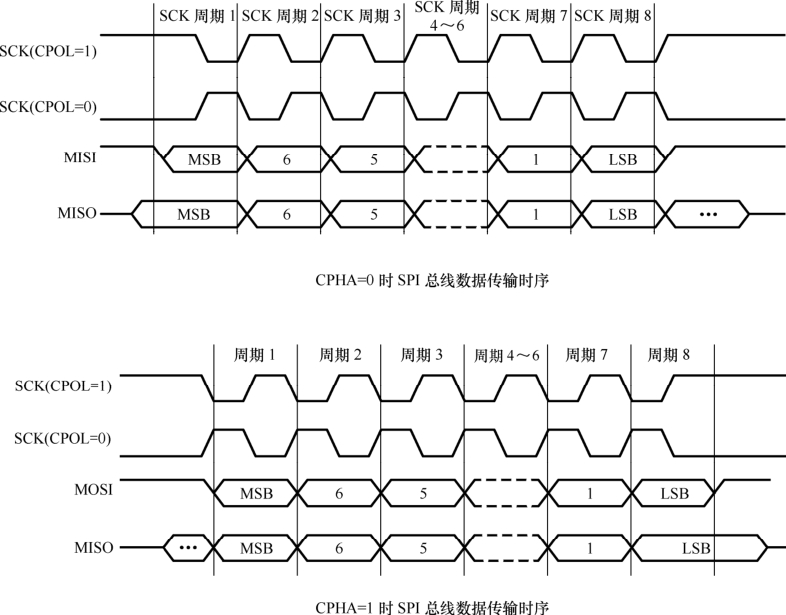

### 12.3.2 Linux SPI主机和设备驱动

SPI（同步外设接口）是由摩托罗拉公司开发的全双工同步串行总线，其接口由MISO（串行数据输入）、MOSI（串行数据输出）、SCK（串行移位时钟）、SS（从使能信号）4种信号构成，SS决定了惟一的与主设备通信的从设备，主设备通过产生移位时钟来发起通信。通信时，数据由MOSI输出，MISO输入，数据在时钟的上升或下降沿由MOSI输出，在紧接着的下降或上升沿由MISO读入，这样经过8/16次时钟的改变，完成8/16位数据的传输。

SPI模块为了和外设进行数据交换，根据外设工作要求，其输出串行同步时钟极性（CPOL）和相位（CPHA）可以进行配置。如果CPOL= 0，串行同步时钟的空闲状态为低电平；如果CPOL= 1，串行同步时钟的空闲状态为高电平。如果CPHA= 0，在串行同步时钟的第一个跳变沿（上升或下降）数据被采样；如果CPHA = 1，在串行同步时钟的第二个跳变沿（上升或下降）数据被采样。SPI接口时序如图12.5所示。

在Linux中，用代码清单12.13的spi_master结构体来描述一个SPI主机控制器驱动，其主要成员是主机控制器的序号（系统中可能存在多个SPI主机控制器）、片选数量、SPI模式和时钟设置用到的函数、数据传输用到的函数等。

代码清单12.13 spi.master结构体

1 struct spi_master { 
 
 2 struct device dev; 
 
 3 s16 bus_num; 
 
 4 u16 num_chipselect; 
 
 5

6 /* 设置模式和时钟 */ 
 
 7 int (*setup)(struct spi_device *spi); 
 
 8 
 
 9 /* 双向数据传输 */ 
 
 10 int (*transfer)(struct spi_device *spi, 
 
 11 struct spi_message *mesg); 
 
 12 
 
 13 void (*cleanup)(struct spi_device *spi); 
 
 14 };

分配、注册和注销SPI主机的API由SPI核心提供：

struct spi_master * spi_alloc_master(struct device *host, unsigned size); 
 
 int spi_register_master(struct spi_master *master); 
 
 void spi_unregister_master(struct spi_master *master);

在Linux中，用代码清单12.14的spi_driver结构体来描述一个SPI外设驱动，可以认为是spi_master的client驱动。

代码清单12.14 spi.driver结构体

1 struct spi_driver { 
 
 2 int (*probe)(struct spi_device *spi); 
 
 3 int (*remove)(struct spi_device *spi); 
 
 4 void (*shutdown)(struct spi_device *spi); 
 
 5 int (*suspend)(struct spi_device *spi, pm_message_t mesg); 
 
 6 int (*resume)(struct spi_device *spi); 
 
 7 struct device_driver driver; 
 
 8 };

可以看出，spi_driver结构体和platform_driver结构体有极大的相似性，都有probe()、remove()、suspend()、resume()这样的接口。是的，这几乎是一切client驱动的习惯模板。

在SPI外设驱动中，当透过SPI总线进行数据传输的时候，使用了一套与CPU无关的统一的接口。这套接口的第1个关键数据结构就是spi_transfer，它用于描述SPI传输，如代码清单12.15所示。

代码清单12.15 spi.transfer结构体

1 struct spi_transfer { 
 
 2 const void *tx_buf; 
 
 3 void *rx_buf; 
 
 4 unsigned len; 
 
 5 
 
 6 dma_addr_t tx_dma; 
 
 7 dma_addr_t rx_dma; 
 
 8 
 
 9 unsigned cs_change:1; 
 
 10 u8 bits_per_word; 
 
 11 u16 delay_usecs; 
 
 12 u32 speed_hz; 
 
 13 
 
 14 struct list_head transfer_list; 
 
 15 };

而一次完整的SPI传输流程可能不只包含一次spi_transfer，它可能包含一个或多个spi_transfer，这些spi_transfer最终通过spi_message组织在一起，其定义如代码清单12.16所示。

代码清单12.16 spi.message结构体

1 struct spi_message { 
 
 2 struct list_head transfers; 
 
 3 
 
 4 struct spi_device *spi; 
 
 5 
 
 6 unsigned is_dma_mapped:1; 
 
 7 
 
 8 /* 完成被一个callback报告 */ 
 
 9 void (*complete)(void *context); 
 
 10 void *context; 
 
 11 unsigned actual_length; 
 
 12 int status; 
 
 13 
 
 14 struct list_head queue; 
 
 15 void *state; 
 
 16 };

通过spi_message_init()可以初始化spi_message，而将spi_transfer添加到spi_message队列的方法则是：

void spi_message_add_tail(struct spi_transfer *t, struct spi_message *m);

发起一次spi_message的传输有同步和异步两种方式，使用同步API时，会阻塞等待这个消息被处理完。同步操作时使用的API是：

int spi_sync(struct spi_device *spi, struct spi_message *message);

使用异步API时，不会阻塞等待这个消息被处理完，但是可以在spi_message的complete字段挂接一个回调函数，当消息被处理完成后，该函数会被调用。异步操作时使用的API是：

int spi_async(struct spi_device *spi, struct spi_message *message);

代码清单12.17是非常典型的初始化spi_transfer、spi_message并进行SPI数据传输的例子，同时它们也是SPI核心层的两个通用API，在SPI外设驱动中可以直接调用它们进行写和读操作。

代码清单12.17 SPI传输实例spi.write()、spi.read() API

1 static inline int 
 
 2 spi_write(struct spi_device *spi, const u8 *buf, size_t len) 
 
 3 { 
 
 4 struct spi_transfer t = { 
 
 5 .tx_buf = buf, 
 
 6 .len = len, 
 
 7 }; 
 
 8 struct spi_message m; 
 
 9 
 
 10 spi_message_init(&m); 
 
 11 spi_message_add_tail(&t, &m); 
 
 12 return spi_sync(spi, &m); 
 
 13 } 
 
 14 
 
 15 static inline int 
 
 16 spi_read(struct spi_device *spi, u8 *buf, size_t len) 
 
 17 { 
 
 18 struct spi_transfer t = { 
 
 19 .rx_buf = buf, 
 
 20 .len = len,

21 }; 
 
 22 struct spi_message m; 
 
 23 
 
 24 spi_message_init(&m); 
 
 25 spi_message_add_tail(&t, &m); 
 
 26 return spi_sync(spi, &m); 
 
 27 }

LDD6410开发板所使用的S3C6410的SPI主机控制器驱动位于drivers/spi/spi_s3c.h和drivers/spi/spi_s3c.c这两个文件，其主体是实现了spi_master的setup()、transfer()等成员函数。

SPI外设驱动遍布于内核的drivers、sound的各个子目录之下，SPI只是一种总线，spi_driver的作用只是将SPI外设挂接在该总线上，因此在spi_driver的probe()成员函数中，将注册SPI外设本身所属设备驱动的类型。

和platform_driver对应着一个platform_device一样，spi_driver也对应着一个spi_device；platform_ device需要在BSP的板文件中添加板信息数据，而spi_device也同样需要。spi_device的板信息用spi_board_info结构体描述，该结构体记录SPI外设使用的主机控制器序号、片选序号、数据比特率、SPI传输模式（即CPOL、CPHA）等。如诺基亚770上两个SPI设备的板信息数据如代码清单12.18，位于板文件arch/arm/mach-omap1/board-nokia770.c。

代码清单12.18 诺基亚770板文件中的spi.board.info

1 static struct spi_board_info nokia770_spi_board_info[] __initdata = { 
 
 2 [0] = { 
 
 3 .modalias = "lcd_mipid", 
 
 4 .bus_num = 2, /* 用到的SPI主机控制器序号 */ 
 
 5 .chip_select = 3, /* 使用哪一号片选 */ 
 
 6 .max_speed_hz = 12000000, /* SPI数据传输比特率 */ 
 
 7 .platform_data = &nokia770_mipid_platform_data, 
 
 8 }, 
 
 9 [1] = { 
 
 10 .modalias = "ads7846", 
 
 11 .bus_num = 2, 
 
 12 .chip_select = 0, 
 
 13 .max_speed_hz = 2500000, 
 
 14 .irq = OMAP_GPIO_IRQ(15), 
 
 15 .platform_data = &nokia770_ads7846_platform_data, 
 
 16 }, 
 
 17 };

在Linux启动过程中，在机器的init_machine()函数中，会通过如下语句注册这些spi_board_info：

spi_register_board_info(nokia770_spi_board_info, 
 
 ARRAY_SIZE(nokia770_spi_board_info));

这一点和启动时通过platform_add_devices()添加platform_device非常相似。

