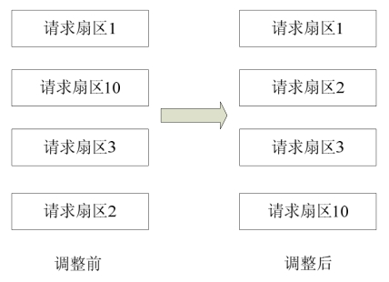

### 13.1 块设备的I/O操作特点

字符设备与块设备I/O操作的不同如下。

（1）块设备只能以块为单位接受输入和返回输出，而字符设备则以字节为单位。大多数设备是字符设备，因为它们不需要缓冲而且不以固定块大小进行操作。

（2）块设备对于I/O请求有对应的缓冲区，因此它们可以选择以什么顺序进行响应，字符设备无须缓冲且被直接读写。对于存储设备而言调整读写的顺序作用巨大，因为在读写连续的扇区比分离的扇区更快。

（3）字符设备只能被顺序读写，而块设备可以随机访问。虽然块设备可随机访问，但是对于磁盘这类机械设备而言，顺序地组织块设备的访问可以提高性能，如图13.1所示，对扇区1、10、3、2的请求被调整为对扇区1、2、3、10的请求。而对SD卡、RamDisk等块设备而言，不存在机械上的原因，进行这样的调整没有必要。

