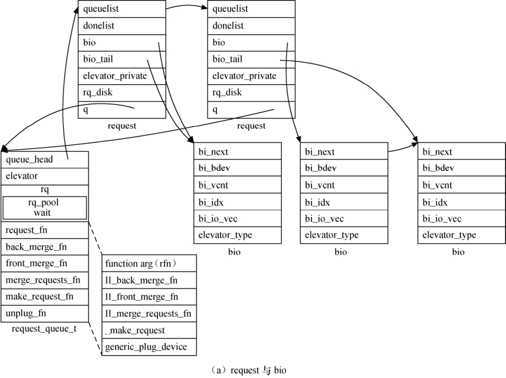
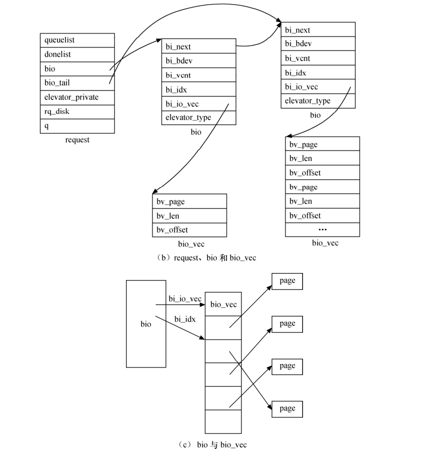

### 13.2.3 request与bio结构体

#### 1．请求

在Linux块设备驱动中，使用request结构体来表征等待进行的I/O请求，这个结构体的定义如代码清单13.3所示。

代码清单13.3 request结构体

1 struct request { 
 
 2 struct list_head queuelist; 
 
 3 struct call_single_data csd; 
 
 4 int cpu; 
 
 5 
 
 6 struct request_queue *q; 
 
 7 
 
 8 unsigned int cmd_flags; 
 
 9 enum rq_cmd_type_bits cmd_type; 
 
 10 unsigned long atomic_flags; 
 
 11 
 
 12 /* 维护I/O submission的BIO遍历状态 
 
 13 * hard_开头的成员仅用于块层内部，驱动不应该改变它们 
 
 14 */ 
 
 15 
 
 16 sector_t sector; /* 要提交的下一个sector */ 
 
 17 sector_t hard_sector; /* 要完成的下一个sector */ 
 
 18 unsigned long nr_sectors; /* 剩余需要提交的sector数 */ 
 
 19 unsigned long hard_nr_sectors; /*剩余需要完成的sector数*/ 
 
 20 /* 在当前segment中剩余的需提交的sector数 */ 
 
 21 unsigned int current_nr_sectors; 
 
 22 
 
 23 /*在当前segment中剩余的需完成的sector数 */ 
 
 24 unsigned int hard_cur_sectors; 
 
 25 
 
 26 struct bio *bio; 
 
 27 struct bio *biotail; 
 
 28 
 
 29 struct hlist_node hash; 
 
 30 union { 
 
 31 struct rb_node rb_node; /* sort/lookup */ 
 
 32 void *completion_data; 
 
 33 }; 
 
 34 
 
 35 /* 
 
 36 * I/O调度器可获得的两个指针，如果需要更多，请动态分配

37 */ 
 
 38 void *elevator_private; 
 
 39 void *elevator_private2; 
 
 40 
 
 41 struct gendisk *rq_disk; 
 
 42 unsigned long start_time; 
 
 43 
 
 44 /* scatter-gather DMA方式下 addr+len对的数量(执行物理地址合并后) 
 
 45 */ 
 
 46 unsigned short nr_phys_segments; 
 
 47 
 
 48 unsigned short ioprio; 
 
 49 
 
 50 void *special; 
 
 51 char *buffer; 
 
 52 
 
 53 int tag; 
 
 54 int errors; 
 
 55 
 
 56 int ref_count; 
 
 57 
 
 58 unsigned short cmd_len; 
 
 59 unsigned char __cmd[BLK_MAX_CDB]; 
 
 60 unsigned char *cmd; 
 
 61 
 
 62 unsigned int data_len; 
 
 63 unsigned int extra_len; 
 
 64 unsigned int sense_len; 
 
 65 void *data; 
 
 66 void *sense; 
 
 67 
 
 68 unsigned long deadline; 
 
 69 struct list_head timeout_list; 
 
 70 unsigned int timeout; 
 
 71 int retries; 
 
 72 
 
 73 /* 
 
 74 * 完成回调函数 
 
 75 */ 
 
 76 rq_end_io_fn *end_io; 
 
 77 void *end_io_data; 
 
 78 
 
 79 struct request *next_rq; 
 
 80 };

request结构体的主要成员包括：

sector_t hard_sector; 
 
 unsigned long hard_nr_sectors; 
 
 unsigned int hard_cur_sectors;

上述3个成员标识还未完成的扇区，hard_sector是第一个尚未传输的扇区，hard_nr_sectors是尚待完成的扇区数，hard_cur_sectors是当前I/O操作中待完成的扇区数。

sector_t sector; 
 
 unsigned long nr_sectors; 
 
 unsigned int current_nr_sectors;

驱动中会经常与这3个成员打交道，这3个成员在内核和驱动交互中发挥着重大作用。它们以512字节大小为一个扇区，如果硬件的扇区大小不是512字节，则需要进行相应的调整。例如，如果硬件的扇区大小是2048字节，则在进行硬件操作之前，需要用4来除起始扇区号。

hard_sector、hard_nr_sectors、hard_cur_sectors与sector、nr_sectors、current_nr_sectors之间可认为是“副本”关系。

struct bio *bio;

bio是这个请求中包含的bio结构体的链表，驱动中不宜直接存取这个成员，__rq_for_each_ bio(_bio, rq)宏封装了对bio链表的遍历方法，其定义为：

#define __rq_for_each_bio(_bio, rq) \ 
 
 if ((rq->bio)) \ 
 
 for (_bio = (rq)->bio; _bio; _bio = _bio->bi_next)

char *buffer;

指向缓冲区的指针，数据应当被传送到或者来自这个缓冲区，这个指针是一个内核虚拟地址，可被驱动直接引用。

unsigned short nr_phys_segments;

该值表示相邻的页被合并后，这个请求在物理内存中占据的段的数目。

如果设备支持分散/聚集（SG，scatter/gather）操作，可依据此字段申请sizeof(scatterlist)* nr_ phys_segments的内存，并使用下列函数进行DMA映射：

int blk_rq_map_sg(struct request_queue *, struct request *, struct scatterlist *);

该函数与dma_map_sg()类似，它返回scatterlist列表入口的数量。

struct list_head queuelist;

用于链接这个请求到请求队列的链表结构，blkdev_dequeue_request()可用于从队列中移除请求。

使用如下宏可以从request获得数据传送的方向。

rq_data_dir(struct request *req);

0返回值表示从设备中读，非0返回值表示向设备写。

#### 2．请求队列

一个块请求队列是一个块I/O request的队列，其定义如代码清单13.4所示。

代码清单13.4 request队列结构体

1 struct request_queue { 
 
 2 ... 
 
 3 request_fn_proc *request_fn; 
 
 4 make_request_fn *make_request_fn; 
 
 5 prep_rq_fn *prep_rq_fn; 
 
 6 unplug_fn *unplug_fn; 
 
 7 prepare_discard_fn *prepare_discard_fn; 
 
 8 merge_bvec_fn *merge_bvec_fn; 
 
 9 prepare_flush_fn *prepare_flush_fn; 
 
 10 softirq_done_fn *softirq_done_fn; 
 
 11 rq_timed_out_fn *rq_timed_out_fn; 
 
 12 dma_drain_needed_fn *dma_drain_needed; 
 
 13 lld_busy_fn *lld_busy_fn; 
 
 14 ... 
 
 15 spinlock_t __queue_lock; 
 
 16 spinlock_t *queue_lock; 
 
 17 
 
 18 /* 
 
 19 * queue kobject

20 */ 
 
 21 struct kobject kobj; 
 
 22 
 
 23 /* 
 
 24 * queue设置 
 
 25 */ 
 
 26 unsigned long nr_requests; /* Max # of requests */ 
 
 27 unsigned int nr_congestion_on; 
 
 28 unsigned int nr_congestion_off; 
 
 29 unsigned int nr_batching; 
 
 30 
 
 31 unsigned int max_sectors; 
 
 32 unsigned int max_hw_sectors; 
 
 33 unsigned short max_phys_segments; 
 
 34 unsigned short max_hw_segments; 
 
 35 unsigned short hardsect_size; 
 
 36 unsigned int max_segment_size; 
 
 37 
 
 38 unsigned long seg_boundary_mask; 
 
 39 void *dma_drain_buffer; 
 
 40 unsigned int dma_drain_size; 
 
 41 unsigned int dma_pad_mask; 
 
 42 unsigned int dma_alignment; 
 
 43 
 
 44 struct blk_queue_tag *queue_tags; 
 
 45 struct list_head tag_busy_list; 
 
 46 
 
 47 unsigned int nr_sorted; 
 
 48 unsigned int in_flight; 
 
 49 
 
 50 unsigned int rq_timeout; 
 
 51 struct timer_list timeout; 
 
 52 struct list_head timeout_list; 
 
 53 
 
 54 /* 
 
 55 * sg stuff 
 
 56 */ 
 
 57 unsigned int sg_timeout; 
 
 58 unsigned int sg_reserved_size; 
 
 59 int node; 
 
 60 #ifdef CONFIG_BLK_DEV_IO_TRACE 
 
 61 struct blk_trace *blk_trace; 
 
 62 #endif 
 
 63 ... 
 
 64 };

请求队列跟踪等候的块I/O请求，它存储用于描述这个设备能够支持的请求的类型信息、它们的最大大小、多少不同的段可进入一个请求、硬件扇区大小、对齐要求等参数，其结果是：如果请求队列被配置正确了，它不会交给该设备一个不能处理的请求。

请求队列还实现一个插入接口，这个接口允许使用多个I/O调度器，I/O调度器（也称电梯）的工作是以最优性能的方式向驱动提交I/O请求。大部分I/O调度器累积批量的I/O请求，并将它们排列为递增（或递减）的块索引顺序后提交给驱动。进行这些工作的原因在于，对于磁头而言，当给定顺序排列的请求时，可以使得磁盘顺序地从一头到另一头工作，非常像一个满载的电梯，在一个方向移动直到所有它的“请求”被满足。

另外，I/O调度器还负责合并邻近的请求，当一个新I/O请求被提交给调度器后，它会在队列里搜寻包含邻近扇区的请求。如果找到一个，并且如果结果的请求不是太大，调度器将合并这两个请求。

对磁盘等块设备进行I/O操作顺序的调度类似于电梯的原理，先服务完上楼的乘客，再服务下楼的乘客效率会更高，而顺序响应用户的请求则电梯会无序地忙乱。

Linux 2.6内核包含4个I/O调度器，它们分别是No-op I/O scheduler、Anticipatory I/O scheduler、Deadline I/O scheduler与CFQ I/O scheduler。

Noop I/O scheduler是一个简化的调度程序，该算法实现了一个简单FIFO队列，它只作最基本的合并与排序。

Anticipatory I/O scheduler算法推迟I/O请求，以期能对它们进行排序，获得最高的效率。在每次处理完读请求之后，不是立即返回，而是等待几个微妙。在这段时间内，任何来自临近区域的请求都被立即执行。超时以后，继续原来的处理。

Deadline I/O scheduler是针对Anticipatory I/O scheduler的缺点进行改善而来的，它试图把每次请求的延迟降至最低，该算法重排了请求的顺序来提高性能。它使用轮询的调度器，简洁小巧，提供了最小的读取延迟和尚佳的吞吐量，特别适合于读取较多的环境（比如数据库）。

CFQ I/O scheduler为系统内的所有任务分配均匀的I/O带宽，提供一个公平的工作环境，在多媒体应用中，能保证audio、video及时从磁盘读取数据。

内核block目录中的noop-iosched.c、as-iosched.c、deadline-iosched.c和cfq-iosched.c文件分别实现了上述调度算法。

可以通过给kernel添加启动参数，选择使用的IO调度算法，如：

kernel elevator=deadline

（1）初始化请求队列。

request_queue_t *blk_init_queue(request_fn_proc *rfn, spinlock_t *lock);

该函数的第一个参数是请求处理函数的指针，第二个参数是控制访问队列权限的自旋锁，这个函数会发生内存分配的行为，它可能会失败，因此一定要检查它的返回值。这个函数一般在块设备驱动的模块加载函数中调用。

（2）清除请求队列。

void blk_cleanup_queue(request_queue_t * q);

这个函数完成将请求队列返回给系统的任务，一般在块设备驱动模块卸载函数中调用。

而blk_put_queue()宏则定义为：

#define blk_put_queue(q) blk_cleanup_queue((q))

（3）分配“请求队列”。

request_queue_t *blk_alloc_queue(int gfp_mask);

对于Flash、RAM盘等完全随机访问的非机械设备，并不需要进行复杂的I/O调度，这个时候，应该使用上述函数分配一个“请求队列”，并使用如下函数来绑定请求队列和“制造请求”函数（make_request_fn）。

void blk_queue_make_request(request_queue_t * q, make_request_fn * mfn);

在13.6.2节我们会看到，这种方式分配的“请求队列”实际上不包含任何request，所以给其加上引号。

（4）提取请求。

struct request *elv_next_request(struct request_queue *q);

上述函数用于返回下一个要处理的请求（由I/O调度器决定），如果没有请求则返回NULL。 elv_next_request()不会清除请求，它仍然将这个请求保留在队列上，但是标识它为活动的，这个标识将阻止I/O调度器合并其他的请求到已开始执行的请求。 因为elv_next_request()不从队列里清除请求，因此连续调用它两次，两次会返回同一个请求结构体。

（5）去除请求。

void blkdev_dequeue_request(struct request *req);

上述函数从队列中去除一个请求。如果驱动中同时从同一个队列中操作了多个请求，它必须以这样的方式将它们从队列中去除。

如果需要将一个已经出列的请求归还到队列中，可以进行以下调用：

void elv_requeue_request(request_queue_t *queue, struct request *req);

另外，块设备层还提供了一套函数，这些函数可被驱动用来控制一个请求队列的操作，主要包括以下操作。

（6）启停请求队列。

void blk_stop_queue(request_queue_t *queue); 
 
 void blk_start_queue(request_queue_t *queue);

如果块设备到达不能处理等候的命令的状态，应调用blk_stop_queue()来告知块设备层。之后，请求函数将不被调用，除非再次调用blk_start_queue()将设备恢复到可处理请求的状态。

（7）参数设置。

void blk_queue_max_sectors(request_queue_t *queue, unsigned short max); 
 
 void blk_queue_max_phys_segments(request_queue_t *queue, unsigned short max); 
 
 void blk_queue_max_hw_segments(request_queue_t *queue, unsigned short max); 
 
 void blk_queue_max_segment_size(request_queue_t *queue, unsigned int max);

这些函数用于设置描述块设备可处理的请求的参数。blk_queue_max_sectors()描述任一请求可包含的最大扇区数，默认值为255；blk_queue_max_phys_segments()和blk_queue_max_hw_segments()都控制一个请求中可包含的最大物理段（系统内存中不相邻的区），blk_queue_max_hw_segments()考虑了系统I/O内存管理单元的重映射，这两个参数缺省都是128。blk_queue_max_segment_size告知内核请求段的最大字节数，默认值为65536。

（8）通告内核。

void blk_queue_bounce_limit(request_queue_t *queue, u64 dma_addr);

该函数用于告知内核块设备执行DMA时可使用的最高物理地址dma_addr，如果一个请求包含超出这个限制的内存引用，系统将会给这个操作分配一个“反弹”缓冲区。这种方式的代价昂贵，因此应尽量避免使用。

可以给dma_addr参数提供任何可能的值或使用预先定义的宏，如BLK_BOUNCE_HIGH（对高端内存页使用反弹缓冲区）、BLK_BOUNCE_ISA（驱动只可在16MB的ISA区执行DMA）或者BLK_BOUCE_ANY（驱动可在任何地址执行DMA），缺省值是BLK_BOUNCE_HIGH。

blk_queue_segment_boundary(request_queue_t *queue, unsigned long mask);

如果我们正在驱动编写的设备无法处理跨越一个特殊大小内存边界的请求，应该使用这个函数来告知内核这个边界。例如，如果设备处理跨4MB边界的请求有困难，应该传递一个0x3fffff掩码，缺省的掩码是0xffffffff（对应4GB边界）。

void blk_queue_dma_alignment(request_queue_t *queue, int mask);

告知内核块设备施加于DMA 传送的内存对齐限制，所有请求都匹配这个对齐，缺省的屏蔽是0x1ff，它导致所有的请求被对齐到512字节边界。

void blk_queue_hardsect_size(request_queue_t *queue, unsigned short max);

该函数告知内核块设备硬件扇区的大小，所有由内核产生的请求都是这个大小的倍数并且被正确对界。但是，内核块设备层和驱动之间的通信还是以512字节扇区为单位进行。

#### 3．块I/O

通常一个bio对应一个上层传递给块层的I/O请求，代码清单13.5给出了bio结构体的定义。I/O调度算法可将连续的bio合并成一个request。request是bio经由块层进行调整后的结果，这是request和bio的区别。所以，一个request可以包含多个bio。

代码清单13.5 bio结构体

1 struct bio { 
 
 2 sector_t bi_sector; /* 要传输的第一个扇区 */ 
 
 3 struct bio *bi_next; /* 下一个bio */ 
 
 4 struct block_device*bi_bdev; 
 
 5 unsigned long bi_flags; /* 状态、命令等 */ 
 
 6 unsigned long bi_rw; /* 低位表示READ/WRITE，高位表示优先级*/ 
 
 7 
 
 8 unsigned short bi_vcnt; /* bio_vec数量 */ 
 
 9 unsigned short bi_idx; /* 当前bvl_vec索引 */ 
 
 10 
 
 11 /* 执行物理地址合并后sgement的数目 */ 
 
 12 unsigned short bi_phys_segments; 
 
 13 
 
 14 unsigned int bi_size; 
 
 15 
 
 16 /* 为了明了最大的segment尺寸，我们考虑这个bio中第一个和最后一个 
 
 17 可合并的segment的尺寸 */ 
 
 18 unsigned int bi_hw_front_size; 
 
 19 unsigned int bi_hw_back_size; 
 
 20 
 
 21 unsigned int bi_max_vecs; /* 我们能持有的最大bvl_vecs数 */ 
 
 22 unsigned int bi_comp_cpu; /* completion CPU */ 
 
 23 
 
 24 struct bio_vec *bi_io_vec; /* 实际的vec列表 */ 
 
 25 
 
 26 bio_end_io_t *bi_end_io; 
 
 27 atomic_t bi_cnt; 
 
 28 
 
 29 void *bi_private; 
 
 30 #if defined(CONFIG_BLK_DEV_INTEGRITY) 
 
 31 struct bio_integrity_payload *bi_integrity; /* 数据完整性 */ 
 
 32 #endif 
 
 33 
 
 34 bio_destructor_t *bi_destructor; /* 析构 */ 
 
 35 };

下面我们对其中的核心成员进行分析：

sector_t bi_sector;

标识这个 bio 要传送的第一个（512字节）扇区。

unsigned int bi_size;

被传送的数据大小，以字节为单位，驱动中可以使用bio_sectors(bio)宏获得以扇区为单位的大小，该宏实际定义为“((bio)->bi_size >> 9)”。

unsigned long bi_flags; 
 
 unsigned long bi_rw;

一组描述bio的标志，如果这是一个写请求，bi_rw最低有效位被置位，可以使用bio_data_ dir(bio)宏来获得读写方向，该宏实际定义为“((bio)->bi_rw & 1)”。

bio的核心是一个称为bi_io_vec的数组，它由bio_vec结构体组成，bio_vec结构体的定义如代码清单13.6所示。

代码清单13.6 bio.vec结构体

1 struct bio_vec { 
 
 2 struct page *bv_page; /* 页指针 */ 
 
 3 unsigned int bv_len; /* 传输的字节数 */ 
 
 4 unsigned int bv_offset; /* 偏移位置 */ 
 
 5 };

我们不应该直接访问bio的bio_vec成员，而应该使用bio_for_each_segment()宏来进行这项工作，可以用这个宏循环遍历整个bio中的每个段，这个宏的定义如代码清单13.7所示。

代码清单13.7 bio.for.each.segment宏

1 #define __bio_for_each_segment(bvl, bio, i, start_idx) \ 
 
 2 for (bvl = bio_iovec_idx((bio), (start_idx)), i = (start_idx); \ 
 
 3 i < (bio)->bi_vcnt; \ 
 
 4 bvl++, i++) 
 
 5 
 
 6 #define bio_for_each_segment(bvl, bio, i) \ 
 
 7 __bio_for_each_segment(bvl, bio, i, (bio)->bi_idx)

图13.2（a）所示为request队列、request与bio数据结构之间的关系，13.2（b）所示为request、bio和bio_vec数据结构之间的关系，13.2（c）所示为bio与bio_vec数据结构之间的关系，因此整个图13.2递归地呈现了request队列、request、bio和bio_vec这4个结构体之间的关系。

内核还提供了一组函数（宏）用于操作bio：

int bio_data_dir(struct bio *bio);

这个函数可用于获得数据传输的方向是READ还是WRITE。

struct page *bio_page(struct bio *bio) ;

这个函数可用于获得目前的页指针。

int bio_offset(struct bio *bio) ;

这个函数返回操作对应的当前页内的偏移，通常块I/O操作本身就是页对齐的。

int bio_cur_sectors(struct bio *bio) ;

这个函数返回当前bio_vec要传输的扇区数。

char *bio_data(struct bio *bio) ;

这个函数返回数据缓冲区的内核虚拟地址。

char *bvec_kmap_irq(struct bio_vec *bvec, unsigned long *flags) ;

这个函数返回一个内核虚拟地址，这个地址可用于存取被给定的bio_vec入口指向的数据缓冲区。它也会屏蔽中断并返回一个原子kmap（用于高端内存映射），因此，在bvec_kunmap_irq()被调用以前，驱动不应该睡眠。

void bvec_kunmap_irq(char *buffer, unsigned long *flags);

这个函数是bvec_kmap_irq()函数的“反函数”，它撤销bvec_kmap_irq()创建的映射。

char *bio_kmap_irq(struct bio *bio, unsigned long *flags);

这个函数是对bvec_kmap_irq()的包装，它返回给定的bio的当前bio_vec入口的映射。

char *_ _bio_kmap_atomic(struct bio *bio, int i, enum km_type type);

这个函数通过kmap_atomic()获得返回给定bio的第i个缓冲区的虚拟地址。

void _ _bio_kunmap_atomic(char *addr, enum km_type type);

这个函数返还由_ _bio_kmap_atomic()获得的内核虚拟地址。

需要注意的是，xx_kmap_xx、xx_kunmap_xx系列函数针对的是支持高端内存的驱动。

另外，对bio的引用计数通过如下宏/函数完成：

#define bio_get(bio) atomic_inc(&(bio)->bi_cnt) 
 
 void bio_put(struct bio *bio); /* 释放对bio的引用 */

如下函数用于在内核中向块层提交一个BIO：

void submit_bio(int rw, struct bio *bio);

结合使用bio_get()、submit_bio()、bio_put()的流程一般是：

bio_get(bio); 
 
 submit_bio(rw, bio); 
 
 if (bio->bi_flags ...) 
 
 do_something 
 
 bio_put(bio);

