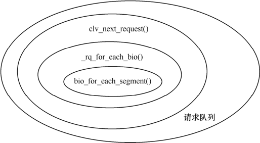

### 13.6.1 使用请求队列

块设备驱动请求函数的原型为：

void request(request_queue_t *queue);

这个函数不能由驱动自己调用，只有当内核认为是时候让驱动处理对设备的读写等操作时，它才调用这个函数。

请求函数可以在没有完成请求队列中的所有请求的情况下返回，甚至在一个请求不完成都可以返回。但是，对大部分设备而言，在请求函数中处理完所有请求后再返回通常是值得推荐的方法。代码清单13.14给出了一个简单的request()函数的例子。

代码清单13.13 块设备驱动请求函数例程

1 static void xxx_request(request_queue_t *q) 
 
 2 { 
 
 3 struct request *req; 
 
 4 while ((req = elv_next_request(q)) != NULL) { 
 
 5 struct xxx_dev *dev = req->rq_disk->private_data; 
 
 6 if (!blk_fs_request(req)) {/* 不是文件系统请求 */ 
 
 7 printk(KERN_NOTICE "Skip non-fs request\n"); 
 
 8 end_request(req, 0); 
 
 9 continue; 
 
 10 } 
 
 11 xxx_transfer(dev, req->sector, req->current_nr_sectors, req->buffer, 
 
 12 rq_data_dir(req)); /* 处理这个请求 */ 
 
 13 end_request(req, 1); /* 通知成功完成这个请求 */ 
 
 14 } 
 
 15 } 
 
 16 
 
 17 /* 完成具体的块设备I/O操作 */ 
 
 18 static void xxx_transfer(struct xxx_dev *dev, unsigned long sector, unsigned 
 
 19 long nsect, char *buffer, int write) 
 
 20 { 
 
 21 unsigned long offset = sector * KERNEL_SECTOR_SIZE; 
 
 22 unsigned long nbytes = nsect * KERNEL_SECTOR_SIZE; 
 
 23 if ((offset + nbytes) > dev->size) { 
 
 24 printk(KERN_NOTICE "Beyond-end write (%ld %ld)\n", offset, nbytes); 
 
 25 return ; 
 
 26 } 
 
 27 if (write) 
 
 28 write_dev(offset, buffer, nbytes); /* 向设备写nbytes个字节的数据 */ 
 
 29 else 
 
 30 read_dev(offset, buffer, nbytes); /* 从设备读nbytes个字节的数据 */ 
 
 31 }

上述代码第4行使用elv_next_request()获得队列中第一个未完成的请求，end_request()会将请求从请求队列中剥离。第6行判断请求是否为文件系统请求，如果不是，则直接清除，调用end_ request()，传递给end_request()的第二个参数为0意味着处理该请求失败。而第13行传递给end_request()的第二个参数为1意味着该请求处理成功。

end_request()函数非常重要，其源代码如代码清单13.14所示。不过要留意的是，新的内核版本建议在驱动中调用blk_end_request()或__blk_end_request()来结束request。

代码清单13.14 end.request()函数源代码

1 void end_request(struct request *req, int uptodate) 
 
 2 { 
 
 3 int error = 0; 
 
 4 
 
 5 if (uptodate <= 0) 
 
 6 error = uptodate ? uptodate : -EIO; 
 
 7 
 
 8 __blk_end_request(req, error, req->hard_cur_sectors << 9); 
 
 9 } 
 
 10 int __blk_end_request(struct request *rq, int error, unsigned int nr_bytes) 
 
 11 { 
 
 12 if (rq->bio && __end_that_request_first(rq, error, nr_bytes)) 
 
 13 return 1; 
 
 14 
 
 15 add_disk_randomness(rq->rq_disk); 
 
 16 
 
 17 end_that_request_last(rq, error); 
 
 18 
 
 19 return 0; 
 
 20 }

当设备已经完成一个I/O请求的部分或者全部扇区传输后，它必须通告块设备层，上述代码中的第12和17行完成这个工作。__end_that_request_first()函数的原型为：

int __end_that_request_first(struct request *req, int error, 
 
 int nr_bytes)

这个函数告知块设备层，块设备驱动已经完成nr_bytes个扇区的传送。__end_that_request_first ()的返回值是一个标志，指示是否这个请求中的所有扇区已经被传送。返回值为0表示所有的扇区已经被传送并且这个请求完成，之后，我们必须使用blkdev_dequeue_request()来从队列中清除这个请求。最后，将这个请求传递给end_that_request_last()函数。

void end_that_request_last(struct request *req);

end_that_request_last()通知所有正在等待这个请求完成的对象请求已经完成并回收这个请求结构体。

第15行的add_disk_randomness()函数的作用是使用块I/O请求的时间信息来给系统的随机数池贡献熵，它不影响块设备驱动。但是，仅当磁盘的操作时间是真正随机的时候（gendisk的random成员不为0，大部分机械设备如此），它才会调用add_timer_randomness()。

代码清单13.15给出了一个更复杂的请求函数，它进行了3层遍历：遍历请求队列中的每个请求，遍历请求中的每个bio，遍历bio中的每个段。

代码清单13.15 请求函数遍历请求、bio和段

1 static void xxx_full_request(request_queue_t *q) 
 
 2 { 
 
 3 struct request *req;

4 int sectors_xferred; 
 
 5 struct xxx_dev *dev = q->queuedata; 
 
 6 /* 遍历每个请求 */ 
 
 7 while ((req = elv_next_request(q)) != NULL) { 
 
 8 if (!blk_fs_request(req)) { 
 
 9 printk(KERN_NOTICE "Skip non-fs request\n"); 
 
 10 
 
 11 end_request(req, 0); 
 
 12 continue; 
 
 13 } 
 
 14 sectors_xferred = xxx_xfer_request(dev, req); 
 
 15 end_request(req, 1); /* 通知成功完成这个请求 */ 
 
 16 } 
 
 17 /* 请求处理 */ 
 
 18 static int xxx_xfer_request(struct xxx_dev *dev, struct request *req) 
 
 19 { 
 
 20 struct bio_vec *bvec; 
 
 21 /* 遍历请求中的每个bio的每个segment */ 
 
 22 rq_for_each_segment(bvec, req, iter) { 
 
 23 ... 
 
 24 } 
 
 25 }

上述代码中第26行调用的rq_for_each_segment()实际是一个二重循环，它的第一重循环遍历一个request的每个bio，第二重循环遍历一个bio的每个segment：

#define rq_for_each_segment(bvl, _rq, _iter) \ 
 
 __rq_for_each_bio(_iter.bio, _rq) \ 
 
 bio_for_each_segment(bvl, _iter.bio, _iter.i)

图13.3所示为一个请求队列内request、bio以及bio中segment的层层遍历关系。

