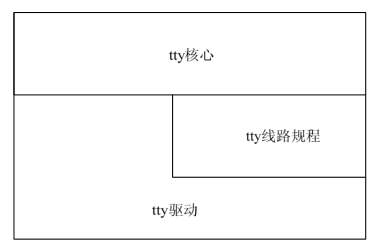
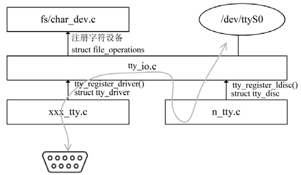

### 14.2 终端设备驱动结构

Linux内核中tty的层次结构如图14.1所示，包含tty核心、tty线路规程和tty驱动，tty线路规程的工作是以特殊的方式格式化从一个用户或者硬件收到的数据，这种格式化常常采用一个协议转换的形式，例如PPP和Bluetooth。tty设备发送数据的流程为：tty核心从一个用户获取将要发送给一个tty设备的数据，tty核心将数据传递给tty线路规程驱动，接着数据被传递到tty驱动，tty驱动将数据转换为可以发送给硬件的格式。接收数据的流程为：从tty硬件接收到的数据向上交给tty驱动，进入tty线路规程驱动，再进入tty核心，在这里它被一个用户获取。尽管大多数时候tty核心和tty之间的数据传输会经历tty线路规程的转换，但是tty驱动与tty核心之间也可以直接传输数据。

图14.2显示了与tty相关的主要源文件及数据的流向。drivers/char/tty_io.c定义了tty设备通用的file_operations结构体并实现了接口函数tty_register_driver()用于注册tty设备，它会利用fs/char_dev.c提供的接口函数注册字符设备，与具体设备对应的tty驱动将实现tty_driver结构体中的成员函数。同时tty_io.c也提供了tty_register_ldisc()接口函数用于注册线路规程，典型地，例如drivers/char/n_tty.c文件则针对N_TTY线路规程实现了tty_disc结构体中的成员。

从图14.2可以看出，特定tty设备驱动的主体工作是填充tty_driver结构体中的成员，实现其中的成员函数，tty_driver结构体的定义如代码清单14.1。

代码清单14.1 tty_driver结构体

1 struct tty_driver { 
 
 2 int magic; /* 该结构体的幻数 */ 
 
 3 struct kref kref; /* Reference管理 */ 
 
 4 struct cdev cdev; 
 
 5 struct module *owner; 
 
 6 const char *driver_name; 
 
 7 const char *name; 
 
 8 int name_base; 
 
 9 int major; /* 主设备号 */ 
 
 10 int minor_start; /* 开始次设备号 */ 
 
 11 int minor_num; /* 可能的设备数量 */ 
 
 12 int num; /* 被分配设备的数量 */ 
 
 13 short type; /* tty驱动的类型 */ 
 
 14 short subtype; /* tty驱动的子类 */ 
 
 15 struct ktermios init_termios; /* 初始的termios */ 
 
 16 int flags; /* tty驱动标志 */ 
 
 17 struct proc_dir_entry *proc_entry; /* /proc入口 */ 
 
 18 struct tty_driver *other; /* 仅对PTY驱动有用 */ 
 
 19 
 
 20 /* 
 
 21 * tty数据结构指针 
 
 22 */ 
 
 23 struct tty_struct **ttys; 
 
 24 struct ktermios **termios; 
 
 25 struct ktermios **termios_locked; 
 
 26 void *driver_state; 
 
 27 
 
 28 /* 
 
 29 * 驱动中的操作函数 
 
 30 */ 
 
 31 
 
 32 const struct tty_operations *ops; 
 
 33 struct list_head tty_drivers; 
 
 34 };

tty_driver结构体中的magic表示给这个结构体的“幻数”，设为TTY_DRIVER_MAGIC（即0x5402），在 alloc_tty_driver()函数中被初始化。

name与driver_name的不同在于后者表示驱动的名字，用在 /proc/tty 和 sysfs中，而前者表示驱动的设备节点名。

type与subtype描述tty驱动的类型和子类型，subtype的值依赖于type，type成员的可能值为TTY_DRIVER_TYPE_SYSTEM（subtype 应当设为 SYSTEM_TYPE_TTY、SYSTEM_TYEP_ CONSOLE、SYSTEM_TYPE_SYSCONS或SYSTEM_TYPE_SYSPTMX）、TTY_DRIVER_TYPE_ CONSOLE（仅被控制台驱动使用）、TTY_DRIVER_TYPE_SERIAL（被任何串行类型驱动使用，subtype通常设为SERIAL_TYPE_NORMAL）、TTY_DRIVER_TYPE_PTY（被伪控制台接口pty使用，此时subtype需要被设置为PTY_TYPE_MASTER或PTY_TYPE_SLAVE）、TTY_DRIVER_ TYPE_SCC（由SCC驱动使用）。

init_termios为初始线路设置，为一个termios结构体，这个成员被用来提供一个线路设置集合。

termios用于保存当前的线路设置，这些线路设置控制当前波特率、数据大小、数据流控设置等，这个结构体包含tcflag_t c_iflag（输入模式标志）、tcflag_t c_oflag（输出模式标志）、tcflag_t c_cflag（控制模式标志）、tcflag_t c_lflag（本地模式标志）、cc_t c_line（线路规程类型）、cc_t c_cc[NCCS]（一个控制字符数组）等成员。

驱动会使用一个标准的数值集初始化这个成员，它拷贝自tty_std_termios变量，tty_std_termos 在tty核心中的定义如代码清单14.2。

代码清单14.2 tty.std.termios变量

1 struct ktermios tty_std_termios = { 
 
 2 .c_iflag = ICRNL | IXON, /* 输入模式 */ 
 
 3 .c_oflag = OPOST | ONLCR,/* 输出模式 */ 
 
 4 .c_cflag = B38400 | CS8 | CREAD | HUPCL,/* 控制模式 */ 
 
 5 .c_lflag = ISIG | ICANON | ECHO | ECHOE | ECHOK | 
 
 6 ECHOCTL | ECHOKE | IEXTEN, /* 本地模式 */ 
 
 7 .c_cc = INIT_C_CC, /* 控制字符，用来修改终端的特殊字符映射 */ 
 
 8 .c_ispeed = 38400, 
 
 9 .c_ospeed = 38400 
 
 10 };

tty_driver结构体中的major、minor_start、minor_num表示主设备号、次设备号及可能的次设备数，name表示设备名（如ttyS），第32行是一个tty_operations结构体的指针，它的定义如代码清单14.3，其成员函数通常需在特定设备tty驱动模块初始化函数中被赋值。

代码清单14.3 tty.operations结构体

1 struct tty_operations { 
 
 2 struct tty_struct * (*lookup)(struct tty_driver *driver, 
 
 3 struct inode *inode, int idx); 
 
 4 int (*install)(struct tty_driver *driver, struct tty_struct *tty); 
 
 5 void (*remove)(struct tty_driver *driver, struct tty_struct *tty); 
 
 6 int (*open)(struct tty_struct * tty, struct file * filp); 
 
 7 void (*close)(struct tty_struct * tty, struct file * filp); 
 
 8 void (*shutdown)(struct tty_struct *tty); 
 
 9 int (*write)(struct tty_struct * tty, 
 
 10 const unsigned char *buf, int count); 
 
 11 int (*put_char)(struct tty_struct *tty, unsigned char ch); 
 
 12 void (*flush_chars)(struct tty_struct *tty); 
 
 13 int (*write_room)(struct tty_struct *tty); 
 
 14 int (*chars_in_buffer)(struct tty_struct *tty); 
 
 15 int (*ioctl)(struct tty_struct *tty, struct file * file, 
 
 16 unsigned int cmd, unsigned long arg);

17 long (*compat_ioctl)(struct tty_struct *tty, struct file * file, 
 
 18 unsigned int cmd, unsigned long arg); 
 
 19 void (*set_termios)(struct tty_struct *tty, struct ktermios * old); 
 
 20 void (*throttle)(struct tty_struct * tty); 
 
 21 void (*unthrottle)(struct tty_struct * tty); 
 
 22 void (*stop)(struct tty_struct *tty); 
 
 23 void (*start)(struct tty_struct *tty); 
 
 24 void (*hangup)(struct tty_struct *tty); 
 
 25 int (*break_ctl)(struct tty_struct *tty, int state); 
 
 26 void (*flush_buffer)(struct tty_struct *tty); 
 
 27 void (*set_ldisc)(struct tty_struct *tty); 
 
 28 void (*wait_until_sent)(struct tty_struct *tty, int timeout); 
 
 29 void (*send_xchar)(struct tty_struct *tty, char ch); 
 
 30 int (*read_proc)(char *page, char **start, off_t off, 
 
 31 int count, int *eof, void *data); 
 
 32 int (*tiocmget)(struct tty_struct *tty, struct file *file); 
 
 33 int (*tiocmset)(struct tty_struct *tty, struct file *file, 
 
 34 unsigned int set, unsigned int clear); 
 
 35 int (*resize)(struct tty_struct *tty, struct tty_struct *real_tty, 
 
 36 struct winsize *ws); 
 
 37 int (*set_termiox)(struct tty_struct *tty, struct termiox *tnew); 
 
 38 #ifdef CONFIG_CONSOLE_POLL 
 
 39 int (*poll_init)(struct tty_driver *driver, int line, char *options); 
 
 40 int (*poll_get_char)(struct tty_driver *driver, int line); 
 
 41 void (*poll_put_char)(struct tty_driver *driver, int line, char ch); 
 
 42 #endif 
 
 43};

put_char()为单字节写函数，当单个字节被写入设备时这个函数被tty核心调用，如果一个tty驱动没有定义这个函数，将使用count参数为1的write()函数。

flush_chars()与wait_until_sent()函数都用于刷新数据到硬件。

write_room()指示有多少缓冲区空闲，chars_in_buffer()指示缓冲区中包含的数据数。

当在tty设备的设备节点上执行IOCTL操作时，tty_operations结构体的ioctl()函数会被tty核心调用。

当设备的termios设置被改变时，set_termios()函数将被tty核心调用。

throttle()、unthrottle()、stop()和start()为数据抑制函数，这些函数用来辅助控制tty核心的输入缓冲区。当tty核心的输入缓冲区满时，throttle()函数将被调用，tty驱动试图通知设备不应当发送字符给它。当tty核心的输入缓冲区已被清空时，unthrottle()函数将被调用以暗示设备可以接收数据。sop()和start()函数非常像throttle()和unthrottle()函数，但它们表示tty驱动应当停止发送数据给设备以及恢复发送数据。

当tty驱动挂起tty设备时，hangup()函数被调用，在此函数中进行相关的硬件操作。

当tty驱动要在RS-232端口上打开或关闭线路的BREAK状态时，break_ctl()线路中断控制函数被调用。如果state状态设为-1，BREAK状态打开，如果状态设为0，BREAK状态关闭。如果这个函数由tty驱动实现，而tty核心将处理TCSBRK、TCSBRKP、TIOCSBRK和TIOCCBRK这些IOCTL命令。

flush_buffer()函数用于刷新缓冲区并丢弃任何剩下的数据。

set_ldisc()函数用于设置线路规程，当tty核心改变tty驱动的线路规程时这个函数被调用，这个函数通常不需要被驱动定义。

send_xchar()为X-类型字符发送函数，这个函数用来发送一个高优先级XON或者XOFF字符给tty设备，要被发送的字符在第2个参数ch中指定。

read_proc()和write_proc()为/proc读和写函数。

tiocmget()函数用于获得tty设备的线路设置，对应的tiocmset()用于设置tty设备的线路设置，参数set和clear包含了要设置或者清除的线路设置。

Linux内核提供了一组函数用于操作tty_driver结构体及tty设备，如下所示。

（1）分配tty驱动。

struct tty_driver *alloc_tty_driver(int lines);

这个函数返回tty_driver指针，其参数为要分配的设备数量，line会被赋值给tty_driver的num成员。

（2）注册tty驱动。

int tty_register_driver(struct tty_driver *driver);

参数为由alloc_tty_driver ()分配的tty_driver结构体指针，注册tty驱动成功时返回0。

（3）注销tty驱动。

int tty_unregister_driver(struct tty_driver *driver);

这个函数与tty_register_driver ()对应，tty驱动最终会调用上述函数注销tty_driver。

（4）注册tty设备。

void tty_register_device(struct tty_driver *driver, unsigned index, 
 
 struct device *device);

仅有tty_driver是不够的，驱动必须依附于设备，tty_register_device()函数用于注册关联于tty_driver的设备，index为设备的索引（范围是0～driver->num），如：

for (i = 0; i < XXX_TTY_MINORS; ++i) 
 
 tty_register_device(xxx_tty_driver, i, NULL);

（5）注销tty设备。

void tty_unregister_device(struct tty_driver *driver, unsigned index);

上述函数与tty_register_device()对应，用于注销tty设备，其使用方法如：

for (i = 0; i < XXX_TTY_MINORS; ++i) 
 
 tty_unregister_device(xxx_tty_driver, i);

（6）设置tty驱动操作。

void tty_set_operations(struct tty_driver *driver, struct tty_operations *op);

上述函数会将tty_operations结构体中的函数指针拷贝给tty_driver对应的函数指针。

终端设备驱动都围绕tty_driver结构体而展开，一般而言，终端设备驱动应包含如下组成。

（1）终端设备驱动模块加载函数和卸载函数，完成注册和注销tty_driver，初始化和释放终端设备对应的tty_driver结构体成员及硬件资源。

（2）实现tty_operations结构体中的一系列成员函数，主要是实现open()、close()、write()、tiocmget()、tiocmset()等函数。

