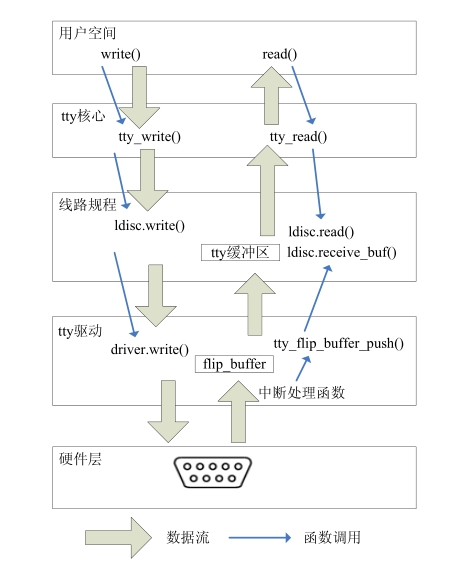

### 14.4 数据发送和接收

图14.3所示终端设备数据发送和接收过程中的数据流以及函数调用关系。用户在有数据发送给终端设备时，通过“write()系统调用—tty核心—线路规程”的层层调用，最终调用tty_driver结构体中的write()函数完成发送。

因为传输速度和tty硬件缓冲区容量的原因，不是所有的写程序要求的字符都可以在调用写函数时被发送，因此写函数应当返回能够发送给硬件的字节数以便用户程序检查是否所有的数据被真正写入。如果在 write()调用期间发生任何错误，一个负的错误码应当被返回。

tty_driver的write()函数接受3个参数tty_struct、发送数据指针及要发送的字节数，一般首先会通过tty_struct的driver_data成员得到设备私有信息结构体，然后依次进行必要的硬件操作开始发送，代码清单14.6为tty_driver的write()函数范例。

代码清单14.6 tty.driver结构体的write()成员函数范例

1 static int xxx_write(struct tty_struct *tty, const unsigned char *buf, int count) 
 
 2 { 
 
 3 /* 获得tty设备私有数据 */ 
 
 4 struct xxx_tty *xxx = (struct xxx_tty*)tty->driver_data; 
 
 5 ... 
 
 6 /* 开始发送 */ 
 
 7 while (1) { 
 
 8 local_irq_save(flags); 
 
 9 c = min_t(int, count, min(SERIAL_XMIT_SIZE - xxx->xmit_cnt - 1, 
 
 10 SERIAL_XMIT_SIZE - xxx->xmit_head)); 
 
 11 
 
 12 if (c <= 0) { 
 
 13 local_irq_restore(flags); 
 
 14 break; 
 
 15 } 
 
 16 /* 拷贝到发送缓冲区 */ 
 
 17 memcpy(xxx->xmit_buf + xxx->xmit_head, buf, c); 
 
 18 xxx->xmit_head = (xxx->xmit_head + c) &(SERIAL_XMIT_SIZE - 1);

19 xxx->xmit_cnt += c; 
 
 20 local_irq_restore(flags); 
 
 21 
 
 22 buf += c; 
 
 23 count -= c; 
 
 24 total += c; 
 
 25 } 
 
 26 
 
 27 if (xxx->xmit_cnt && !tty->stopped && !tty->hw_stopped) 
 
 28 start_xmit(xxx);/* 开始发送 */ 
 
 29 return total; /* 返回发送的字节数 */ 
 
 30 }

当tty子系统自己需要发送数据到tty设备时，如果没有实现put_char()函数，write()函数将被调用，此时传入的count参数为1，通过对代码清单14.7的分析即可获知。

代码清单14.7 put.char()函数的write()替代

1 int tty_register_driver(struct tty_driver *driver) 
 
 2 { 
 
 3 ... 
 
 4 if (!driver->put_char)//没有定义put_char()函数 
 
 5 driver->put_char = tty_default_put_char; 
 
 6 ... 
 
 7 } 
 
 8 static void tty_default_put_char(struct tty_struct *tty, unsigned char ch) 
 
 9 { 
 
 10 tty->driver->write(tty, &ch, 1);//调用tty_driver.write()函数 
 
 11 }

读者朋友们可能注意到了，tty_operations结构体中没有提供read()函数。因为发送是用户主动的，而接收即用户调read()则是读一片缓冲区中已放好的数据。tty核心在一个称为struct tty_ flip_buffer的结构体中缓冲数据直到它被用户请求。因为tty核心提供了缓冲逻辑，因此每个tty驱动并非一定要实现它自身的缓冲逻辑。

tty驱动不必过于关心tty_flip_buffer结构体的细节，如果其count字段大于或等于TTY_ FLIPBUF_SIZE，这个flip缓冲区就需要被刷新到用户，刷新通过对tty_flip_buffer_push()函数的调用来完成，代码清单14.8给出了范例。

代码清单14.8 tty.flip.buffer.push()范例

1 for (i = 0; i < data_size; ++i) { 
 
 2 if (tty->flip.count >= TTY_FLIPBUF_SIZE) 
 
 3 tty_flip_buffer_push(tty);/* 数据填满向上层“推”*/ 
 
 4 tty_insert_flip_char(tty, data[i], TTY_NORMAL); /* 把数据插入缓冲区 */ 
 
 5 } 
 
 6 tty_flip_buffer_push(tty);

从tty驱动接收到字符将被tty_insert_flip_char()函数插入flip缓冲区。该函数的第1个参数是数据应当保存入的tty_struct结构体，第2个参数是要保存的字符，第3个参数是应当为这个字符设置的标志，如果字符是一个接收到的常规字符，则设为TTY_NORMAL，如果是一个特殊类型的指示错误的字符，依据具体的错误类型，应当设为TTY_BREAK、TTY_PARITY或TTY_OVERRUN。

