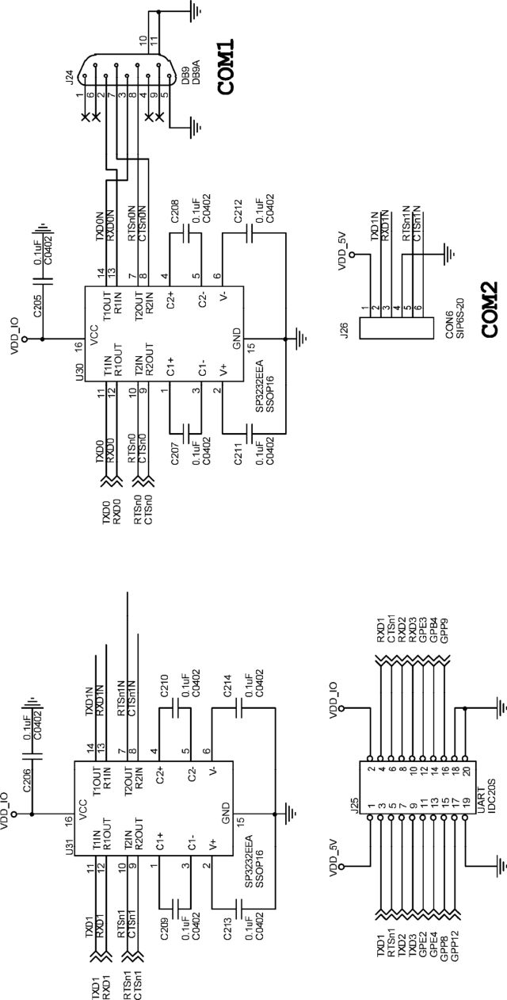

### 14.8.1 S3C6410串口硬件描述

S3C6410具有4路高速串口，LDD6410为第1路串口设计了1个DB9接口，其他都通过DIP插座引出，其原理如图14.5所示，图中的SP3232EEA是1个电平转换芯片。

LDD6410开发板所用内核版本2.6.28.6的串口驱动位于drivers/serial/samsung.c、drivers/ serial/s3c6400.c文件，其中samsung.c是底层核心，而s3c6400.c（为S3C6400、S3C6410、CPU_S5P644服务）调用了它。

