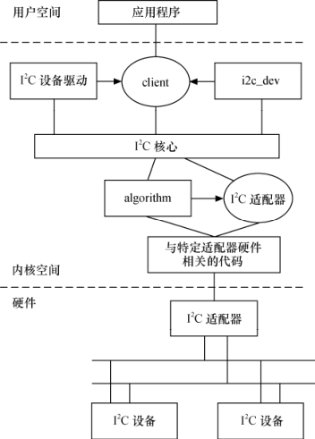

### 15.1 Linux的I2C体系结构

Linux的I2C体系结构分为3个组成部分。

（1）I2C核心。

I2C核心提供了I2C总线驱动和设备驱动的注册、注销方法，I2C通信方法（即“algorithm”）上层的、与具体适配器无关的代码以及探测设备、检测设备地址的上层代码等。

（2）I2C总线驱动。

I2C总线驱动是对I2C硬件体系结构中适配器端的实现，适配器可由CPU控制，甚至可以直接集成在CPU内部。

I2C总线驱动主要包含了I2C适配器数据结构i2c_adapter、I2C适配器的algorithm数据结构i2c_algorithm和控制I2C适配器产生通信信号的函数。

经由I2C总线驱动的代码，我们可以控制I2C适配器以主控方式产生开始位、停止位、读写周期，以及以从设备方式被读写、产生ACK等。

（3）I2C设备驱动。

I2C设备驱动（也称为客户驱动）是对I2C硬件体系结构中设备端的实现，设备一般挂接在受CPU控制的I2C适配器上，通过I2C适配器与CPU交换数据。

I2C设备驱动主要包含了数据结构i2c_driver和i2c_client，我们需要根据具体设备实现其中的成员函数。

在Linux 2.6内核中，所有的I2C设备都在sysfs文件系统中显示，存于/sys/bus/i2c/目录，以适配器地址和芯片地址的形式列出，例如：

$ tree /sys/bus/i2c/

/sys/bus/i2c/

|-- devices

| |-- 0-0048 -> ../../../devices/legacy/i2c-0/0-0048

| |-- 0-0049 -> ../../../devices/legacy/i2c-0/0-0049

| |-- 0-004a -> ../../../devices/legacy/i2c-0/0-004a

| |-- 0-004b -> ../../../devices/legacy/i2c-0/0-004b

| |-- 0-004c -> ../../../devices/legacy/i2c-0/0-004c

| |-- 0-004d -> ../../../devices/legacy/i2c-0/0-004d

| |-- 0-004e -> ../../../devices/legacy/i2c-0/0-004e

| '-- 0-004f -> ../../../devices/legacy/i2c-0/0-004f

'-- drivers

|-- i2c_adapter

'-- lm75

|-- 0-0048 -> ../../../../devices/legacy/i2c-0/0-0048

|-- 0-0049 -> ../../../../devices/legacy/i2c-0/0-0049

|-- 0-004a -> ../../../../devices/legacy/i2c-0/0-004a

|-- 0-004b -> ../../../../devices/legacy/i2c-0/0-004b

|-- 0-004c -> ../../../../devices/legacy/i2c-0/0-004c

|-- 0-004d -> ../../../../devices/legacy/i2c-0/0-004d

|-- 0-004e -> ../../../../devices/legacy/i2c-0/0-004e

'-- 0-004f -> ../../../../devices/legacy/i2c-0/0-004f

在Linux内核源代码中的drivers目录下包含一个i2c目录，而在i2c目录下又包含如下文件和文件夹。

（1）i2c-core.c。

这个文件实现了I2C核心的功能以及/proc/bus/i2c*接口。

（2）i2c-dev.c。

实现了I2C适配器设备文件的功能，每一个I2C适配器都被分配一个设备。通过适配器访问设备时的主设备号都为89，次设备号为0～255。应用程序通过“i2c-%d”（i2c-0, i2c-1,…, i2c-10,…）文件名并使用文件操作接口open()、write()、read()、ioctl()和close()等来访问这个设备。

i2c-dev.c并没有针对特定的设备而设计，只是提供了通用的read()、write()和ioctl()等接口，应用层可以借用这些接口访问挂接在适配器上的I2C设备的存储空间或寄存器，并控制I2C设备的工作方式。

（3）chips文件夹。

这个目录中包含了一些特定的I2C设备驱动，如Dallas公司的DS1337实时钟芯片、EPSON公司的RTC8564实时钟芯片和I2C接口的EEPROM驱动等。

在具体的I2C设备驱动中，调用的都是I2C核心提供的API，因此，这使得具体的I2C设备驱动不依赖于CPU的类型和I2C适配器的硬件特性。

（4）busses文件夹。

这个文件中包含了一些I2C总线的驱动，如针对S3C2410、S3C2440和S3C6410等处理器的I2C控制器驱动为i2c-s3c2410.c。

（5）algos文件夹。

实现了一些I2C总线适配器的algorithm。

此外，内核中的i2c.h这个头文件对i2c_driver、i2c_client、i2c_adapter和i2c_algorithm这4个数据结构进行了定义。理解这4个结构体的作用十分关键，代码清单15.1、15.2、15.3、15.4分别给出了它们的定义。

代码清单15.1 i2c_adapter结构体

1 struct i2c_adapter { 
 
 2 struct module *owner;/*所属模块*/ 
 
 3 unsigned int id; /*algorithm的类型，定义于i2c-id.h，以I2C_ALGO_开始*/ 
 
 4 unsigned int class; 
 
 5 struct i2c_algorithm *algo;/*总线通信方法结构体指针*/ 
 
 6 void *algo_data;/* algorithm数据 */ 
 
 7 int (*client_register)(struct i2c_client *); /*client注册时调用*/ 
 
 8 int (*client_unregister)(struct i2c_client *); /*client注销时调用*/ 
 
 9 u8 level; 
 
 10 struct semaphore bus_lock; /*控制并发访问的自旋锁*/ 
 
 11 struct semaphore clist_lock; 
 
 12 int timeout; 
 
 13 int retries; /*重试次数*/ 
 
 14 struct device dev;/* 适配器设备 */ 
 
 15 struct class_device class_dev;/* 类设备 */ 
 
 16 int nr; 
 
 17 struct list_head clien; /* client链表头*/ 
 
 18 struct list_head list; 
 
 19 char name[48]; /*适配器名称*/ 
 
 20 struct completion dev_released; /*用于同步*/ 
 
 21};

代码清单15.2 i2c_algorithm结构体

1 struct i2c_algorithm { 
 
 2 int (*master_xfer)(struct i2c_adapter *adap,struct i2c_msg *msgs, 
 
 3 int num); /*i2c传输函数指针*/ 
 
 4 int (*smbus_xfer) (struct i2c_adapter *adap, u16 addr, /*smbus传输函数指针*/ 
 
 5 unsigned short flags, char read_write, 
 
 6 u8 command, int size, union i2c_smbus_data * data); 
 
 7 u32 (*functionality) (struct i2c_adapter *);/*返回适配器支持的功能*/ 
 
 8 };

上述代码第4行对应为SMBus传输函数指针，SMBus大部分基于I2C总线规范，SMBus不需增加额外引脚。与I2C总线相比，SMBus增加了一些新的功能特性，在访问时序也有一定的差异。

代码清单15.3 i2c_driver结构体

1 struct i2c_driver { 
 
 2 int id; 
 
 3 unsigned int class; 
 
 4 int (*attach_adapter)(struct i2c_adapter *); /*依附i2c_adapter函数指针 */ 
 
 5 int (*detach_adapter)(struct i2c_adapter *); /*脱离i2c_adapter函数指针*/ 
 
 6 int (*detach_client)(struct i2c_client *); /*i2c client脱离函数指针*/

7 int (*probe)(struct i2c_client *, const struct i2c_device_id *); 
 
 8 int (*remove)(struct i2c_client *); 
 
 9 void (*shutdown)(struct i2c_client *); 
 
 10 int (*suspend)(struct i2c_client *, pm_message_t mesg); 
 
 11 int (*resume)(struct i2c_client *); 
 
 12 int (*command)(struct i2c_client *client, unsigned int cmd, void *arg); 
 
 13 struct device_driver driver; 
 
 14 const struct i2c_device_id *id_table; /* 该驱动所支持的设备ID表 */ 
 
 15 int (*detect)(struct i2c_client *, int kind, struct i2c_board_info *); 
 
 16 const struct i2c_client_address_data *address_data; 
 
 17 struct list_head clients; 
 
 18 };

代码清单15.4 i2c_client结构体

1 struct i2c_client { 
 
 2 unsigned int flags;/* 标志 */ 
 
 3 unsigned short addr; /* 低7位为芯片地址 */ 
 
 4 char name[I2C_NAME_SIZE]; /* 设备名称 */ 
 
 5 struct i2c_adapter *adapter;/*依附的i2c_adapter*/ 
 
 6 struct i2c_driver *driver; /*依附的i2c_driver */ 
 
 7 struct device dev; /* 设备结构体*/ 
 
 8 int irq; /* 设备使用的中断号*/ 
 
 9 struct list_head list; /* 链表头 */ 
 
 10 struct completion released; /* 用于同步 */ 
 
 11 };

下面分析i2c_driver、i2c_client、i2c_adapter和i2c_algorithm这4个数据结构的作用及其盘根错节的关系。

（1）i2c_adapter与i2c_algorithm。

i2c_adapter对应于物理上的一个适配器，而i2c_algorithm对应一套通信方法。一个I2C适配器需要i2c_algorithm中提供的通信函数来控制适配器上产生特定的访问周期。缺少i2c_algorithm 的i2c_adapter什么也做不了，因此i2c_adapter中包含其使用的i2c_algorithm的指针。

i2c_algorithm中的关键函数master_xfer()用于产生I2C访问周期需要的信号，以i2c_msg（即I2C消息）为单位。i2c_msg结构体也非常关键，代码清单15.5给出了它的定义。

代码清单15.5 i2c_msg结构体

1 struct i2c_msg { 
 
 2 _ _u16 addr;/* 设备地址*/ 
 
 3 _ _u16 flags;/* 标志 */ 
 
 4 _ _u16 len;/* 消息长度*/ 
 
 5 _ _u8 *buf;/* 消息数据*/ 
 
 6 };

（2）i2c_driver与i2c_client。

i2c_driver对应一套驱动方法，其主要成员函数是probe()、remove()、suspend()、resume()等，另外id_table是该驱动所支持的I2C设备的ID表。i2c_client对应于真实的物理设备，每个I2C设备都需要一个i2c_client来描述。i2c_driver与i2c_client的关系是一对多，一个i2c_driver上可以支持多个同等类型的i2c_client。

i2c_client信息通常在BSP的板文件中通过i2c_board_info填充，如下面代码就定义了一个了I2C设备ID为“ad7142_joystick”、地址为0x2C、中断号位IRQ_PF5的i2c_client：

static struct i2c_board_info __initdata xxx_i2c_board_info[] = { 
 
 #if defined(CONFIG_JOYSTICK_AD7142) || defined(CONFIG_JOYSTICK_AD7142_MODULE) 
 
 { 
 
 I2C_BOARD_INFO("ad7142_joystick", 0x2C), 
 
 .irq = IRQ_PF5, 
 
 }, 
 
 ... 
 
 }

在I2C总线驱动i2c_bus_type的match()函数i2c_device_match()中，会调用i2c_match_id()函数匹配板文件中定义的ID和i2c_driver所支持的ID表。

（3）i2c_adpater与i2c_client。

i2c_adpater与i2c_client的关系与I2C硬件体系中适配器和设备的关系一致，即i2c_client依附于i2c_adpater。由于一个适配器上可以连接多个I2C设备，所以一个i2c_adpater也可以被多个i2c_client依附，i2c_adpater中包括依附于它的i2c_client的链表。

假设I2C总线适配器xxx上有两个使用相同驱动程序的yyy I2C设备，在打开该I2C总线的设备结点后相关数据结构之间的逻辑组织关系将如图15.2所示。

从上面的分析可知，虽然I2C硬件体系结构比较简单，但是I2C体系结构在Linux中的实现却相当复杂。当工程师拿到实际的电路板，面对复杂的Linux I2C子系统，应该如何下手写驱动呢？究竟有哪些是需要亲自做的，哪些是内核已经提供的呢？理清这个问题非常有意义，可以使我们面对具体问题时迅速地抓住重点。

一方面，适配器驱动可能是Linux内核本身还不包含的；另一方面，挂接在适配器上的具体设备驱动可能也是Linux内核还不包含的。因此，工程师要实现的主要工作如下。

● 提供I2C适配器的硬件驱动，探测、初始化I2C适配器（如申请I2C的I/O地址和中断号）、驱动CPU控制的I2C适配器从硬件上产生各种信号以及处理I2C中断等。

● 提供I2C适配器的algorithm，用具体适配器的xxx_xfer()函数填充i2c_algorithm的master_xfer指针，并把i2c_algorithm指针赋值给i2c_adapter的algo指针。

● 实现I2C设备驱动中的i2c_driver接口，用具体设备yyy的yyy_probe()、yyy_remove()、yyy_suspend()、yyy_resume()函数指针和i2c_device_id设备ID表赋值给i2c_driver的probe、remove、suspend、resume和id_table指针。

● 实现I2C设备所对应类型的具体驱动，i2c_driver只是实现设备与总线的挂接，而挂接在总线上的设备则是千差万别。例如，如果是字符设备，就实现文件操作接口，即实现具体设备yyy的yyy_read()、yyy_write()和yyy_ioctl()函数等；如果是声卡，就实现ALSA驱动。

上述工作中前两个属于I2C总线驱动，后两个属于I2C设备驱动，做完这些工作，系统会增加两个内核模块。15.3～15.4节将详细分析这些工作的实施方法，给出设计模板，而15.5～15.6节将给出两个具体的实例。

