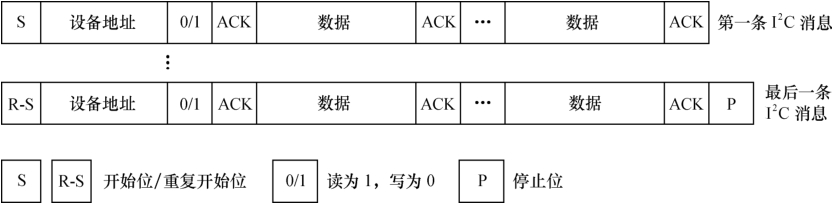

### 15.3.2 I2C总线通信方法

我们需要为特定的I2C适配器实现其通信方法，主要实现i2c_algorithm的master_xfer()函数和functionality()函数。

functionality()函数非常简单，用于返回algorithm所支持的通信协议，如I2C_FUNC_I2C、I2C_ FUNC_10BIT_ADDR、I2C_FUNC_SMBUS_READ_BYTE、I2C_FUNC_SMBUS_WRITE_BYTE等。

master_xfer()函数在I2C适配器上完成传递给它的i2c_msg数组中的每个I2C消息，代码清单15.11所示为xxx设备的master_xfer()函数模板。

代码清单15.11 I2C总线驱动master_xfer函数模板

1 static int i2c_adapter_xxx_xfer(struct i2c_adapter *adap, struct i2c_msg *msgs, 
 
 2 int num) 
 
 3 { 
 
 4 ... 
 
 5 for (i = 0; i < num; i++) { 
 
 6 i2c_adapter_xxx_start(); /*产生开始位*/ 
 
 7 /*是读消息*/ 
 
 8 if (msgs[i]->flags &I2C_M_RD) { 
 
 9 i2c_adapter_xxx_setaddr((msg->addr << 1) | 1); /*发送从设备读地址*/ 
 
 10 i2c_adapter_xxx_wait_ack(); /*获得从设备的ack*/ 
 
 11 i2c_adapter_xxx_readbytes(msgs[i]->buf, msgs[i]->len); /*读取msgs[i] ->len 
 
 12 长的数据到msgs[i]->buf*/ 
 
 13 } else { /*是写消息*/ 
 
 14 i2c_adapter_xxx_setaddr(msg->addr << 1); /*发送从设备写地址*/ 
 
 15 i2c_adapter_xxx_wait_ack(); /*获得从设备的ack*/ 
 
 16 i2c_adapter_xxx_writebytes(msgs[i]->buf, msgs[i]->len); /*读取msgs[i] ->len

17 长的数据到msgs[i]->buf*/ 
 
 18 } 
 
 19 } 
 
 20 i2c_adapter_xxx_stop(); /*产生停止位*/ 
 
 21 }

上述代码实际上给出了一个master_xfer()函数处理I2C消息数组的流程，对于数组中的每个消息，判断消息类型，若为读消息，则赋从设备地址为（msg->addr << 1）|1，否则为msg->addr << 1。对每个消息产生一个开始位，紧接着传送从设备地址，然后开始数据的发送或接收，对最后的消息还需产生一个停止位。如图15.3所示为整个master_xfer()完成的时序。

master_xfer()函数模板中的i2c_adapter_xxx_start()、i2c_adapter_xxx_setaddr()、i2c_adapter_ xxx_wait_ack()、i2c_adapter_xxx_readbytes()、i2c_adapter_xxx_writebytes()和i2c_adapter_xxx_stop()函数用于完成适配器的底层硬件操作，与I2C适配器和CPU的具体硬件直接相关，需要由工程师根据芯片的数据手册来实现。

i2c_adapter_xxx_readbytes()用于从从设备上接收一串数据，i2c_adapter_xxx_writebytes()用于向从设备写入一串数据，这两个函数的内部也会涉及I2C总线协议中的ACK应答。

master_xfer()函数的实现在形式上会很多样，即便是Linux内核源代码中已经给出的一些I2C总线驱动的master_xfer()函数，由于由不同的组织或个人完成，风格上的差别也非常大，不一定能与模板完全对应，如master_xfer()函数模板给出的消息处理是顺序进行的，而有的驱动以中断方式来完成这个流程（15.5节的实例即是如此）。不管具体怎么实施，流程的本质都是不变的。因为这个流程不以驱动工程师的意志为转移，最终由I2C总线硬件上的通信协议决定。

多数I2C总线驱动会定义一个xxx_i2c结构体，作为i2c_adapter的algo_data（类似“私有数据”），其中包含I2C消息数组指针、数组索引及I2C适配器algorithm访问控制用的自旋锁、等待队列等，而master_xfer()函数完成消息数组中消息的处理也可通过对xxx_i2c结构体相关成员的访问来控制。代码清单15.12所示为xxx_i2c结构体的定义，与图15.2中的xxx_i2c是对应的。

代码清单15.12 xxx_i2c结构体模板

1 struct xxx_i2c { 
 
 2 spinlock_t lock; 
 
 3 wait_queue_head_t wait; 
 
 4 struct i2c_msg *msg; 
 
 5 unsigned int msg_num;

6 unsigned int msg_idx; 
 
 7 unsigned int msg_ptr; 
 
 8 ... 
 
 9 struct i2c_adapter adap; 
 
 10 };

