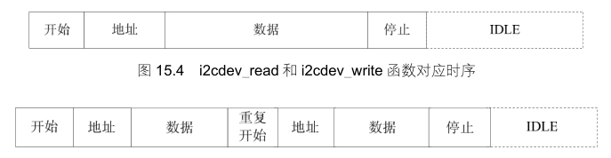

### 15.4.3 Linux的i2c-dev.c文件分析

i2c-dev.c文件完全可以被看作一个I2C设备驱动，不过，它实现的一个i2c_client是虚拟、临时的，随着设备文件的打开而产生，并随设备文件的关闭而撤销，并没有被添加到i2c_adapter的clien链表中。i2c-dev.c针对每个I2C适配器生成一个主设备号为89的设备文件，实现了i2c_driver的成员函数以及文件操作接口，所以i2c-dev.c的主体是“i2c_driver成员函数+字符设备驱动”。

i2c-dev.c中提供i2cdev_read()、i2cdev_write()函数来对应用户空间要使用的read()和write()文件操作接口，这两个函数分别调用I2C核心的i2c_master_recv()和i2c_master_send()函数来构造一条I2C消息并引发适配器algorithm通信函数的调用，完成消息的传输，对应于如图15.4所示的时序。但是，很遗憾，大多数稍微复杂一点I2C设备的读写流程并不对应于一条消息，往往需要两条甚至更多的消息来进行一次读写周期（即如图15.5所示的重复开始位RepStart模式），这种情况下，在应用层仍然调用read()、write()文件API来读写I2C设备，将不能正确地读写。许多工程师碰到过类似的问题，往往经过相当长时间的调试都没法解决I2C设备的读写，连错误的原因也无法找到，显然是对i2cdev_read()和i2cdev_write()函数的作用有所误解。

鉴于上述原因，i2c-dev.c中i2cdev_read()和i2cdev_write()函数不具备太强的通用性，没有太大的实用价值，只能适用于非RepStart模式的情况。对于两条以上消息组成的读写，在用户空间需要组织i2c_msg消息数组并调用I2C_RDWR IOCTL命令。代码清单15.15所示为i2cdev_ioctl()函数的框架。

代码清单15.15 i2c-dev_c中的i2cdev_ioctl函数

1 static int i2cdev_ioctl(struct inode *inode, struct file *file, 
 
 2 unsigned int cmd, unsigned long arg) 
 
 3 { 
 
 4 struct i2c_client *client = (struct i2c_client *)file->private_data; 
 
 5 ... 
 
 6 switch ( cmd ) { 
 
 7 case I2C_SLAVE:

8 case I2C_SLAVE_FORCE: 
 
 9 ... /*设置从设备地址*/ 
 
 10 case I2C_TENBIT: 
 
 11 ... 
 
 12 case I2C_PEC: 
 
 13 ... 
 
 14 case I2C_FUNCS: 
 
 15 ... 
 
 16 case I2C_RDWR: 
 
 17 return i2cdev_ioctl_rdrw(client, arg); 
 
 18 case I2C_SMBUS: 
 
 19 ... 
 
 20 case I2C_RETRIES: 
 
 21 ... 
 
 22 case I2C_TIMEOUT: 
 
 23 ... 
 
 24 default: 
 
 25 return i2c_control(client,cmd,arg); 
 
 26 } 
 
 27 return 0; 
 
 28 }

常用的IOCTL包括I2C_SLAVE（设置从设备地址）、I2C_RETRIES（没有收到设备ACK情况下的重试次数，默认为1）、I2C_TIMEOU（超时）以及I2C_RDWR。

代码清单15.16和代码清单15.17所示为直接通过read()、write()接口和O_RDWR IOCTL读写I2C设备的例子。

代码清单15.16 直接通过read()/write()读写I2C设备

1 #include <stdio.h> 
 
 2 #include <linux/types.h> 
 
 3 #include <fcntl.h> 
 
 4 #include <unistd.h> 
 
 5 #include <stdlib.h> 
 
 6 #include <sys/types.h> 
 
 7 #include <sys/ioctl.h> 
 
 8 #include <linux/i2c.h> 
 
 9 #include <linux/i2c-dev.h> 
 
 10 
 
 11 int main(int argc, char **argv) 
 
 12 { 
 
 13 unsigned int fd; 
 
 14 unsigned short mem_addr; 
 
 15 unsigned short size; 
 
 16 unsigned short idx; 
 
 17 #define BUFF_SIZE 32 
 
 18 char buf[BUFF_SIZE]; 
 
 19 char cswap; 
 
 20 union 
 
 21 { 
 
 22 unsigned short addr; 
 
 23 char bytes[2]; 
 
 24 } tmp; 
 
 25 
 
 26 if (argc < 3) {

27 printf("Use:\n%s /dev/i2c-x mem_addr size\n", argv[0]); 
 
 28 return 0; 
 
 29 } 
 
 30 sscanf(argv[2], "%d", &mem_addr); 
 
 31 sscanf(argv[3], "%d", &size); 
 
 32 
 
 33 if (size > BUFF_SIZE) 
 
 34 size = BUFF_SIZE; 
 
 35 
 
 36 fd = open(argv[1], O_RDWR); 
 
 37 
 
 38 if (!fd) { 
 
 39 printf("Error on opening the device file\n"); 
 
 40 return 0; 
 
 41 } 
 
 42 
 
 43 ioctl(fd, I2C_SLAVE, 0x50); /* 设置EEPROM地址 */ 
 
 44 ioctl(fd, I2C_TIMEOUT, 1); /* 设置超时 */ 
 
 45 ioctl(fd, I2C_RETRIES, 1); /* 设置重试次数 */ 
 
 46 
 
 47 for (idx = 0; idx < size; ++idx, ++mem_addr) { 
 
 48 tmp.addr = mem_addr; 
 
 49 cswap = tmp.bytes[0]; 
 
 50 tmp.bytes[0] = tmp.bytes[1]; 
 
 51 tmp.bytes[1] = cswap; 
 
 52 write(fd, &tmp.addr, 2); 
 
 53 read(fd, &buf[idx], 1); 
 
 54 } 
 
 55 buf[size] = 0; 
 
 56 close(fd); 
 
 57 printf("Read %d char: %s\n", size, buf); 
 
 58 return 0; 
 
 59 }

代码清单15.17 通过O_RDWR IOCTL读写I2C设备

1 #include <stdio.h> 
 
 2 #include <linux/types.h> 
 
 3 #include <fcntl.h> 
 
 4 #include <unistd.h> 
 
 5 #include <stdlib.h> 
 
 6 #include <sys/types.h> 
 
 7 #include <sys/ioctl.h> 
 
 8 #include <errno.h> 
 
 9 #include <assert.h> 
 
 10 #include <string.h> 
 
 11 #include <linux/i2c.h> 
 
 12 #include <linux/i2c-dev.h> 
 
 13 
 
 14 int main(int argc, char **argv) 
 
 15 { 
 
 16 struct i2c_rdwr_ioctl_data work_queue; 
 
 17 unsigned int idx; 
 
 18 unsigned int fd; 
 
 19 unsigned int slave_address, reg_address;

20 unsigned char val; 
 
 21 int i; 
 
 22 int ret; 
 
 23 
 
 24 if (argc < 4) { 
 
 25 printf("Usage:\n%s /dev/i2c-x start_addr reg_addr\n", argv[0]); 
 
 26 return 0; 
 
 27 } 
 
 28 
 
 29 fd = open(argv[1], O_RDWR); 
 
 30 
 
 31 if (!fd) { 
 
 32 printf("Error on opening the device file\n"); 
 
 33 return 0; 
 
 34 } 
 
 35 sscanf(argv[2], "%x", &slave_address); 
 
 36 sscanf(argv[3], "%x", &reg_address); 
 
 37 
 
 38 work_queue.nmsgs = 2; /* 消息数量 */ 
 
 39 work_queue.msgs = (struct i2c_msg*)malloc(work_queue.nmsgs *sizeof(struct 
 
 40 i2c_msg)); 
 
 41 if (!work_queue.msgs) { 
 
 42 printf("Memory alloc error\n"); 
 
 43 close(fd); 
 
 44 return 0; 
 
 45 } 
 
 46 
 
 47 ioctl(fd, I2C_TIMEOUT, 2); /* 设置超时 */ 
 
 48 ioctl(fd, I2C_RETRIES, 1); /* 设置重试次数 */ 
 
 49 
 
 50 for (i = reg_address; i < reg_address + 16; i++) { 
 
 51 val = i; 
 
 52 (work_queue.msgs[0]).len = 1; 
 
 53 (work_queue.msgs[0]).addr = slave_address; 
 
 54 (work_queue.msgs[0]).buf = &val; 
 
 55 
 
 56 (work_queue.msgs[1]).len = 1; 
 
 57 (work_queue.msgs[1]).flags = I2C_M_RD; 
 
 58 (work_queue.msgs[1]).addr = slave_address; 
 
 59 (work_queue.msgs[1]).buf = &val; 
 
 60 
 
 61 ret = ioctl(fd, I2C_RDWR, (unsigned long) &work_queue); 
 
 62 if (ret < 0) 
 
 63 printf("Error during I2C_RDWR ioctl with error code: %d\n", ret); 
 
 64 else 
 
 65 printf("reg:%02x val:%02x\n", i, val); 
 
 66 } 
 
 67 close(fd); 
 
 68 return ; 
 
 69 }

该程序位于虚拟机的/home/lihacker/develop/svn/ldd6410-read-only/tes/i2c/i2c-base-test目录，使用该工具可指定读取某I2C控制器上某I2C从设备的某寄存器，如读I2C控制器0上的地址为0x18的从设备，从寄存器0x20开始读：

# i2c-test /dev/i2c-0 0x18 0x20

reg:20 val:07 
 
 reg:21 val:00 
 
 reg:22 val:00 
 
 reg:23 val:00 
 
 reg:24 val:00 
 
 reg:25 val:00 
 
 reg:26 val:00 
 
 reg:27 val:00 
 
 reg:28 val:00 
 
 reg:29 val:00 
 
 reg:2a val:00 
 
 reg:2b val:00 
 
 reg:2c val:00 
 
 reg:2d val:00 
 
 reg:2e val:00 
 
 reg:2f val:00

