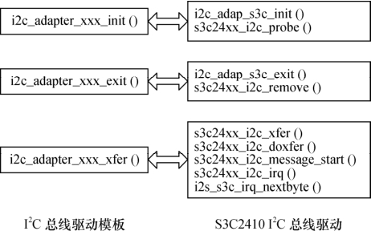

### 15.5.2 S3C6410 I2C总线驱动总体分析

S3C6410的I2C总线驱动drivers/i2c/busses/i2c-s3c2410.c支持S3C24XX、S3C64XX、S5PC1XX 和S5P64XX处理器，在我们使用的2.6.28.6内核版本中，其名称仍然叫2410，显然是历史原因引起的。它主要完成以下工作。

（1）设计对应于i2c_adapter_xxx_init()模板的S3C6410的模块加载函数和对应于i2c_ adapter_xxx_exit()函数模板的模块卸载函数。

（2）设计对应于i2c_adapter_xxx_xfer()模板的S3C6410适配器的通信方法函数。

针对S3C24XX、S3C64XX、S5PC1XX和S5P64XX处理器，functionality()函数s3c24xx_i2c_ func()只需简单地返回I2C_FUNC_I2C|I2C_FUNC_SMBUS_EMUL| I2C_FUNC_PROTOCOL_ MANGLING表明其支持的功能。

图15.6给出了S3C6410驱动中的主要函数与15.3节模板函数的对应关系，由于实现通信方法的方式不一样，模板的一个函数可能对应于S3C6410 I2C总线驱动的多个函数。

