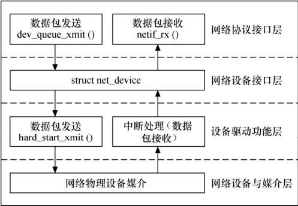

### 16.1 Linux网络设备驱动的结构

Linux网络设备驱动程序的体系结构如图16.1所示，从上到下可以划分为4层，依次为网络协议接口层、网络设备接口层、提供实际功能的设备驱动功能层以及网络设备与媒介层，这4层的作用如下所示。

（1）网络协议接口层向网络层协议提供统一的数据包收发接口，不论上层协议为ARP还是IP，都通过dev_queue_xmit()函数发送数据，并通过netif_rx()函数接收数据。这一层的存在使得上层协议独立于具体的设备。

（2）网络设备接口层向协议接口层提供统一的用于描述具体网络设备属性和操作的结构体net_device，该结构体是设备驱动功能层中各函数的容器。实际上，网络设备接口层从宏观上规划了具体操作硬件的设备驱动功能层的结构。

（3）设备驱动功能层各函数是网络设备接口层net_device数据结构的具体成员，是驱使网络设备硬件完成相应动作的程序，它通过hard_start_xmit()函数启动发送操作，并通过网络设备上的中断触发接收操作。

（4）网络设备与媒介层是完成数据包发送和接收的物理实体，包括网络适配器和具体的传输媒介，网络适配器被设备驱动功能层中的函数物理上驱动。对于Linux系统而言，网络设备和媒介都可以是虚拟的。

在设计具体的网络设备驱动程序时，我们需要完成的主要工作是编写设备驱动功能层的相关函数以填充net_device数据结构的内容并将net_device注册入内核。

