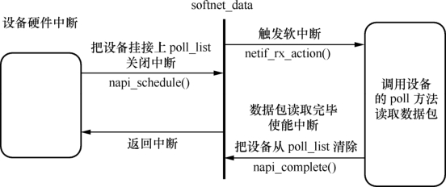

### 16.6 数据接收流程

网络设备接收数据的主要方法是由中断引发设备的中断处理函数，中断处理函数判断中断类型，如果为接收中断，则读取接收到的数据，分配sk_buffer数据结构和数据缓冲区，将接收到的数据复制到数据缓冲区，并调用netif_rx()函数将sk_buffer传递给上层协议。代码清单16.9所示为完成这一过程的函数模板。

代码清单16.9 网络设备驱动的中断处理函数模板

1 static void xxx_interrupt(int irq, void *dev_id) 
 
 2 { 
 
 3 ... 
 
 4 switch (status &ISQ_EVENT_MASK) { 
 
 5 case ISQ_RECEIVER_EVENT: 
 
 6 /* 获取数据包 */ 
 
 7 xxx_rx(dev); 
 
 8 break; 
 
 9 /* 其他类型的中断 */ 
 
 10 } 
 
 11 } 
 
 12 static void xxx_rx(struct xxx_device *dev) 
 
 13 { 
 
 14 ... 
 
 15 length = get_rev_len (...); 
 
 16 /* 分配新的套接字缓冲区 */ 
 
 17 skb = dev_alloc_skb(length + 2); 
 
 18 
 
 19 skb_reserve(skb, 2); /* 对齐 */ 
 
 20 skb->dev = dev;

21 
 
 22 /* 读取硬件上接收到的数据 */ 
 
 23 insw(ioaddr + RX_FRAME_PORT, skb_put(skb, length), length >> 1); 
 
 24 if (length &1) 
 
 25 skb->data[length - 1] = inw(ioaddr + RX_FRAME_PORT); 
 
 26 
 
 27 /* 获取上层协议类型 */ 
 
 28 skb->protocol = eth_type_trans(skb, dev); 
 
 29 
 
 30 /* 把数据包交给上层 */ 
 
 31 netif_rx(skb); 
 
 32 
 
 33 /* 记录接收时间戳 */ 
 
 34 dev->last_rx = jiffies; 
 
 35 ... 
 
 36 }

从上述代码的第4～7行可以看出，当设备的中断处理程序判断中断类型为数据包接收中断时，它调用第12～36定义的xxx_rx()函数完成更深入的数据包接收工作。xxx_rx()函数代码中的第15行从硬件读取到接收数据包有效数据的长度，第16～19行分配sk_buff和数据缓冲区，第22～25行读取硬件上接收到的数据并放入数据缓冲区，第27～28行解析接收数据包上层协议的类型，最后，第30～31行代码将数据包上交给上层协议。

如果是NAPI兼容的设备驱动，则可以通过poll方式接收数据包。这种情况下，我们需要为该设备驱动提供作为netif_napi_add()参数的xxx_poll()函数，如代码清单16.10所示。

代码清单16.10 网络设备驱动的poll函数模板

1 static int xxx_poll(struct napi_struct *napi, int budget) 
 
 2 { 
 
 3 int npackets = 0; 
 
 4 struct sk_buff *skb; 
 
 5 struct xxx_priv *priv = container_of(napi, struct xxx_priv, napi); 
 
 6 struct xxx_packet *pkt; 
 
 7 
 
 8 while (npackets < budget && priv->rx_queue) { 
 
 9 /*从队列中取出数据包*/ 
 
 10 pkt = xxx_dequeue_buf(dev); 
 
 11 
 
 12 /*接下来的处理，和中断触发的数据包接收一致*/ 
 
 13 skb = dev_alloc_skb(pkt->datalen + 2); 
 
 14 ... 
 
 15 skb_reserve(skb, 2); 
 
 16 memcpy(skb_put(skb, pkt->datalen), pkt->data, pkt->datalen); 
 
 17 skb->dev = dev; 
 
 18 skb->protocol = eth_type_trans(skb, dev); 
 
 19 /*调用netif_receive_skb，而不是net_rx, 将数据包交给上层协议*/ 
 
 20 netif_receive_skb(skb); 
 
 21 
 
 22 /*更改统计数据 */ 
 
 23 priv->stats.rx_packets++; 
 
 24 priv->stats.rx_bytes += pkt->datalen; 
 
 25 xxx_release_buffer(pkt); 
 
 26 npackets++;

27 } 
 
 28 if (npackets < budget) { 
 
 29 napi_complete(napi); 
 
 30 xxx_enable_rx_int (…); /* 再次使能网络设备的接收中断 */ 
 
 31 } 
 
 32 return npackets; 
 
 33 }

上述代码中的budget是在初始化阶段分配给接口的weight值，poll函数每次只能接收最多budget数量的数据包。第8行的while()循环读取设备的接收缓冲区，读取数据包并提交给上层。这个过程和中断触发的数据包接收过程一致，但是最后使用netif_receive_skb()函数而非netif_rx()函数将数据包提交给上层。这里体现出了中断处理机制和轮询机制之间的差别。

当一个轮询过程结束时，第29行代码调用napi_complete()宣布这一消息，而第30行代码则再次启动网络设备的接收中断。

虽然NAPI兼容的设备驱动以poll方式接收数据包，但是仍然需要首次数据包接收中断来触发poll过程。与数据包的中断接收方式不同的是，以轮询方式接收数据包时，当第一次中断发生后，中断处理程序要禁止设备的数据包接收中断并调度NAPI，如代码清单16.11所示。

代码清单16.11 网络设备驱动的poll中断处理函数模板

1 static void xxx_poll_interrupt(int irq, void *dev_id) 
 
 2 { 
 
 3 switch (status &ISQ_EVENT_MASK) { 
 
 4 case ISQ_RECEIVER_EVENT: 
 
 5 … /* 获取数据包 */ 
 
 6 xxx_disable_rx_int(...); /* 禁止接收中断 */ 
 
 7 napi_schedule(&priv->napi); 
 
 8 break; 
 
 9 … /* 其他类型的中断 */ 
 
 10 } 
 
 11 }

上述代码第7行的napi_schedule ()函数被轮询方式驱动的中断程序调用，将设备的poll方法添加到网络层的poll处理队列中，排队并且准备接收数据包，最终触发一个NET_RX_SOFTIRQ软中断，通知网络层接收数据包。图16.2所示为NAPI驱动程序各部分的调用关系。

在支持NAPI的网络设备驱动中，通常还会进行如下与NAPI相关的工作。

（1）在私有数据结构体如xxx_priv中增加一个成员：

struct napi_struct napi;

这是代码清单16.11第5行调用container_of ()可以得到xxx_priv类型指针的原因。

（2）通常会在设备驱动初始化时调用：

netif_napi_add(dev, napi, xxx_poll, XXX_NET_NAPI_WEIGHT);

（3）通常会在net_device结构体的open()和stop()成员函数中分别调用napi_enable()和napi_disable()。

