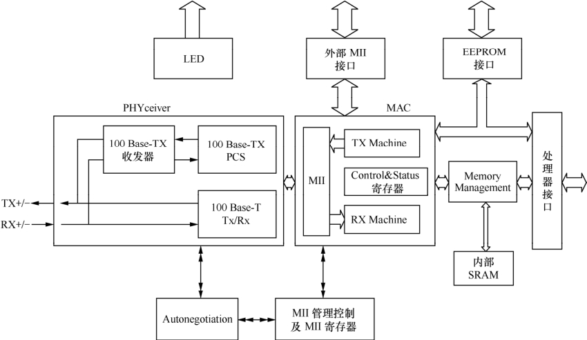
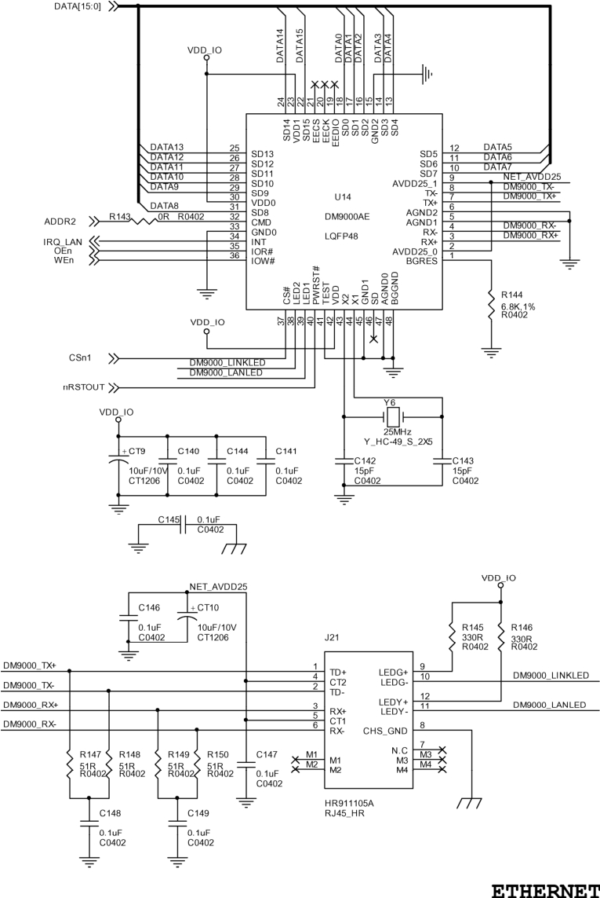

### 16.9.1 DM9000网卡硬件描述

DM9000是开发板采用的网络芯片，是一个高度集成而且功耗很低的高速网络控制器，可以和CPU直连，支持10/100MB以太网连接，芯片内部自带4K双字节的SRAM（3KB用来发送，13KB用来接收）。针对不同的处理器，接口支持8位、16位和32位。图16.3所示为DM8900的内部结构框架。

在LDD6410开发板上，LDD6410直接挂接在S3C6410的存储器总线上，其连接原理如图16.4所示。DM9000占据S3C6410片选1的内存空间，而且由S3C6410地址线第2位驱动CMD引脚，这说明片选1的地址0～3对应的是DM9000的I/O端口，而4～7对应的是数据端口，这一信息对于移植DM9000驱动到LDD6410非常关键。

