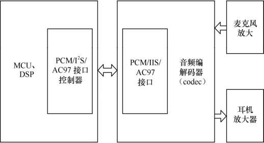
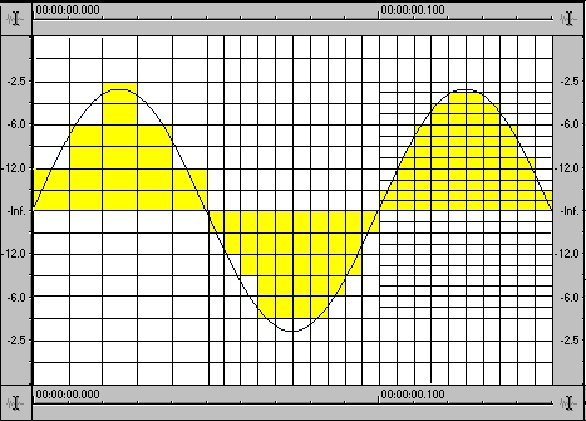

### 17.1 数字音频设备

目前，手机、PDA、MP3等许多嵌入式设备中包含了数字音频设备，一个典型的数字音频系统的电路组成如图17.1所示。图17.1中的嵌入式微控制器/DSP中集成了PCM、IIS或AC'97音频接口，通过这些接口连接外部的音频编解码器即可实现声音的AD和DA转换，图中的功放完成模拟信号的放大功能。

音频编解码器是数字音频系统的核心，衡量它的主要指标如下。

#### 1．采样频率

采样的过程就是将通常的模拟音频信号的电信号转换成二进制码0和1的过程，这些0和1便构成了数字音频文件。图17.2中的正弦曲线代表原始音频曲线，方格代表采样后得到的结果，两者越吻合说明采样结果越好。

采样频率是每秒钟的采样次数，我们常说的44.1kHz采样频率就是每秒钟采样44100次。理论上采样频率越高，转换精度越高，目前主流的采样频率是48kHz。

#### 2．量化精度

量化精度是指对采样数据分析的精度，比如24bit量化精度就是指将标准电平信号按照2 的24次方进行分析，也就是说将图17.2中的纵坐标等分为224等分。量化精度越高，声音就越逼真。

